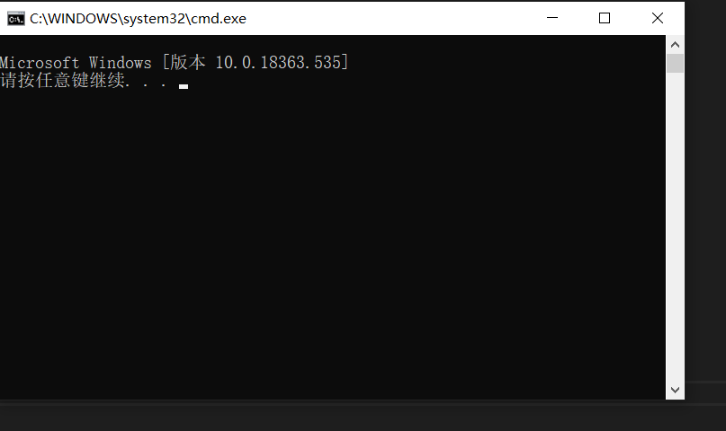
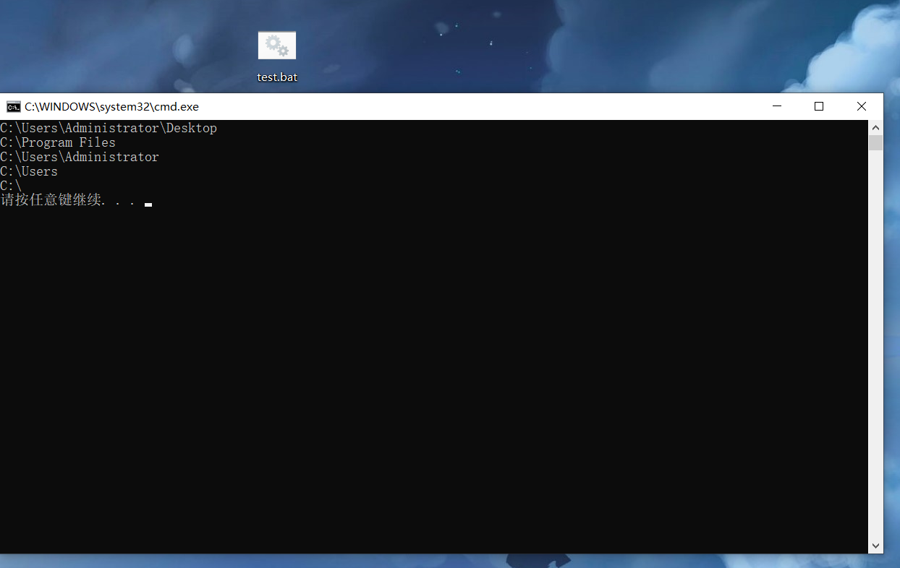
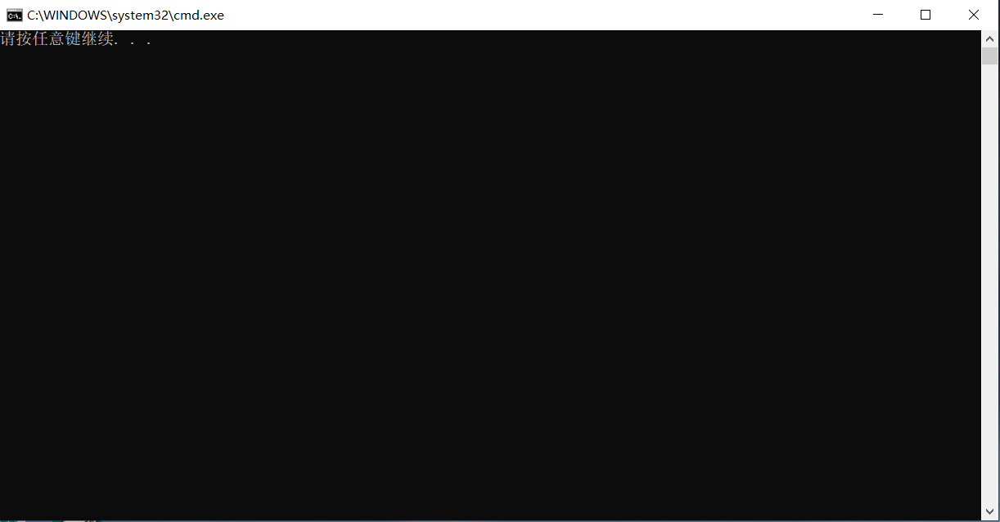
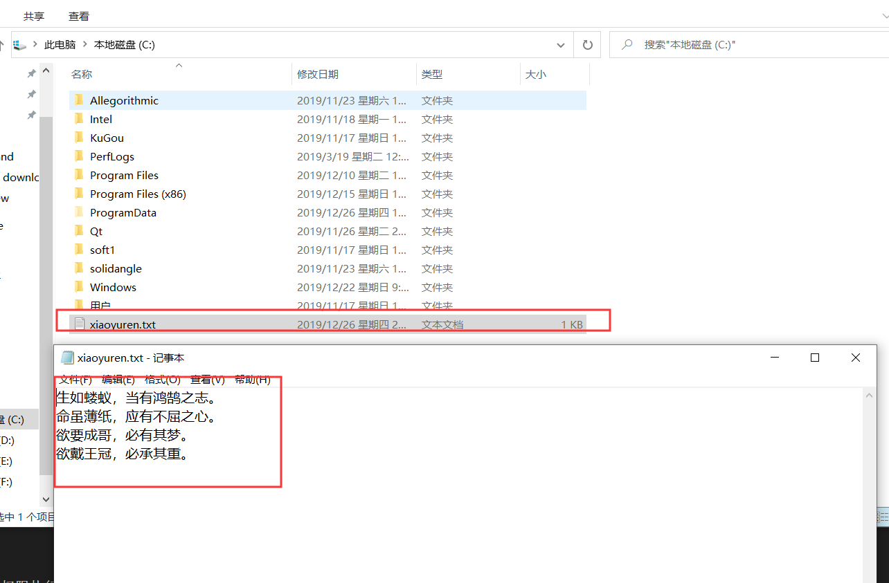
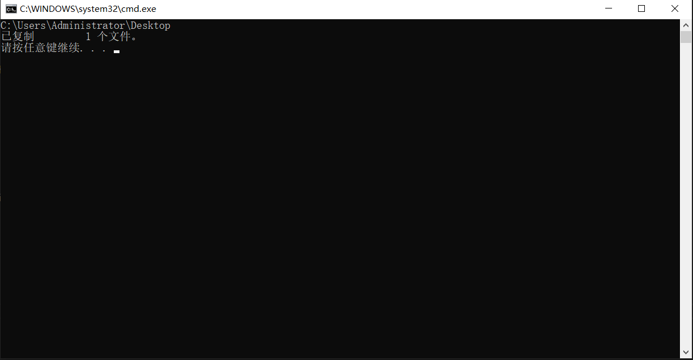
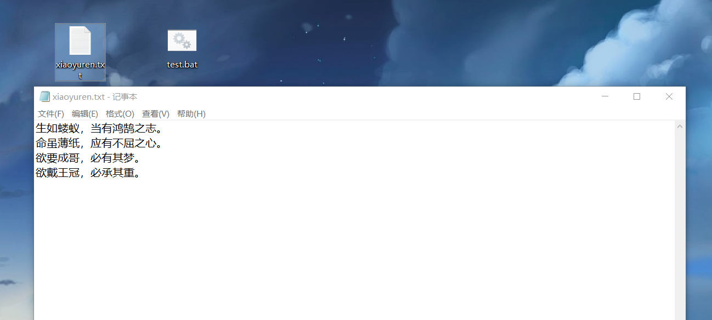
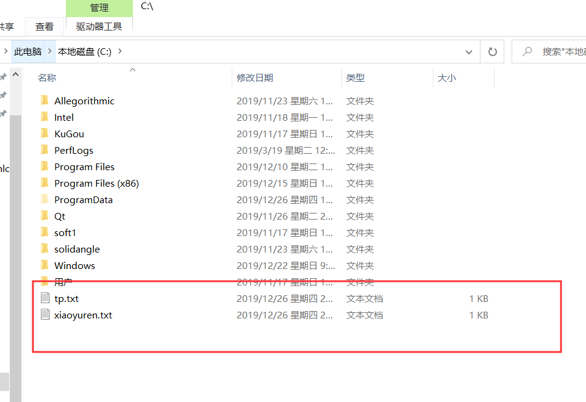
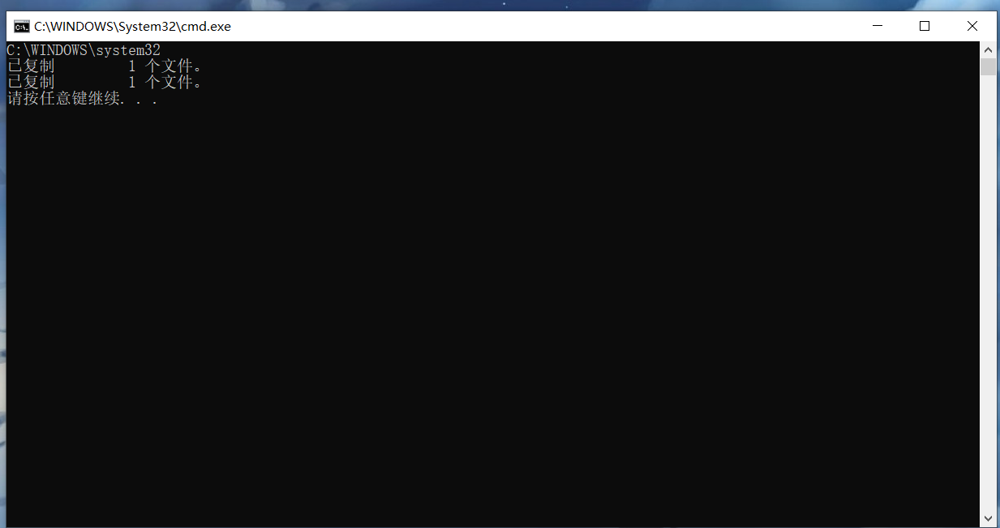

batch的命令学习
<!-- more -->

## VER
&emsp;&emsp;此批处理命令显示你正在使用的MS-DOS版本，创建一个.bat文件，输入以下指令，然后运行。
```
@echo off 
ver
```
事实上你什么也看不到，加一个pause暂停操作。
```
@echo off 
ver
pause
```

你可以看到windows的版本是`Microsoft Windows [版本 10.0.18363.535]`。

## ASSOC 
&emsp;&emsp;这是一个批处理命令，用于将扩展名与文件类型（FTYPE）关联，显示现有关联或删除关联。
Syntax：
```
assoc – Displays all the file extensions 
assoc | find “.ext” – Displays only those file extensions which have the extension ext.
```
Example:
```
@echo off 
assoc > C:\lists.txt 
assoc | find “.doc” > C:\listsdoc.txt
```
Output:
文件关联列表将路由到文件lists.txt。 以下输出显示了运行上述批处理文件后，listsdoc.txt文件中的内容。
```
.doc=Word.Document.8 
.dochtml=wordhtmlfile 
.docm=Word.DocumentMacroEnabled.12 
.docmhtml=wordmhtmlfile 
.docx=Word.Document.12 
.docxml=wordxmlfile
```
惭愧，没搞懂怎么用
## CD
&emsp;&emsp;此批处理命令是用于更改目录或显示当前目录。
Syntax：
```
CD
```
Example:
```
@echo off
Rem The cd without any parameters is used to display the current working directory
cd
Rem Changing the path to Program Files
cd\Program Files
cd
Rem Changing the path to Program Files
cd %USERPROFILE%
cd
Rem Changing to the parent directory
cd..
cd
Rem Changing to the parent directory two levels up
cd..\..
cd
pause
```
Output:
把.bat文件放到桌面来运行

可以看到，第一个`cd`表示显示`C:\Users\Administrator\Desktop`目录， `cd\Program Files`表示切换到`C:\Program Files`目录，`cd %USERPROFILE%`
切换到`C:\Users\Administrator`目录，`cd..`表示切换到父目录，这里显示是`C:\Users`，`cd..\..`向上切换到祖父目录（跨两个层级），这里显示的是`C:\`，细心
你可能会发现为什么只上去一个目录啊，这是因为已经到最顶层目录了，如果你在更底层目录级别，它就会实现切换两个级别目录。
当然还有没有发现，REM，这家伙那肯定就是只起注释用的，bat会忽略它后面的内容。这东西可以用`::`就像C++的全局作用域符号。

## CLS
&emsp;&emsp;此批处理命令是用于清屏
Syntax:
```
cls
```
Example:
```
@echo off
Rem The cd without any parameters is used to display the current working directory
cd
Rem Changing the path to Program Files
cd\Program Files
cd
Rem Changing the path to Program Files
cd %USERPROFILE%
cd

Rem Changing to the parent directory two levels up
cd..\..
cd
pause
cls
pause

```
这个bat文件就是在CD例子的基础上多加了这两行指令
```
cls
pause
```
运行后会得到这样的效果：

按下任意键，你会发现之前显示的东西全被清楚了

再按下任意键退出cmd窗口。

## COPY
&emsp;&emsp;此命令用于将文件从一个位置复制到另一位置，（这个应该很常用）
Syntax:
```
Copy [source] [destination]
```
文件将从source 拷贝到目的位置
Examples:
```
@echo off
cd
Rem Copies xiaoyuren.txt to the present working directory. 
Rem If there is no destination identified , it defaults to the present working directory.
copy c:\xiaoyuren.txt
Rem The file xiaoyuren.txt will be copied from C:\ to C:\tp location
copy C:\xiaoyuren.txt c:\tp.txt
Rem Quotation marks are required if the file name contains spaces
copy “C:\xiao yuren.txt”
Rem Copies all the files in F drive which have the txt file extension to the
current working directory copy
F:\*.txt
Rem Copies all files from dirA to dirB. Note that directories nested in dirA will not be copied
copy C:\dirA dirB
pause
```
这个太长了我们来一步步分解一下
首先在C盘目录下创建一个xiaoyuren.txt


其次在桌面的.bat文件输入以下内容，这段含义是什么，可以看到我没有填写目的位置，那它就会默认拷贝到当前所处的目录下。
```
@echo off
cd 
copy c:\xiaoyuren.txt
pause
```

运行这个bat后可以看到，当前路径为桌面路径`C:\Users\Administrator\Desktop`。
然后在桌面也看到了生成了一个xiaoyuren.txt，里面的内容跟之前在C盘下创建的一样，说明成功复制到了默认路径下。



现在在bat文件里面增加`copy C:\xiaoyuren.txt c:\tp.txt`,注意window的文件夹是不区分大小写的。
```
@echo off
cd 
copy c:\xiaoyuren.txt
copy C:\xiaoyuren.txt c:\tp.txt
pause
```
以管理员权限运行，按理来说我桌面会生成一个xiaoyuren.txt，C盘下会生成一个tp.txt文件，可以看到C盘下顺利的生成了一个tp.txt文件

但是遗憾的是，虽然CMD显示生复制了两个文件，如图所示：

但我在桌面没有看到xaioyuren.txt文件，不知道为什么。我尝试直接运行.bat文件，桌面是可以生成xiaoyuren.txt，但是C盘受限于管理员权限，
没有生成tp.txt，这个很好理解，win10下C盘进行写需要管理员权限。


手动在C盘目录下创建一个名为`xiao yuren`的txt文件。
```
@echo off
cd 
copy c:\"xiao yuren.txt"
pause
```
这段代码的效果就是，把C盘下`xiao yuren.txt`文件复制到桌面，注意带空格的文件名要用双引号括起来。

鉴于copy复制出异常情况，我打算先放弃 copy的使用说明，待后续看看是咋回事。

## 未完待续······

&emsp;&emsp;
&emsp;&emsp;
&emsp;&emsp;
&emsp;&emsp;
&emsp;&emsp;
&emsp;&emsp;
&emsp;&emsp;
&emsp;&emsp;
&emsp;&emsp;
&emsp;&emsp;
&emsp;&emsp;
&emsp;&emsp;
&emsp;&emsp;
&emsp;&emsp;
&emsp;&emsp;
&emsp;&emsp;
&emsp;&emsp;
&emsp;&emsp;
&emsp;&emsp;
&emsp;&emsp;

