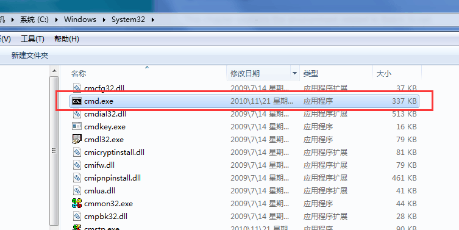
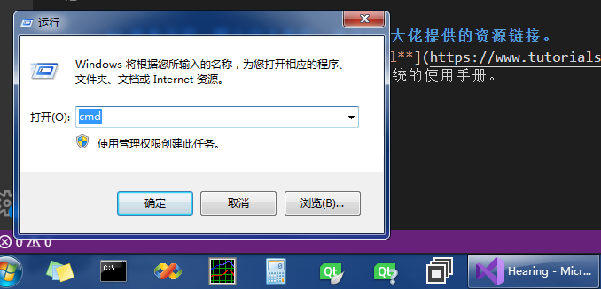
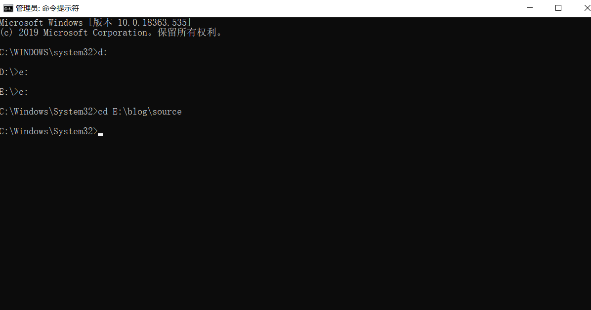

.bat在我的印象中很强大，批处理文件，移动复制拷贝很好使，可能这是最低级的使用法，这么好用的工具当然向去学习下，相信学点皮毛也够我终身受用。
<!-- more -->

## Batch脚本简述
&emsp;&emsp;批处理脚本存储在简单的文件，该文件包含带有依次自动执行的命令行。脚本是一种通过自动化这些命令序列来减轻这种必要性的方法，以使
人们在shell上的使用更轻松，更有效率。要了解脚本还是得对计算机编程的变量、命令、语法等概念有一定了解。
## Batch脚本的属性
* 可以读取用户的输入，以便可以对其进行进一步处理。
* 具有控制结构，例如：`if`,`while`,`for`,`switch`,以实现更好的自动化和脚本编写。
* 支持高级属性，例如：函数和数组。
* 支持正则表达式（这个看起来很强大，可惜我不会用，我看别人用正则表达式很溜，一本书讲正则，羡慕会正则的人）。
* 可以包含其它编程代码：例如:Per（不知道能不能包含C++）。
批处理脚本一些常见的用法：
* 为不同目的设置servers
* 自动执行常规活动，例如删除不需要的文件或日志
* 自动将应用程序从一个环境部署到另一个环境
* 一次在不同的机器上安装程序
&emsp;&emsp;批处理文件具有特殊的扩展名BAT或者CMD。这种类型的文件可通过称为命令解释器的系统文件提供的接口（有时称为shell）进行识别和执行。
在Windows系统上，此解释器称为cmd.exe。
运行批处理文件很简单，只需单击它即可。 批处理文件也可以在命令提示符或“开始-运行”行中运行。 在这种情况下，除非文件的路径位于路径环境中，否则
必须使用完整路径名。以下是批处理脚本的简单示例。运行时，此批处理脚本将删除当前目录中的所有文件。
```
:: Deletes All files in the Current Directory With Prompts and Warnings
::(Hidden, System, and Read-Only Files are Not Affected)
:: @ECHO OFF
DEL . DR
```
## Batch脚本环境
#### 写和执行
&emsp;&emsp;通常，要创建批处理文件，请使用记事本。这是用于创建批处理文件的最简单的工具。接下来是批处理脚本的执行环境。
在Windows系统上，这是通过命令提示符或cmd.exe完成的。所有批处理文件都在此环境中运行。
以下是三种不同的方式运行cmd.exe
* 进到`C:\Windows\System32`目录下双击cmd.exe可执行程序

* 通过“运行”输入命令`cmd`来启用cmd.exe

启用CMD后，就会显示以下的屏幕，这就是你的批处理执行环境了。

#### 环境变量
&emsp;&emsp;为了从命令提示符下运行批处理文件，你需要转到存储批处理文件的位置，或者可以在path环境变量中输入文件位置。
因此，假设批处理文件存储在`C:\Application\bin`位置，则可以在系统环境变量下包含这个路径。还有个更简单的方法，直接在
CMD下输入 `cd: C:\Application\bin` 如果D盘就得先转到D盘`D:`,F盘就`F:`。我上图的效果里面有。

## 啥也不说，附上官方教程，来自Icy大佬提供的资源链接。
**传送门**：[**https://www.tutorialspoint.com/batch_script/index.htm**](https://www.tutorialspoint.com/batch_script/index.htm)
感兴趣的朋友自行去疑似官方网站查阅系统的使用手册。

来个Icy大佬的在线发牌操作，简单直观明了。跑题了这个跟主题没关系。


