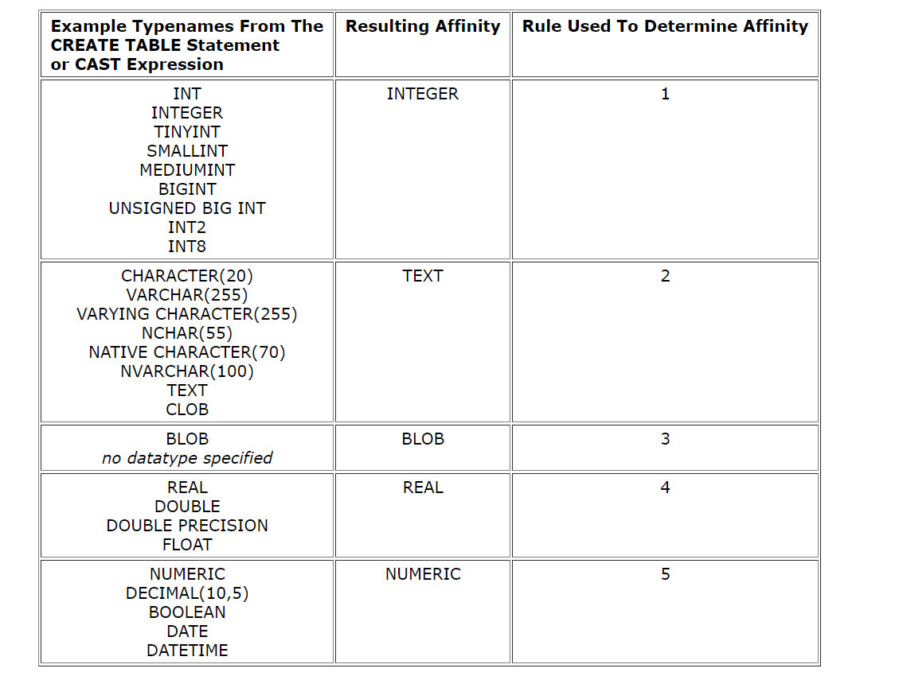

现在接触的东西越多，困惑越来越多，每个地方都需要花大量的时间投入，就好比这个SQLite，来头很多，看他们的文档，当今世界最广泛使用的轻量级数据库。
浩大的SQLite我却连它数据类型其实都还没明白，看了菜鸟教程也写的不够详细，决定来一探究竟。
<!-- more -->
## 什么是 SQLite
&emsp;&emsp;SQLite是一种C语言库，可实现：`small`（小型）、`fast`（快速）、`self-contained`（自包含）、`high-reliability`（高可靠性）
及`full-featured`（功能齐全）的SQL数据库引擎。SQLite是世界上最常用的数据库引擎。SQLite内置于所有手机和大多数计算机中，并捆绑在人们每天使
用的无数其他应用程序中。————以上来自官方描述
&emsp;&emsp;总之越深入了解越觉得这家伙牛逼，开源的，要是能学到点东西，那就值了。

## 数据类型在SQLite
&emsp;&emsp;大多数SQL数据库引擎（据我们所知，除SQLite以外的所有SQL数据库引擎）都使用静态的固定类型。对于静态类型，值的数据类型由其容器确定
————值存储在其中的特定列。
&emsp;&emsp;SQLite使用更通用的动态类型系统。在SQLite中，值的数据类型与值本身（而不是其容器）相关联。SQLite的动态类型系统与其他数据库引擎的
更常见的静态类型系统向后兼容，因为在静态类型的数据库上运行的SQL语句应在SQLite中以相同的方式运行。 但是，SQLite中的动态类型允许它执行传统的
严格类型数据库中无法做到的事情。

## 存储类和数据类型
&emsp;&emsp;每个被存储在SQLite数据库（或由数据库引擎操作）的值都为以下存储类的一种：
* ``NULL``.    The value is a NULL value.(空值)

* ``INTEGER``. The value is a signed integer, stored in 1, 2, 3, 4, 6, or 8 bytes depending on the magnitude of the value.（字节大小取决于值）

* ``REAL``.    The value is a floating point value, stored as an 8-byte IEEE floating point number.（浮点值，存储为8字节IEEE浮点数）

* ``TEXT``.    The value is a text string, stored using the database encoding (UTF-8, UTF-16BE or UTF-16LE).（文本，三种编码方式）

* ``BLOB``.    The value is a blob of data, stored exactly as it was input.（二进制数据BLOB数据类型，取决于输入）
&emsp;&emsp;`storage class`(存储类)比`DataType`(数据类型)更通用。 例如，INTEGER存储类包括6种不同长度的不同整数数据类型。这在磁盘上有所作为。但是，
一旦从磁盘上读取INTEGER值并将其读入内存进行处理，它们便会转换为最通用的数据类型（8字节有符号整数）。因此，在大多数情况下，“存储类”与“数据类型”是无法
区分的，并且这两个术语可以互换使用。
&emsp;&emsp;除了`INTEGER PRIMARY KEY`列外，SQLite版本3数据库中的任何列均可用于存储任何存储类的值。
&emsp;&emsp;SQL语句中的所有值，无论它们是嵌入在SQL语句文本中的文字还是绑定到预编译SQL语句的参数都具有隐式存储类。在下面描述的情况下，数据库引擎可以
在查询执行期间在数字存储类（`INTEGER`和`REAL`）与TEXT之间转换值。

## Boolean Datatype
&emsp;&emsp;SQLite没有单独的布尔存储类。 而是将布尔值存储为0（`false`）和1（`true`）。

## Date and Time Datatype
&emsp;&emsp;SQLite没有为存储日期和/或时间预留存储类，相反，SQLite内置的`Date And Time Functions `接口可以将日期和时间存储为`TEXT`，`REAL`或
`INTEGER`值:
* ``TEXT`` as ISO8601 strings ("YYYY-MM-DD HH:MM:SS.SSS"). (转成类似：2020-06-06 11:27:38.9254739)
* ``REAL`` as Julian day numbers, the number of days since noon in Greenwich on November 24, 4714 B.C. according to the proleptic Gregorian calendar.
  （作为朱利安天数，是公元前4714年11月24日格林威治以来的天数。根据公历。）
* ``INTEGER`` as Unix Time, the number of seconds since 1970-01-01 00:00:00 UTC.（UNIX系统时间，记录1970年以后的时间）

## Type Affinity 
&emsp;&emsp;使用固定类型的SQL数据库引擎通常将尝试自动将值转换为适当的数据类型。如下：
```
        CREATE TABLE t1（a INT，b VARCHAR（10））;
        INSERT INTO t1（a，b）值（'123'，456）;
```
固定类型的数据库将在执行插入操作之前将字符串“ 123”转换为整数123，将整数456转换为字符串“ 456”。

&emsp;&emsp;为了最大程度地提高SQLite与其他数据库引擎之间的兼容性，并使上面的示例在SQLite上像在其他SQL数据库引擎上一样工作，SQLite在列上支持`type affinity`
(类型关联性)的概念。列的类型关联性是存储在该列中的数据的推荐类型。这里的重要思想是建议类型，而不是必需类型。任何列仍可以存储任何类型的数据。只是有些列（如果有选择）
将更喜欢使用一种存储类而不是另一种。列的首选存储类称为其`affinity`（关联性）。
&emsp;&emsp;向SQLite 3数据库中的每一列分配以下类型关联性之一：
* TEXT
* NUMERIC
* INTEGER
* REAL
* BLOB
（历史记录：`BLOB`类型的关联性以前被称为`NONE`。但是该术语很容易与`no affinity`相混淆，因此将其重命名。）
&emsp;&emsp;具有`TEXT`关联性的列使用存储类`NULL`，`TEXT`或`BLOB`存储所有数据。如果将数字数据插入到具有`TEXT`关联性的列中，则在存储之前将其转换为文本形式。
&emsp;&emsp;具有`NUMERIC`关联性的列可能包含使用所有五个存储类的值。将文本数据插入`NUMERIC`列时，如果文本分别是格式良好的整数或实数文字，则文本的存储类将转换为
`INTEGER`或`REAL`（按优先顺序）。如果`TEXT`值是格式正确的整数文字，太大而无法容纳64位有符号整数，则将其转换为`REAL`。 对于`TEXT`和`REAL`存储类之间的转换，仅保留
该数字的前15个有效十进制数字。如果`TEXT`值不是格式正确的整数或实数文字，则该值将存储为`TEXT`。就本段而言，十六进制整数文字不被认为格式正确，而是存储为TEXT。（这样做是
为了与3.8.6 2014-08-15之前的SQLite版本保持历史兼容性，在该版本中，十六进制整数文字首次引入SQLite。）不会尝试转换`NULL`或`BLOB`值。

&emsp;&emsp;字符串可能看起来像是带小数点和/或指数表示法的浮点文字，但是只要该值可以表示为整数，`NUMERIC`关联性就会将其转换为整数。因此，字符串`3.0e + 5`存储在
具有`NUMERIC`关联性的整数300000而不是浮点值300000.0的列中。

&emsp;&emsp;使用`INTEGER`关联的列的行为与具有`NUMERIC`关联的列的行为相同。`INTEGER`和`NUMERIC`亲和力之间的差异仅在`CAST`表达中才明显。

&emsp;&emsp;具有`REAL`关联性的列的行为类似于具有`NUMERIC`关联性的列，不同之处在于它将整数值强制为浮点表示形式。（作为内部优化，没有小数部分的小浮点值并存储在
具有`REAL`关联性的列中，它们作为整数写入磁盘，以便占用更少的空间，并在读取值时自动转换回浮点。这优化在SQL级别是完全不可见的，只能通过检查数据库文件的原始位来检测到。）

&emsp;&emsp;具有`BLOB`关联性的列不喜欢一个存储类别而不是另一个存储类别，也没有尝试将数据从一个存储类别强制转换为另一个存储类别

## Determination Of Column Affinity
&emsp;&emsp;判定关联性，
列的关联性由列的声明类型确定，并按照所示顺序遵循以下规则：
* 1如果声明的类型包含字符串`INT`，那么将为其分配`INTEGER`关联。

* 2如果列的声明类型包含任何字符串`CHAR`，`CLOB`或` TEXT`，则该列具有`TEXT`关联性。 请注意，类型`VARCHAR`包含字符串`CHAR`，因此被分配为`TEXT`关联。

* 3如果列的声明类型包含字符串`BLOB`，或者未指定类型，则该列具有关联`BLOB`。

* 4如果列的声明类型包含任何字符串`REAL`，`FLOA`或`DOUB`，则该列具有`REAL`关联性。

* 5否则，关联性为`NUMERIC`。
注意，确定关联性的规则顺序很重要。 声明类型为`CHARINT`的列将同时匹配规则1和2，但第一个规则优先，因此列关联性将为`INTEGER`。

## 关联性名称示例
&emsp;&emsp;下表显示了通过上一节的五个规则将更传统的SQL实现中的多少个通用数据类型名称转换为关联性。 该表仅显示SQLite将接受的数据类型名称的一小部分。
请注意，SQLite会忽略类型名称后面的括号中的数字参数（例如：`VARCHAR（255）`）-SQLite不会对字符串，BLOB或字符串的长度施加任何长度限制（大的全局`SQLITE_MAX_LENGTH`限制除外）。
数值。


注意，由于`POINT`末尾的`INT`，声明的类型`FLOATING POINT`将赋予`INTEGER`关联性，而不是`REAL`关联性。 并且声明的`STRING`类型具有`NUMERIC`（而不是`TEXT`）的关联性。

## 官方链接
goolge翻译的脑壳疼，自己上官网看吧。
[``https://www.sqlite.org/index.html``](https://www.sqlite.org/index.html)
[``https://www.sqlite.org/datatype3.html``](https://www.sqlite.org/datatype3.html)