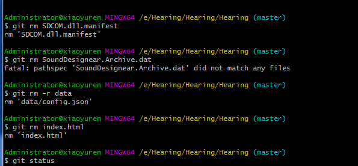
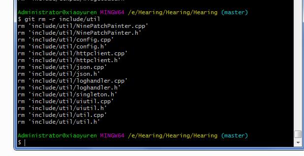
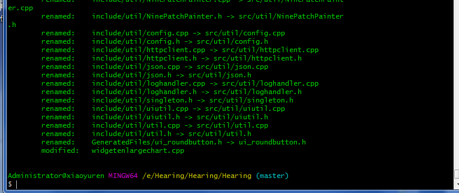

整理工程目录结构，免不了要迁移文件，移动文件后git会提示你deleted之前这些文件，rm单个文件谁都会，操作多个或者整个文件夹该怎么弄呢，特意去官网查询了下怎么用。注意git rm不仅删除了工作目录的文件，还把工作树的索引也给删除（即git的本地数据库中存储的指针索引），已经跟踪修改的文件可以通过增加 -f 来暴力删除.
<!-- more -->

## git rm
`git-rm - Remove files from the working tree and from the index`

## 概要
```
git rm [-f | --force] [-n] [-r] [--cached] [--ignore-unmatch] [--quiet] [--] <file>…​
```
## 描述
```
Remove files from the index, or from the working tree and the index. git rm will not remove a file from just your working directory. (There is no option to remove a file only from the working tree and yet keep it in the index; use /bin/rm if you want to do that.) The files being removed have to be identical to the tip of the branch, and no updates to their contents can be staged in the index, though that default behavior can be overridden with the -f option. When --cached is given, the staged content has to match either the tip of the branch or the file on disk, allowing the file to be removed from just the index.

<file>…​
Files to remove. Fileglobs (e.g. *.c) can be given to remove all matching files. If you want Git to expand file glob characters, you may need to shell-escape them. A leading directory name (e.g. dir to remove dir/file1 and dir/file2) can be given to remove all files in the directory, and recursively all sub-directories, but this requires the -r option to be explicitly given.

-f
--force
Override the up-to-date check.

-n
--dry-run
Don’t actually remove any file(s). Instead, just show if they exist in the index and would otherwise be removed by the command.

-r
Allow recursive removal when a leading directory name is given.

--
This option can be used to separate command-line options from the list of files, (useful when filenames might be mistaken for command-line options).

--cached
Use this option to unstage and remove paths only from the index. Working tree files, whether modified or not, will be left alone.

--ignore-unmatch
Exit with a zero status even if no files matched.

-q
--quiet
git rm normally outputs one line (in the form of an rm command) for each file removed. This option suppresses that output.
```

## DISCUSSION
```The <file> list given to the command can be exact pathnames, file glob patterns, or leading directory names. The command removes only the paths that are known to Git. Giving the name of a file that you have not told Git about does not remove that file.

File globbing matches across directory boundaries. Thus, given two directories d and d2, there is a difference between using git rm 'd*' and git rm 'd/*', as the former will also remove all of directory d2.
```

## 删除已经从文件系统中消失的文件
```
There is no option for git rm to remove from the index only the paths that have disappeared from the filesystem. However, depending on the use case, there are several ways that can be done.

Using “git commit -a”
If you intend that your next commit should record all modifications of tracked files in the working tree and record all removals of files that have been removed from the working tree with rm (as opposed to git rm), use git commit -a, as it will automatically notice and record all removals. You can also have a similar effect without committing by using git add -u.

Using “git add -A”
When accepting a new code drop for a vendor branch, you probably want to record both the removal of paths and additions of new paths as well as modifications of existing paths.

Typically you would first remove all tracked files from the working tree using this command:

git ls-files -z | xargs -0 rm -f
and then untar the new code in the working tree. Alternately you could rsync the changes into the working tree.

After that, the easiest way to record all removals, additions, and modifications in the working tree is:

git add -A
See git-add[1].

Other ways
If all you really want to do is to remove from the index the files that are no longer present in the working tree (perhaps because your working tree is dirty so that you cannot use git commit -a), use the following command:

git diff --name-only --diff-filter=D -z | xargs -0 git rm --cached

```
## 子模块
```
Only submodules using a gitfile (which means they were cloned with a Git version 1.7.8 or newer) will be removed from the work tree, as their repository lives inside the .git directory of the superproject. If a submodule (or one of those nested inside it) still uses a .git directory, git rm will move the submodules git directory into the superprojects git directory to protect the submodule’s history. If it exists the submodule.<name> section in the gitmodules[5] file will also be removed and that file will be staged (unless --cached or -n are used).

A submodule is considered up to date when the HEAD is the same as recorded in the index, no tracked files are modified and no untracked files that aren’t ignored are present in the submodules work tree. Ignored files are deemed expendable and won’t stop a submodule’s work tree from being removed.

If you only want to remove the local checkout of a submodule from your work tree without committing the removal, use git-submodule[1] deinit instead. Also see gitsubmodules[7] for details on submodule removal.
```

## EXAMPLES
```git rm Documentation/\*.txt
Removes all *.txt files from the index that are under the Documentation directory and any of its subdirectories.

Note that the asterisk * is quoted from the shell in this example; this lets Git, and not the shell, expand the pathnames of files and subdirectories under the Documentation/ directory.

git rm -f git-*.sh
Because this example lets the shell expand the asterisk (i.e. you are listing the files explicitly), it does not remove subdir/git-foo.sh.
```
## BUGS
```
Each time a superproject update removes a populated submodule (e.g. when switching between commits before and after the removal) a stale submodule checkout will remain in the old location. Removing the old directory is only safe when it uses a gitfile, as otherwise the history of the submodule will be deleted too. This step will be obsolete when recursive submodule update has been implemented.
```

## 实际使用
```
$ git rm  main.cpp      //删除main.cpp文件 包括工作目录树中的索引
$ git rm *.cpp          //删除所有的.cpp后缀的文件
$ git rm -f include     //删除include目录，及其目录中包含的所有文件，注意删除文件夹记得加 -f
```
删除文件夹，删除文件


删除文件夹


当文件被我人为手动直接移到其它目录，然后git会提示你删除之前跟踪的那些文件，当你把这些文件再add添加为跟踪时，可以看到聪明的git认为你重命名了并移动到了新目录里，这样你的文件提交历史没有丢。

