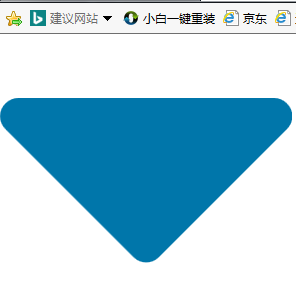
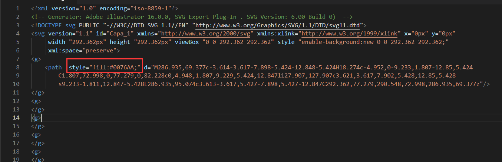
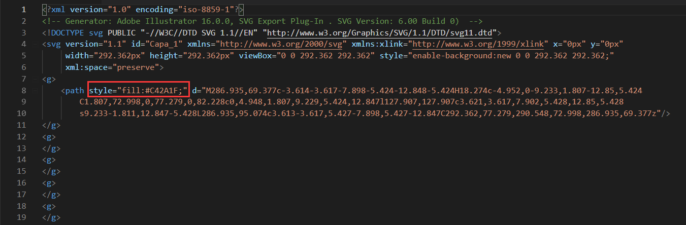
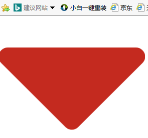

对于没有美工支持的我，想要好看的ICON只能从网上找，可是很多时候总不能找到合适的颜色，要是能修改svg的颜色那岂不美哉，果然百度了一下，很简单就能实现。现在把这个修改方法记录下来。
<!--more-->
修改
***
如下图这是一张蓝色的SVG图

用VisualStudio Code编辑器打开这张SVG，可以看到，这张图由代码构成，找到 path下的 `style = "fill:#xxxxxx"`，如果没有这一项，需要手动添加进去。

修改style的rgb颜色值，将改成红色

最后我们可以看到svg图片成功由蓝色变成了红色

***
这里给大家分享一个我平时比较喜欢去的网站下载svg图片，里面有很多资源。
[`https://www.flaticon.com`](https://www.flaticon.com)