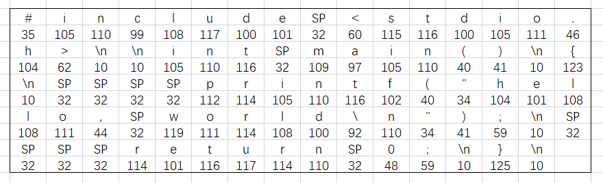

代码到变成执行文件过程的简介，以高级C语言为例
<!-- more -->
```
#include <stdio.h>
int main()
{
    printf("hello world\n")
    return 0;
}
```

大部分的现代计算机系统都使用ASCII标准来表示文本字符，这种方式就是用[0 255]的整数值来表示每个字符，下图给出了Hello.c的ASCII码表示：

hello.c翻译成可执行文件过程可分为四个阶段完成：

* 预处理阶段 。预处理器(cpp)根据以字符#开头的命令，修改原始的C程序。比如hello.c中的第一行的#include <stdio.>命令告诉预预处理器读取系统头文件stdio.h的内容，把它直接插入程序文本中，结果就得到另外一个我们肉眼看不到的完整的C程序，通常是以.i作为文件扩展名。<br />
* 编译阶段。编译器(ccl)将文本文件hello.i翻译成文本文件hello.s,它包含一个汇编语言程序。该程序包含函数main的定义，如下所示：<br />
```
1  main:
2    subq    $8, %rsp
3    movl    $.LCO, %edi
4    call    puts
5    movl    $0, %eax
6    addq    $8, %rsp
7    ret
```

* 汇编阶段。 接下来，汇编器(as)将hello.s翻译成机器语言指令，把这些指令打包成一种叫做可重定位目标程序（relocatable object program）的格式，并将结果保存在目标文件hello.o中，该文件为二进制文件。
*  链接阶段。hello程序调用了printf函数，它是每个C编译器都提供的标准C库中的一个函数。printf函数存在于一个名为printf.o的单独的预编译好了的目标文件中，而这个文件必须以某种方式合并到我们的hello.o程序中，连接器(ld)就负责处理这种合并。结果得到一个可执行目标文件，可以被加载到内存，由操作系统执行。