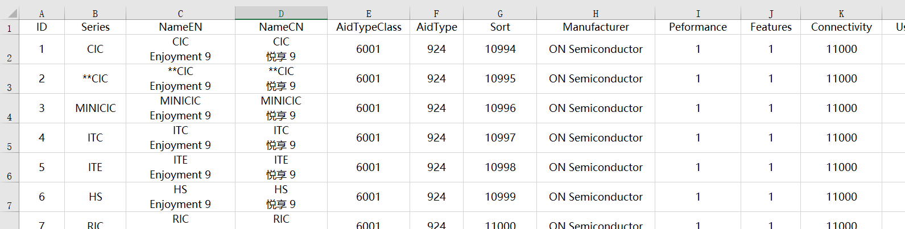
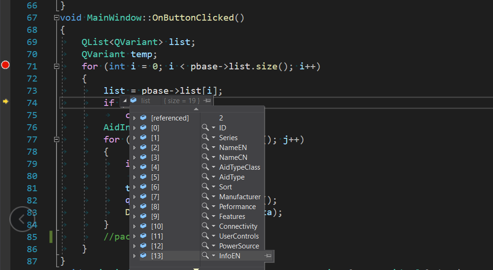
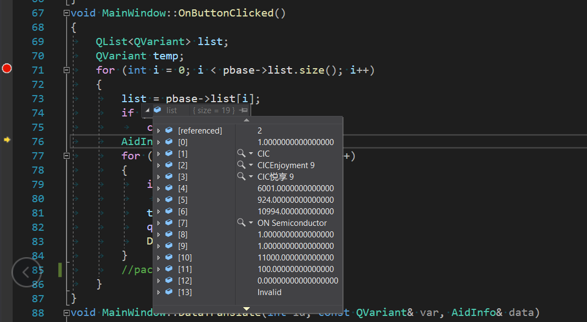
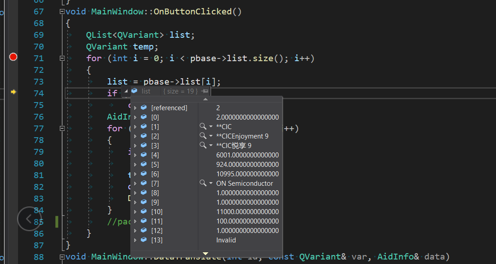
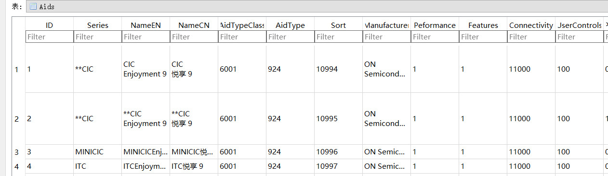

最近经常要往数据库里面写一些预定好的东西，给自己的软件用，但是经常要改动，如果用代码一条条的增加或者更新很麻烦，
索性就想找个偷懒的方法，然后想到excel表格跟我的数据库表格很类似，能不能直接解析excel文件那样就省事多了，我就可
以直接删除表格，重写整体插入。参考了网上很多博客，参差不齐，很多都是你抄我我抄你，跑不起来，不过还是起到了参考
价值，现在把我实现的代码记录下来。遇到的问题也得到了群里的很多大佬帮忙。
<!-- more -->
## 效果图
我需要解析的excel表


通过调试器查看解析的第一行数据


第二行数据


第三行数据


最后写入数据库


## 参考前请先阅读这里
&emsp;&emsp;使用这个需要安装office软件，它中间会启用它，我也没弄明白为啥要这样操作。接口方面主要看open()接口，其它接口我没有去测试过。
当然我还是保留下来，或许将来能用上。
当执行到`open()`函数的`workbook = workbooks->querySubObject("Open (const QString &)", strPath);//获取当前工作簿`这行代码，执行完
这句会弹出如下提示


一般到这个地方都表示你前面运行正确，也正确读取了，叉掉这个弹窗就好了。另外记得调用`open()`接口后一定要`close()`释放掉资源。

## excel表格解析出来用啥容器装
在这里用链表 `QList<QList<QVariant>> list;` 容器存储，最后映射成对应的数据就好了。
## baseexcel.h
```cpp
#ifndef BASEEXCEL_H
#define BASEEXCEL_H
#include <QObject>
#include <QString>
#include <ActiveQt/QAxObject>
#include <QList>
#include <QVariant>
class BaseExcel :public QObject
{
	Q_OBJECT
public:
	BaseExcel(QObject *parent = nullptr);
	~BaseExcel();

    //打开文件
    bool open(const QString &path);
    //关闭文件
    bool close();
    //获取工作表数量
    int getSheetsCount();
    //根据名称创建工作表
    QAxObject* addSheet(const QString &name);
    //根据名称删除工作表
    bool delSheet(const QString &name);
    //根据编号删除工作表
    bool delSheet(int index);
    //根据名称获取工作表
    QAxObject* getSheet(const QString &name);
    //根据编号获取工作表
    QAxObject* getSheet(int index);
    //获取行对象
    QAxObject* getRows(QAxObject* pSheet);
    //获取行数
    int getRowsCount(QAxObject* pSheet);
    //获取列对象
    QAxObject* getColumns(QAxObject* pSheet);
    //获取列数
    int getColumnsCount(QAxObject* pSheet);
    //根据行列值获取单元格值, 如: 3行，5列
    QString getCell(QAxObject* pSheet, int row, int column);
    //根据行列编号获取单元格值, 如: "F6"
    QString getCell(QAxObject* pSheet, const QString &number);
    //根据行列值设置单元格值
    bool setCell(QAxObject* pSheet, int row, int column, const QString &value);
    //根据行列编号设置单元格值
    bool setCell(QAxObject* pSheet, const QString &number, const QString &value);
public: 
    QList<QList<QVariant>> list;
private:
    QAxObject* excel;
    QAxObject* worksheets;
    QAxObject* worksheet;
    QAxObject* workbooks;
    QAxObject* workbook;
    QString    strPath;
};
#endif // !BASEEXCEL_H
```
## baseexcel.cpp
```cpp
#include "baseexcel.h"
#include <QDir>
#include <QFile>
#include <QDebug>
#include <objbase.h>
#include <qapplication.h>
BaseExcel::BaseExcel(QObject *parent):
	QObject(parent),
    excel(nullptr),
    worksheets(nullptr),
    worksheet(nullptr),
    workbooks(nullptr),
    workbook(nullptr),
    strPath("")
{

}
BaseExcel::~BaseExcel()
{
    list.clear();
}

bool BaseExcel::open(const QString &path)
{
    strPath = path;
    QString pathDir = QCoreApplication::applicationDirPath();
#ifdef _DEBUG
    pathDir.replace("/bin/Debug", "");
#else
    pathDir.replace("/bin/Release", "");
#endif
    strPath = pathDir + path;
    QFile file(strPath);
     if (!file.exists())
        return false;


    //CoInitializeEx(NULL, COINIT_MULTITHREADED);
   
    excel = new QAxObject();
    if (NULL == excel) {
        qCritical() << "Created excel object failed...";
        return false;
    }
    try {
        excel->setControl("Excel.Application");       //连接excel文件
        excel->dynamicCall("SetVisible(bool)", false);//显示窗体与否？
        excel->setProperty("DisplayAlerts", false);   //不显示任何警告信息， 如果置为true，会弹出类似“文件已修改，是否保存”的提示

        workbooks = excel->querySubObject("WorkBooks");//获取工作簿集合
        workbook = workbooks->querySubObject("Open (const QString &)", strPath);//获取当前工作簿

        worksheets = workbook->querySubObject("Sheets");        //获取工作表集合
        worksheet = worksheets->querySubObject("Item(int)", 1);//工作表1，即sheet1
        
        QAxObject* usedRange = worksheet->querySubObject("UsedRange");
        QVariant cell = usedRange->dynamicCall("value");

        QVariantList listTemp = cell.toList();
        const int rowCount = listTemp.size();
        QVariantList temp;
        for (int i = 0; i < rowCount; ++i)
        {
            temp = listTemp[i].toList();
            list.append(temp);
        }
    }
    catch (...) {
        qCritical() << "open failed...";
        return false;
    }
    return true;

    //读取sheet的范围
    //QVariantList params;
    //params << "A1" << "A5";  //A1至A5的数据

    //QAxObject* cell = worksheet->querySubObject("Range(QVariant,QVariant)", params);
    //QVariant excel_data = cell->dynamicCall("Value2()");
}

bool BaseExcel::close()
{
    qDebug() << "excel close...";
    if (excel)
    {
        qDebug() << "closing...";
        workbooks->dynamicCall("SaveAs(const QString&)", QDir::toNativeSeparators(strPath));
        workbooks->dynamicCall("Close()");
        excel->dynamicCall("Quit()");
        delete excel;
        excel = NULL;
    }
    return true;
}

int BaseExcel::getSheetsCount()
{
    int count = 0;
    count = worksheets->property("Count").toInt();
    return count;
}

QAxObject* BaseExcel::addSheet(const QString &name)
{
    QAxObject* pWorkSheet = NULL;
    try {
        int count = worksheets->property("Count").toInt();  //获取工作表数目
        QAxObject* pLastSheet = worksheets->querySubObject("Item(int)", count);
        pWorkSheet = worksheets->querySubObject("Add(QVariant)", pLastSheet->asVariant());
        pLastSheet->dynamicCall("Move(QVariant)", pWorkSheet->asVariant());
        pWorkSheet->setProperty("Name", name);  //设置工作表名称
    }
    catch (...) {
        qCritical() << "创建sheet失败...";
    }
    return pWorkSheet;
}

bool BaseExcel::delSheet(const QString &name)
{
    try {
        QAxObject* pFirstSheet = worksheets->querySubObject("Item(QString)", name);
        pFirstSheet->dynamicCall("delete");
    }
    catch (...) {
        qCritical() << "删除sheet失败...";
        return false;
    }
    return true;
}

bool BaseExcel::delSheet(int index)
{
    try {
        QAxObject* pFirstSheet = worksheets->querySubObject("Item(int)", index);
        pFirstSheet->dynamicCall("delete");
    }
    catch (...) {
        qCritical() << "删除sheet失败...";
        return false;
    }
    return true;
}

QAxObject* BaseExcel::getSheet(const QString &name)
{
    QAxObject* pWorkSheet = NULL;
    try {
        pWorkSheet = worksheets->querySubObject("Item(QString)", name);
    }
    catch (...) {
        qCritical() << "获取sheet失败...";
    }
    return pWorkSheet;
}

QAxObject* BaseExcel::getSheet(int index)
{
    QAxObject* pWorkSheet = NULL;
    try {
        pWorkSheet = worksheets->querySubObject("Item(int)", index);
    }
    catch (...) {
        qCritical() << "获取sheet失败...";
    }
    return pWorkSheet;
}

QAxObject* BaseExcel::getRows(QAxObject* pSheet)
{
    QAxObject* pRows = NULL;
    try {
        pRows = pSheet->querySubObject("Rows");
    }
    catch (...) {
        qCritical() << "获取行失败...";
    }
    return pRows;
}

int BaseExcel::getRowsCount(QAxObject* pSheet)
{
    int rows = 0;
    try {
        QAxObject* pRows = getRows(pSheet);
        rows = pRows->property("Count").toInt();
    }
    catch (...) {
        qCritical() << "获取行数失败...";
    }
    return rows;
}

QAxObject* BaseExcel::getColumns(QAxObject* pSheet)
{
    QAxObject* pColumns = NULL;
    try {
        pColumns = pSheet->querySubObject("Columns");
    }
    catch (...) {
        qCritical() << "获取列失败...";
    }
    return pColumns;
}

int BaseExcel::getColumnsCount(QAxObject* pSheet)
{
    int columns = 0;
    try {
        QAxObject* pColumns = getColumns(pSheet);
        columns = pColumns->property("Count").toInt();
    }
    catch (...) {
        qCritical() << "获取列数失败...";
    }
    return columns;
}

QString BaseExcel::getCell(QAxObject* pSheet, int row, int column)
{
    QString strCell = "";
    try {
        QAxObject* pCell = pSheet->querySubObject("Cells(int, int)", row, column);
        strCell = pCell->property("Value").toString();
    }
    catch (...) {
        qCritical() << "获取单元格信息失败...";
    }

    return strCell;
}

QString BaseExcel::getCell(QAxObject* pSheet, const QString &number)
{
    QString strCell = "";
    try {
        QAxObject* pCell = pSheet->querySubObject("Range(QString)", number);
        strCell = pCell->property("Value").toString();
    }
    catch (...) {
        qCritical() << "获取单元格信息失败...";
    }

    return strCell;
}

bool BaseExcel::setCell(QAxObject* pSheet, int row, int column, const QString &value)
{
    try {
        QAxObject* pCell = pSheet->querySubObject("Cells(int, int)", row, column);
        pCell->setProperty("Value", value);
    }
    catch (...) {
        qCritical() << "写入单元格信息失败...";
        return false;
    }
    return true;
}

bool BaseExcel::setCell(QAxObject* pSheet, const QString &number, const QString &value)
{
    try {
        QAxObject* pCell = pSheet->querySubObject("Range(QString)", number);
        pCell->setProperty("Value", value);
    }
    catch (...) {
        qCritical() << "写入单元格信息失败...";
        return false;
    }
    return true;
}
```
## 附录上我写入数据库的代码片段
```cpp
	QList<QVariant> list;
	QVariant temp;
	for (int i = 0; i < pbase->list.size(); i++)
	{
		list = pbase->list[i];//pbase是BaseExcel*类型
		if (0 == i)
			continue;
		AidInfo data = {0};//自己定义的数据库结构
		for (int j = 0; j < list.size(); j++)
		{
			if (0 == j)//ID 这一栏跳过，就相当于读取到的表头
				continue;
			temp = list[j];
			qDebug() << temp.toString();
			DataTranslate(j, temp, data);
		}
		pacoustics->AddAids(&data);
	}
```

