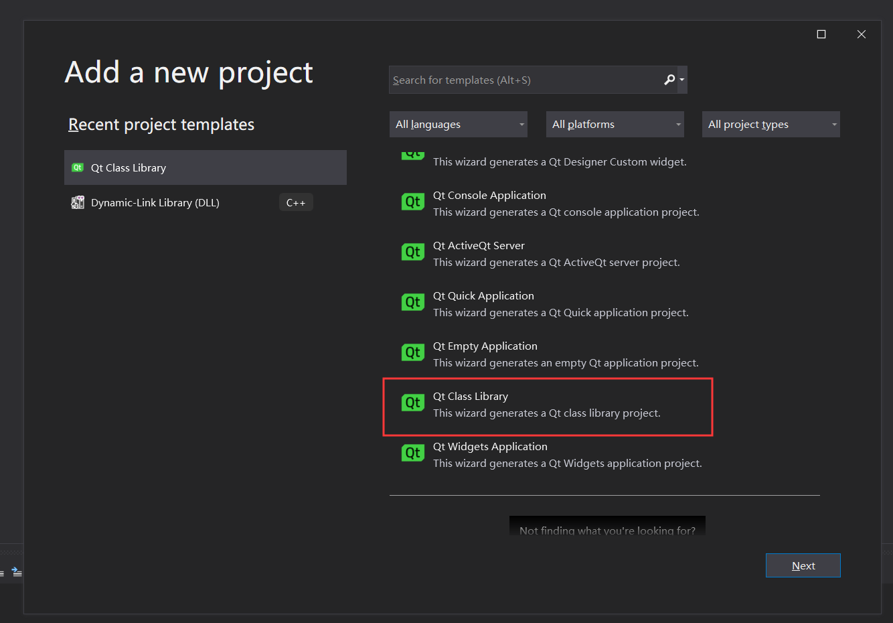
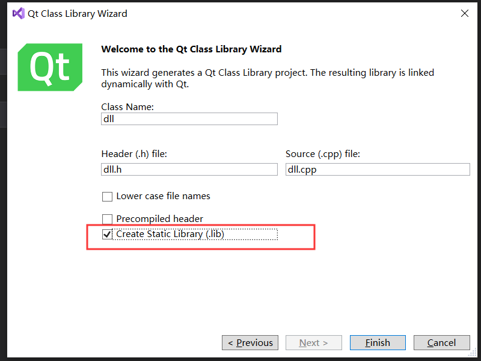
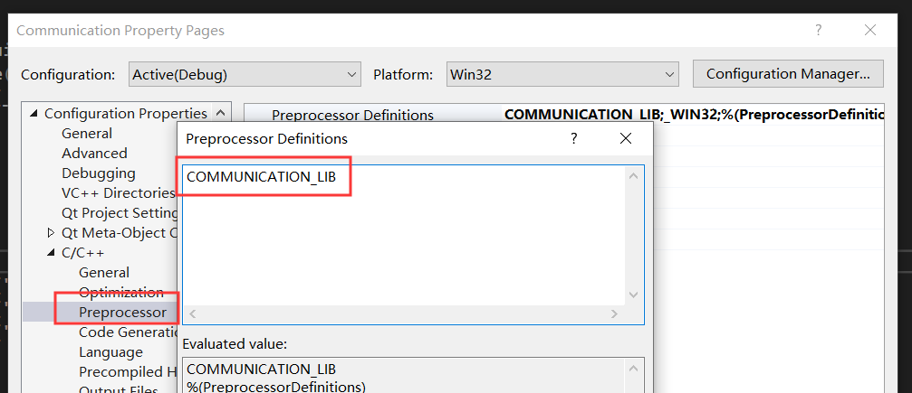
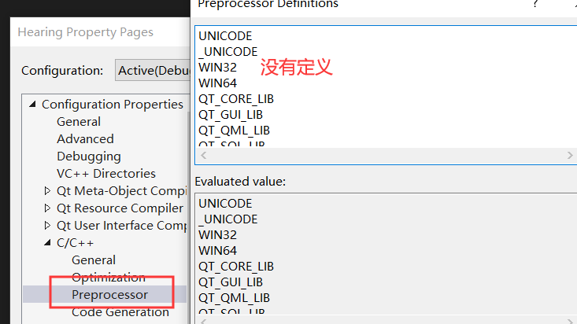
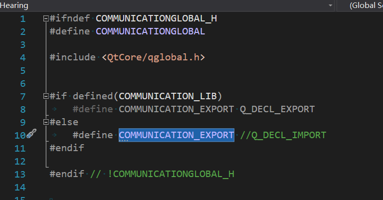

一个简单的类库创建过程，一波三折，好在千古大佬帮我远程，终于搞定了。感谢！最后都怪自己没事在那里瞎搞属性配置，自己给自己挖坑。
<!-- more -->
## 在解决方案下创建Qt类库项目
具体怎么创建不在这里赘述，一开始找了半天没有找到可以创建的类型，原来是项目创建模板那里要选择
`"All languages"` `"All platforms"` `"All project types"`往下翻，这样就可以看到Qt Class Library的创建模板了。



创建向导过程有一个地方需要注意的是，`Create Static Library (.lib)`勾选还是不勾选，如果勾选，代表只创建静态库(.lib)，
如果不勾选，静态库跟动态库(.lib和.dll)文件都会生成



可以看到创建好后会产生共用三个文件 `$(ProjectName).h $(ProjectName)_global.h $(ProjectName).cpp`
到这一步其实就算创建好了（如果你创建的类库没有静态成员），如果你创建的类库含有静态成员，那么编译会通过不了。
## 修改$(ProjectName)_global.h配置
```cpp

#ifndef COMMUNICATIONGLOBAL_H
#define COMMUNICATIONGLOBAL

#include <QtCore/qglobal.h>

#if defined(COMMUNICATION_LIB)
	#define COMMUNICATION_EXPORT Q_DECL_EXPORT
#else
	#define COMMUNICATION_EXPORT //Q_DECL_IMPORT
#endif

#endif // !COMMUNICATIONGLOBAL_H
```
我们跳转到定义看看 `Q_DECL_EXPORT` `Q_DECL_IMPORT`，可以看到是C++的导入导出说明符。
```CPP
#ifdef Q_OS_WIN
#define Q_DECL_EXPORT     __declspec(dllexport)
#define Q_DECL_IMPORT     __declspec(dllimport)
#elif defined(QT_VISIBILITY_AVAILABLE)
```
然后我们在回到$(ProjectName).h头文件里面来看，也就是我们的导出类库的头文件。这里我只展关键部代码。
```cpp
class COMMUNICATION_EXPORT Communication final : public QObject  //注意看这个宏COMMUNICATION_EXPORT
{
	Q_OBJECT
public:
	static Communication* GetInstance();
	~Communication();
}
```
因为我们类库头文件肯定最后要给其它项目使用，如果其它项目包含了这个头文件，那肯定不需要`Q_DECL_EXPORT`说明符生效
如果是生成dll的项目，那肯定就需要它生效了。所以这里需要通过判断有没有定义`COMMUNICATION_LIB`宏来判断它取用哪个
`COMMUNICATION_EXPORT`生效。
这样我们就可以在生成dll的项目定义一个`COMMUNICATION_LIB`宏，使用这个dll的项目就不定义这个宏。
下图为生成dll的项目添加了这个宏进去。

、

此时会导致 `#define COMMUNICATION_EXPORT Q_DECL_EXPORT`语句生效

在我的使用项目中不定义这个宏



可以看到，`#define COMMUNICATION_EXPORT //Q_DECL_IMPORT`语句生效。


