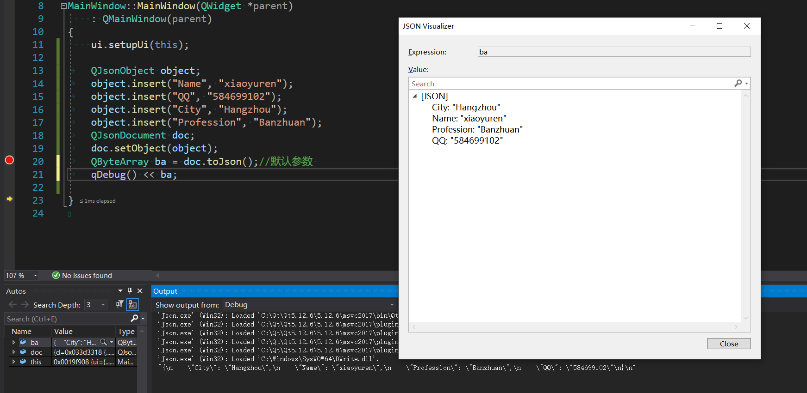
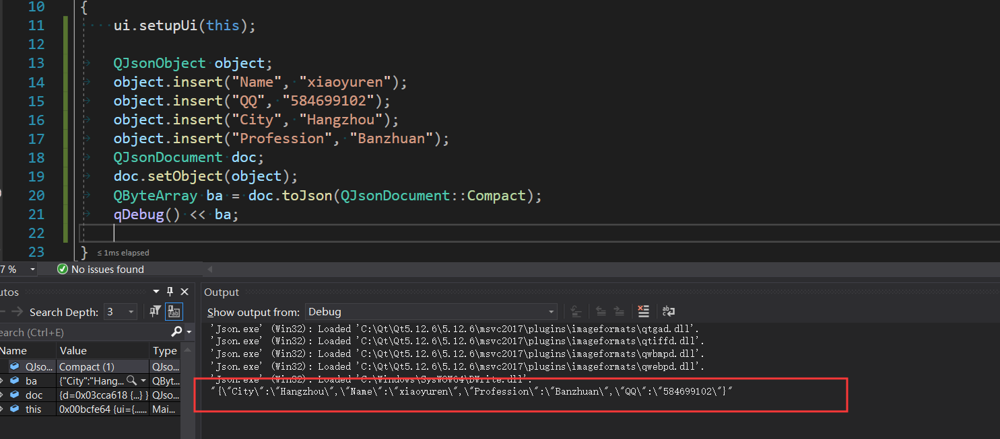
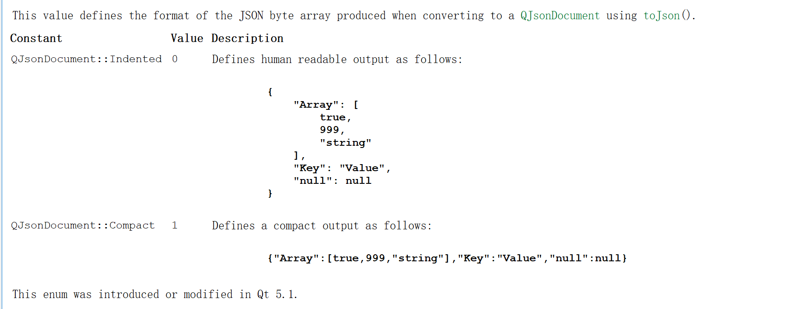
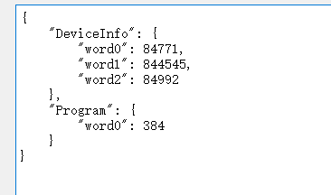
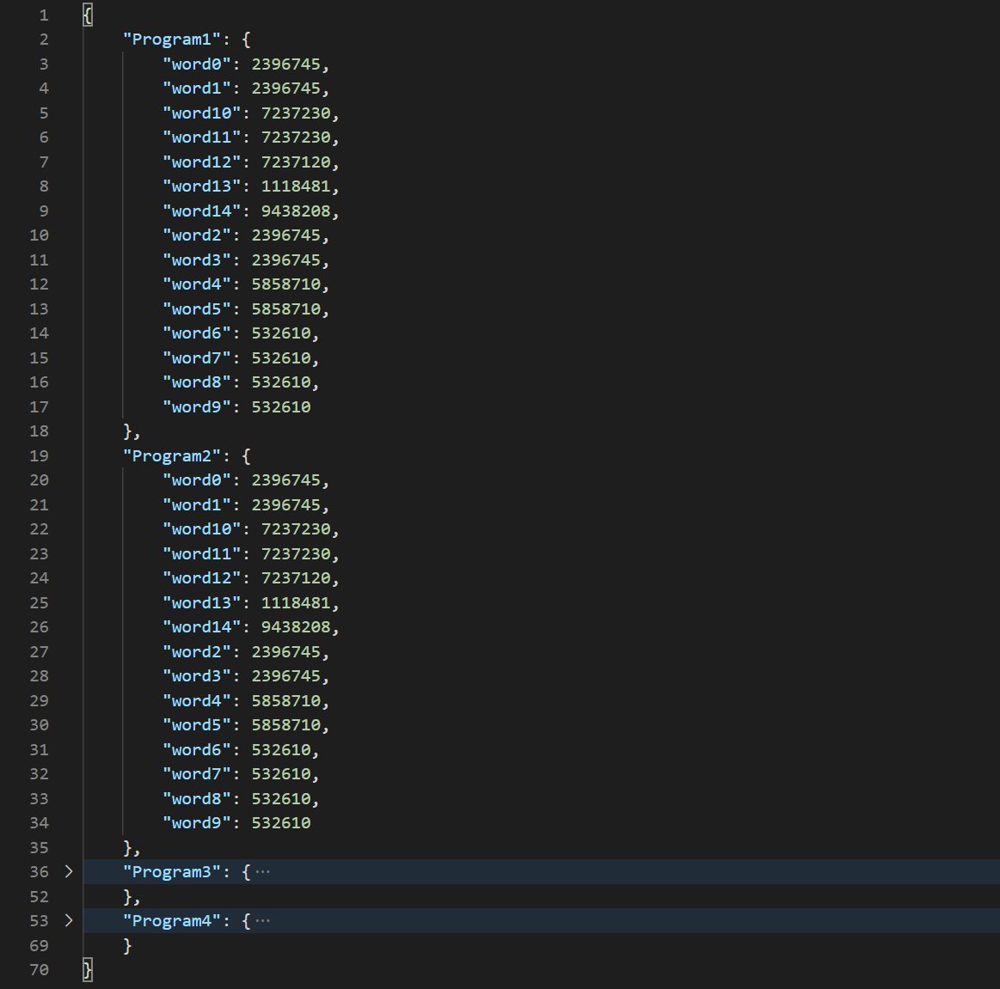
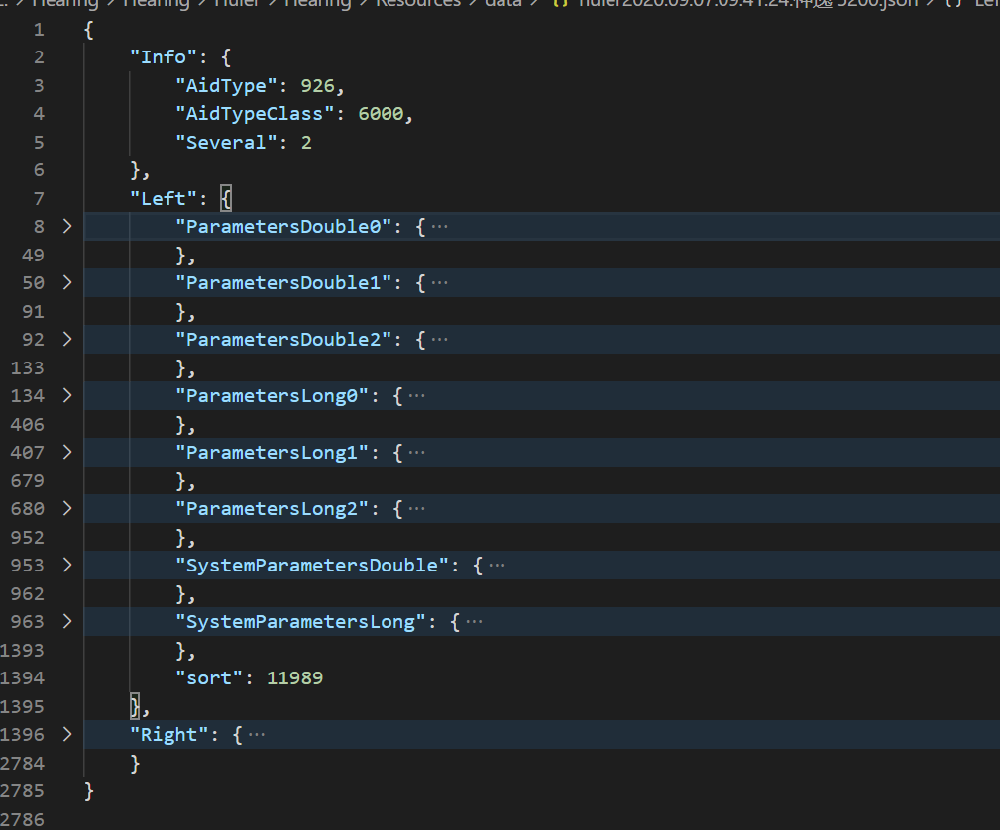

一直都想写篇关于Json的记录，经常忘记了，隔久了竟然有种不会写了的感觉，最后发现是自己没有理解透彻使用规则。刚好最近有使用，又捡起来了，基本上已经算有了自己的理解。
<!-- more -->

## Json数据类型
JSON是一种存储结构化数据的格式。它具有6种基本数据类型：
* bool
* double
* string
* array
* object
* null
值可以具有上述任何类型。`布尔值`由JSON中的字符串true或false表示。JSON没有显式指定数值的有效范围，但是在Qt里面限制为双精度`double`范围了。`string`可以是任何有效的unicode
字符串。`array`是数组（值列表），`object`是`key/value`对的集合，所有的`key`（键）在对象中是string类型，并且一个对象不能包含重复的键。JSON的文本表示形式将数组括在方括号
`[...]`中，将对象括在大括号`{...}`中,数组和对象中的条目以`逗号`分隔。对象中`key`和`value`之间的分隔符是冒号`:`。
来个简单的JSON文档：
```json
{
      "FirstName": "xiao",
      "LastName": "yuren",
      "Age": 35,
      "Address": {
          "Street": "Dongxin road, xiacheng district",
          "City": "Hangzhou",
          "Country": "China"
      },
      "Phone numbers": [
          "+86 10086",
          "+86 12306"
      ]
  }
```
## Qt里面的JSON相关的类
* **QJsonArray**                    Encapsulates a JSON array
* **QJsonDocument**                 Way to read and write JSON documents   
* **QJsonObject**                   Encapsulates a JSON object
* **QJsonParseError**               Used to report errors during JSON parsing
* **QJsonValue**                    Encapsulates a value in JSON
* **QJsonObject::const_iterator**   QJsonObject::const_iterator class provides an STL-style const iterator for QJsonObject
* **QJsonObject::iterator**         QJsonObject::iterator class provides an STL-style non-const iterator for QJsonObject

## 包含Qt相关头文件
```cpp
#include <QJsonParseError>
#include <QJsonDocument>
#include <QJsonObject>
#include <QJsonArray>
#include <QByteArray>
```
## JsonObject
QJsonObject可以直接插入数据，比如`obj.insert("xiaoyuren")`，`obj.insert.("name","xiaoyuren")`，当然还可以插入QJsonObject或者QJsonArray，
其实你想怎么嵌套就怎么嵌套，很方便的。可以利用QVariantMap或者QVariantHash来装载大量的数据，一个是排序一个是无序的。
```cpp
    QJsonObject object;
	object.insert("Name", "xiaoyuren");
	object.insert("QQ", "584699102");
	object.insert("City", "Hangzhou");
	object.insert("Profession", "Banzhuan");
	QJsonDocument doc;
	doc.setObject(object);
	QByteArray ba = doc.toJson();//默认参数
```
效果图（有空格间距）:



```cpp
    QJsonObject object;
	object.insert("Name", "xiaoyuren");
	object.insert("QQ", "584699102");
	object.insert("City", "Hangzhou");
	object.insert("Profession", "Banzhuan");
	QJsonDocument doc;
	doc.setObject(object);
	QByteArray ba = doc.toJson(QJsonDocument::Compact);//消除空格
```

效果图（无空格间距）:



QJsonDocument::toJson()的参数就是设置有无空格



## JsonArray
```cpp
    QJsonArray json;
	json.insert(0, "Master");
	json.insert(1, "Phone");
	json.insert(2, "TV");
	json.insert(3, "Music");
	QJsonDocument jsonDoc;
	jsonDoc.setArray(json);
    jsonDoc.toJson(QJsonDocument::Compact);
```
效果：`["Master","Phone","TV","Music"]`

```cpp
    QJsonArray json;
	json.insert(0, QString::fromLocal8Bit("主程序"));
	json.insert(1, QString::fromLocal8Bit("电话"));
	json.insert(2, QString::fromLocal8Bit("电视"));
	json.insert(3, QString::fromLocal8Bit("音乐"));
	QJsonDocument jsonDoc;
	jsonDoc.setArray(json);
	jsonDoc.toJson(QJsonDocument::Compact);
```
效果：`["主程序","电话","电视","音乐"]`

## 我自己项目中使用到的一些json代码片段
```cpp
    QVariantMap data;
	QVariantMap program1;
	QVariantMap program2;
	long value1[3]; //word0 word1 word2
	long value2;    //word0
    QString name;

    /*中间一些数据细节省略*/

	for (int i = 0; i < 3; i++)
	{
		name = QString("word%1").arg(i);
		program1.insert(name, value1[i]);
	}
	name = "word0";
	program2.insert(name, value2);
	data.insert("DeviceInfo", program1);
	data.insert("Program", program2);

	QJsonDocument jsonDoc;
	QJsonObject rootObj = QJsonObject::fromVariantMap(data);
	jsonDoc.setObject(rootObj);
    jsonDoc.toJson();//转为JSON形式
```
效果图：



```cpp
QByteArray Acoustics::SaveJson()
{
	// 使用QJsonArray添加值，并写入文件
	QVariantMap data;
	QVariantMap program1;
	QVariantMap program2;
	QVariantMap program3;
	QVariantMap program4;
	long value1[] = { 2396745, 2396745, 2396745, 2396745, 5858710, 5858710, 532610, 532610, 532610, 532610,
		/*mpo*/7237230, 7237230, 7237120, /*高级参数*/1118481, 9438208 };
	long value2[] = { 2396745, 2396745, 2396745, 2396745, 5858710, 5858710, 532610, 532610, 532610, 532610,
		/*mpo*/7237230, 7237230, 7237120, /*高级参数*/1118481, 9438208 };
	long value3[] = { 2396745, 2396745, 2396745, 2396745, 5858710, 5858710, 532610, 532610, 532610, 532610,
		/*mpo*/7237230, 7237230, 7237120, /*高级参数*/1118481, 9438208 };
	long value4[] = { 2396745, 2396745, 2396745, 2396745, 5858710, 5858710, 532610, 532610, 532610, 532610,
		/*mpo*/7237230, 7237230, 7237120, /*高级参数*/1118481, 9438208 };
	QString name;
	for (int i = 0; i < 15; i++)
	{
		name = QString("word%1").arg(i);
		program1.insert(name, value1[i]);
		program2.insert(name, value2[i]);
		program3.insert(name, value3[i]);
		program4.insert(name, value4[i]);
	}
	data.insert("Program1", program1);
	data.insert("Program2", program2);
	data.insert("Program3", program3);
	data.insert("Program4", program4);
	QJsonDocument jsonDoc;
	QJsonObject rootObj = QJsonObject::fromVariantMap(data);
	jsonDoc.setObject(rootObj);
	return jsonDoc.toJson();
}
```
效果图：



## 最后介绍下一个json文件拆解



这里根是一个QJsonObject然后整个对象包含了三个对象，看大括号，分别是"Info"、"Left"、"Right"三个对象。
其中"Info"对象下面还有三个key/value对；"Left"对象下含有8个对象和一个key/value对。所以最重要是知道`{}`和`[]`
所代表的含义一个是对象一个是数组，这样就可以无限套娃了，想做成什么样的json形式就做什么形式。
