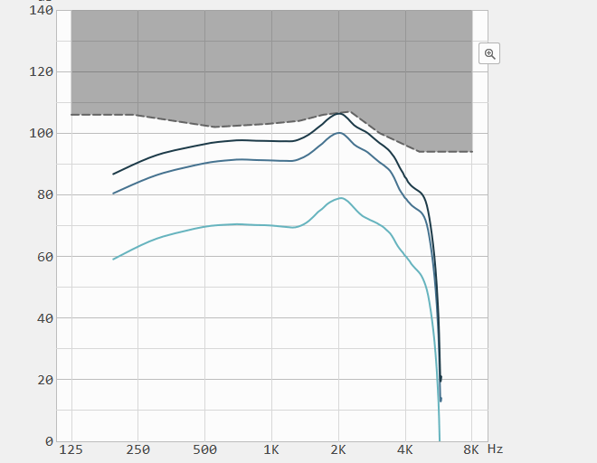

最近重写某些绘图接口，决定制作一个通用型的曲线接口，考虑到不同的曲线，绘制的方法可能不同，坐标点数不同，所以我在这里制作了一个可以动态改变曲线坐标点数的哈希表，这个也算我对哈希表的更上一个台阶的使用，在这里要感谢TaiwanProvince-vanxkr（夜叉大佬），给予了我很多帮助。这里我不结束接口的使用，只讲我自己的使用心得。
<!-- more -->
## 哈希表的存储方式
&emsp;&emsp;这个是我定义左两种不同的曲线坐标容器，里面可以存放
```cpp
QHash<GraphType, QHash<CurveType, QList<QPointF*>>> hashleft;   //QList<QSharedPointer<QPointF>> nullptr大佬建议我用智能指针
QHash<GraphType, QHash<CurveType, QList<QPointF*>>> hashright;  //QList<QSharedPointer<QPointF>>
```
其中GraphType跟CurveType是我定义的图类跟曲线类型
```cpp
//50/80/90曲线 频率500/1000/2000/4000
	enum CurveType
	{
		CURVE_50,		   //50
		CURVE_80,		   //80
		CURVE_90,		   //90
		CURVE_HA_LIMIT,    //HA_limit限制
		CURVE_FREQ_500,    //500 Hz
		CURVE_FREQ_1000,   //1000Hz
		CURVE_FREQ_2000,   //2000Hz
		CURVE_FREQ_4000,   //4000Hz
	};

	//曲线类型
	enum GraphType
	{
		OUTPUT_VS_FREQ,       //输出vs频率
		OUTPUT_VS_INPUT,      //输出vs输入
		GAIN_VS_INPUT         //增益vs输入
	};
```
## 来个这个曲线的效果图
&emsp;&emsp;操作比较慢，等一等可以观察到曲线变化。


## 创建曲线坐标点
&emsp;&emsp;这里我创建了不同Graph跟它对应的Curve坐标点
```cpp
HashCreate(bool isright)
{
	GraphType mgraphType = OUTPUT_VS_FREQ;
	if (isright)//右耳
	{
		switch (pcomunication->aidTypeRight)
		{
		case AidType::IDP_FANSCIANTION_5200:
		case AidType::IDP_FANSCIANTION_3200:
		case AidType::IDP_FANSCIANTION_2200:
		{
			mgraphType = OUTPUT_VS_FREQ;
			for (int i = 0; i <= 2; i++)
			{
				switch (i)
				{
				case 0:
					curveType = CURVE_50;
					break;
				case 1:
					curveType = CURVE_80;
					break;
				case 2:
					curveType = CURVE_90;
					break;
				default:
					break;
				}
				for (int j = 0; j < 79; j++)
				{
					hashright[mgraphType][curveType].append(new QPointF(0.0, 0.0));
				}
			}
			//HA_limit
			curveType = CURVE_HA_LIMIT;
			for (int i = 0; i < 8; i++)
			{
				hashright[mgraphType][curveType].append(new QPointF(0.0, 0.0));
			}
			
			for (int k = 0; k <= 1; k++)
			{
				switch (k)
				{
				case 0:
					mgraphType = OUTPUT_VS_INPUT;
					break;
				case 1:
					mgraphType = GAIN_VS_INPUT;
					break;
				default:
					break;
				}
				for (int i = 0; i < 4; i++)
				{
					switch (i)
					{
					case 0:
						curveType = CURVE_FREQ_500;
						break;
					case 1:
						curveType = CURVE_FREQ_1000;
						break;
					case 2:
						curveType = CURVE_FREQ_2000;
						break;
					case 3:
						curveType = CURVE_FREQ_4000;
					default:
						break;
					}
					for (int j = 0; j < 51; j++)
					{
						hashright[mgraphType][curveType].append(new QPointF(0.0, 0.0));
					}
				}
			}
		}
			break;
		case AidType::IDP_CTK:
			break;
		default:
			break;
		}
	}
	else        //左耳
	{
		switch (pcomunication->aidTypeLeft)
		{
		case AidType::IDP_FANSCIANTION_5200:
		case AidType::IDP_FANSCIANTION_3200:
		case AidType::IDP_FANSCIANTION_2200:
		{
			mgraphType = OUTPUT_VS_FREQ;
			for (int i = 0; i <= 2; i++)
			{
				switch (i)
				{
				case 0:
					curveType = CURVE_50;
					break;
				case 1:
					curveType = CURVE_80;
					break;
				case 2:
					curveType = CURVE_90;
					break;
				default:
					break;
				}
				for (int j = 0; j < 79; j++)
				{
					hashleft[mgraphType][curveType].append(new QPointF(0.0, 0.0));
				}
			}

			//HA_limit
			curveType = CURVE_HA_LIMIT;
			for (int i = 0; i < 8; i++)
			{
				hashleft[mgraphType][curveType].append(new QPointF(0.0, 0.0));
			}
			for (int k = 0; k <= 1; k++)
			{
				switch (k)
				{
				case 0:
					mgraphType = OUTPUT_VS_INPUT;
					break;
				case 1:
					mgraphType = GAIN_VS_INPUT;
					break;
				default:
					break;
				}
				for (int i = 0; i < 4; i++)
				{
					switch (i)
					{
					case 0:
						curveType = CURVE_FREQ_500;
						break;
					case 1:
						curveType = CURVE_FREQ_1000;
						break;
					case 2:
						curveType = CURVE_FREQ_2000;
						break;
					case 3:
						curveType = CURVE_FREQ_4000;
					default:
						break;
					}
					for (int j = 0; j < 51; j++)
					{
						hashleft[mgraphType][curveType].append(new QPointF(0.0, 0.0));
					}
				}
			}
		}
			break;
		case AidType::IDP_CTK:
			break;
		default:
			break;
		}
	}
}

```

## 销毁所有哈希表中的坐标点
&emsp;&emsp;通过遍历的方式去delete
```cpp
HashClear(bool isright)
{
	//遍历出来释放资源
	if (isright)//右耳
	{
		if (hashright.size() > 0)
		{
			QHash<GraphType, QHash<CurveType, QList<QPointF*>>>::iterator i = hashright.begin();
			while (i != hashright.end())
			{
				QHash<CurveType, QList<QPointF*>>::iterator j = i.value().begin();
				while (j != i.value().end())
				{
					while (!j.value().isEmpty())
					{
						delete j.value().takeFirst();
					}
					j++;
				}
				i++;
			}
			hashright.clear();
		}
	}
	else        //左耳
	{
		if (hashleft.size() > 0)
		{
			QHash<GraphType, QHash<CurveType, QList<QPointF*>>>::iterator i = hashleft.begin();
			while (i != hashleft.end())
			{
				QHash<CurveType, QList<QPointF*>>::iterator j = i.value().begin();
				while (j != i.value().end())
				{
					while (!j.value().isEmpty())
					{
						delete j.value().takeFirst();
					}
					j++;
				}
				i++;
			}
			hashleft.clear();
		}
	}
}
```
## 更新坐标点的数据
&emsp;&emsp;这里我给出部分代码，更新OUTPUT_VS_FREQ == graphType，对应的图类，它旗下有4条曲线。CURVE_50/CURVE_80/CURVE_90/CURVE_HA_LIMIT。
```cpp
void UpdateHash()
{
        //含有就不需要new了,直接使用，不含有就需要删除之前的数据，再创建。
		if (!listright.contains(static_cast<int>(pcomunication->aidTypeRight)))
		{
			if (listright.size() != 0)
				HashClear();
			else
			{
				HashCreate();//创建右耳需要的数据
				//创建好后就把标志添加进去，此后会通过listleft里面是否含有这个型号的Num来判别
				listright.append(static_cast<int>(pcomunication->aidTypeRight));
			}

		}

		//输出vs频率
		if (OUTPUT_VS_FREQ == graphType)
		{
			double level[3] = { 50.0,80.0,90.0 };
			for (int i = 0; i <= 2; i++)
			{
				switch (i)
				{
				case 0:
					curveType = CURVE_50;
					break;
				case 1:
					curveType = CURVE_80;
					break;
				case 2:
					curveType = CURVE_90;
					break;
				default:
					break;
				}
				
				
				CComBSTR inLev = "InputLevel";
				hr = pcomunication->m_graphSettings->GetById(inLev, &inputlevelSetting);
				if (SUCCEEDED(hr))
				{
					hr = inputlevelSetting->put_DoubleValue(level[i]);
					Q_ASSERT(SUCCEEDED(hr));
				}
				else
					pcomunication->HandleCOMException();
				
				
				/*hr = pcomunication->m_Graph->SetDomain(FREQDATA_LEN - 1, &pcomunication->freqin.m_psa);
				Q_ASSERT(SUCCEEDED(hr));*/
				
				hr = pcomunication->m_Graph->CalculatePoints(79, &frequencyresponse.m_psa);
				Q_ASSERT(SUCCEEDED(hr));
				
				int num = 2;
				for (auto p : hashright[graphType][curveType])
				{
					p->setX(GetX(m, num * 100) + mlength / 28.0);
					rval = frequencyresponse[num - 2];
					//if (i == 2)
					//{
					//	if (pcomunication->descriptionNumRight == 8 ||
					//		pcomunication->descriptionNumRight == 1 ||
					//		pcomunication->descriptionNumRight == 2)//**CIC ITC ITE
					//	{
					//		if (rval >= 130)
					//			rval = 130;
					//		rval -= 60;//60--120
					//	}
					//	else
					//		rval -= 50;//50--110
					//}
					//else
					//	rval -= level[i];
					rval = -(rval / 20.0) * m;	 //将值转换为负值，对应后面的坐标
					p->setY(rval);
					num++;
				}
				frequencyresponse.Destroy();
			}
			//MPO
			const double FREQ[8]   = { 250,625,1125,1620,2125,2875,4000,6250 };
			curveType = CURVE_HA_LIMIT;
			QVector<long> vector = pcomunication->GetMPO7111();
			int index = 0;
			if (vector.size() == 8)
				for (auto p : hashright[graphType][curveType])
				{
					p->setY(-(vector[index] * m / 20.0));//先取出Y的增益，然后计算y坐标
					p->setX(GetX(m, FREQ[index]) + mlength / 28.0);
					index++;
				}
			

		}
}
```

## 总结
&emsp;&emsp;`QHash<GraphType, QHash<CurveType, QList<QPointF*>>>`之所以选择QPointF*，是因为我曾经在使用OpenGL用存储对象的方式来操作吃了暗亏，当数据量很大的时候，就容易出异常的问题。所以用new的方式更稳妥，没有采用nullptr大佬说的智能指针我觉得，只要小心释放资源，自己来管理还是更开心点的。这个表实际上就相当于树形，也类似windows下的文件夹系统，一个节点可以存放很多儿子。儿子又可以存放很多孙子，而且取用孙子节点的速度还很快，用的是[]数组下标索引。
