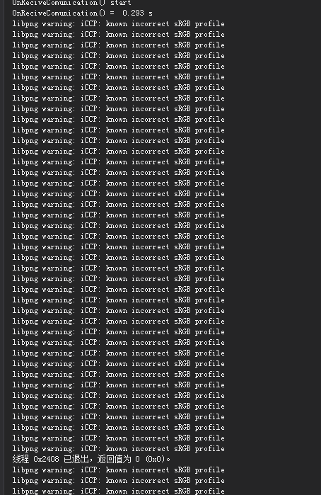
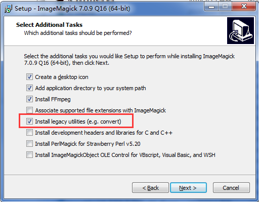

老是一大堆的这种警告，很烦！而且最近几个月我的日志系统工作到一定范围就不工作了，我有理由怀疑是这个警告造成的，不管怎么说先把这个警告问题消除掉再说
<!-- more -->
## 编译错误提示

## 解决办法
* 去官网下载ImageMagick, [https://imagemagick.org/script/download.php#windows](https://imagemagick.org/script/download.php#windows)
* 安装过程中注意勾选Install legacy utilities (e.g. convert)这项，这个是我们要用到的工具，默认是不勾选的，你需要手动勾选上去。另外安装路径最好不要有中文

* 在Qt的资源文件夹下，新建一个convert.bat文件，并存储一下内容
```
@echo off
echo ImageMagick fix libpng warning: iCCP: Not recognizing known sRGB profile ......
echo Search PNG in subdirs and process ...
set fn=E:\Program Files\ImageMagick-7.0.9-Q16\convert.exe
for /f "tokens=*" %%i in ('dir/s/b *.png') do "%fn%" "%%i" -strip "%%i"
pause
```
* 保存，运行消除警告。
