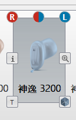
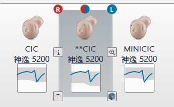
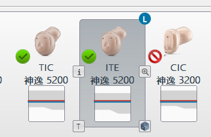
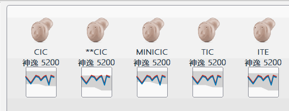

2020年新的一天，祝大家元旦快！路漫漫其修远兮，吾将上下而求索。
<!-- more -->
## 去年的效果跟目前的效果对比
&emsp;&emsp;这个是去年做的效果，当时得到了脏脏鱼大佬跟TM大佬的帮助，说实话当时能做到这样的效果已经不错了，但是还是留下些遗憾。
没有达到最理想的效果，当时受制于QStandarItem只能设置一个QIcon跟一个Text，最终只能做出这样的效果。


这个是前段时间实现的效果，得到了输入大佬跟猫咪大佬的帮助，用代理实现了我最终想要的效果，可以看到增加了阴影范围绘制跟曲
线绘制，我认为这东西是我今年做的算不错的东西啦。



再来一个Gif图看看效果


## 实现
&emsp;&emsp;代理本质上利用了Qt的绘制功能，也就是说你想绘制啥都行，绘制图片，绘制曲线，绘制text。因为我的QListView的item，不同的
Item可能会需要用到不同的曲线、不同的阴影范围、不同的图片（当然我这里暂时用的同一张图片）和不同的text。基本上不同的东西就这些了，
当然可能还有数量的不同。所以应该为代理的item创建一个专属的存放数据的结构体。

## mulistitemdata.h
```cpp
#ifndef MULISTITEMDATA_H
#define MULISTITEMDATA_H

#include <QPointF>
#include <QMetaType>

typedef struct
{
	QVector<QPointF>shadow; //阴影范围数据
    QString iconPath;       //icon路径  
    QString text;           //item名称
	bool able;              //禁用或者开启绘制状态图标  详细请查看muitemdelegate paint函数 
	bool select;            //选择图标或者禁用图标状态                                     
} MuItemData;

Q_DECLARE_METATYPE(MuItemData)

#endif // MULISTITEMDATA_H
```
## muitemdelegate.h
这里就是我们的代理相关的头文件
```cpp
#ifndef MUITEMDELEGATE_H
#define MUITEMDELEGATE_H

#include <QVector>
#include <QPointF>
#include <QStyledItemDelegate>

class MuItemDelegate : public QStyledItemDelegate
{
public:
    MuItemDelegate(QObject *parent = nullptr);
	~MuItemDelegate();
	void Init();

	/********************************************
	* @return 返回x的坐标长度
	* @grid 单个格子的x大小
	* @double 频率大小
	********************************************/
	double GetX(double freq, double grid = 10.0);

	void SetAudioGram(const QVector<double>&left, const QVector<double>&right);

    // painting
    void paint(QPainter *painter,
               const QStyleOptionViewItem &option, const QModelIndex &index) const Q_DECL_OVERRIDE;

    QSize sizeHint(const QStyleOptionViewItem &option,
                   const QModelIndex &index) const Q_DECL_OVERRIDE;
	static QVector<QPointF>left;   //左耳曲线图
	static QVector<QPointF>right;  //右耳曲线
};

#endif // MUITEMDELEGATE_H
```

## muitemdelegate.cpp
&emsp;&emsp;绘制相关过程都在paint函数里面这里绘制你需要得到的效果。
sizeHint函数这里180是你item的高度，这个你一定要设置下，它会影响你item画布的高度。
```cpp
#include "MuItemDelegate.h"
#include "MuListItemData.h"
#include <qmath.h>
#include <QPainter>
#include <QDebug>

//静态数据成员定义
QVector<QPointF>MuItemDelegate::left;   //左耳曲线图
QVector<QPointF>MuItemDelegate::right;  //右耳曲线

MuItemDelegate::MuItemDelegate(QObject *parent) :
    QStyledItemDelegate(parent)
{
	Init();
}
MuItemDelegate::~MuItemDelegate()
{
	left.clear();
	right.clear();
}
void MuItemDelegate::Init()
{
	left.resize(11);
	right.resize(11);
	for (int i = 0; i < left.size(); i++)
	{
		left[i].setY(-1);
	}
	for (int i = 0; i < right.size(); i++)
	{
		right[i].setY(-1);
	}
	/****数据初始化过程省略......****/

}
double MuItemDelegate::GetX(double freq, double gridx)
{
	/***********数据转换代码省略...*******/
	return a;
}
void MuItemDelegate::SetAudioGram(const QVector<double> &mleft, const QVector<double> &mright)
{
	/****数据初始化过程省略......****/
		
}
void MuItemDelegate::paint(QPainter *p, const QStyleOptionViewItem &option, const QModelIndex &index) const
{

	if (index.isValid()) 
	{
		p->save();
		QVariant var = index.data(Qt::UserRole + 1);
		MuItemData itemData = var.value<MuItemData>();

		// item 矩形区域
		QRectF rect;
		rect.setX(option.rect.x());
		rect.setY(option.rect.y());
		rect.setWidth(option.rect.width() - 1);
		rect.setHeight(option.rect.height() - 1);

		QPainterPath path;
		path.moveTo(rect.topRight());
		path.lineTo(rect.topLeft());
		path.quadTo(rect.topLeft(), rect.topLeft());
		path.lineTo(rect.bottomLeft());
		path.quadTo(rect.bottomLeft(), rect.bottomLeft());
		path.lineTo(rect.bottomRight());
		path.quadTo(rect.bottomRight(), rect.bottomRight());
		path.lineTo(rect.topRight());
		path.quadTo(rect.topRight(), rect.topRight());

		// 鼠标悬停或者选中时改变背景色
		if (option.state.testFlag(QStyle::State_MouseOver)) {
			//QStyledItemDelegate::paint(painter, option, index);
		}
		if (option.state.testFlag(QStyle::State_Selected)) {
			QStyledItemDelegate::paint(p, option, index);
		}

		// 绘制图片，歌手，数量位置区域
		QRectF iconRect = QRect(rect.left() + (rect.right() - rect.left()) / 2 - 25, rect.top() +  12, 50, 50);
		QRectF singerRect = QRect(rect.left(), rect.top() + 70, 110, 40);
		p->setRenderHint(QPainter::Antialiasing, true);//设置反锯齿渲染模式
		p->drawImage(iconRect, QImage(itemData.iconPath));
		p->setPen(QPen(QColor(45, 62, 75), 1, Qt::SolidLine, Qt::RoundCap, Qt::RoundJoin));
		p->setFont(QFont("Microsoft YaHei", 9, QFont::Medium, false));
		p->drawText(singerRect, Qt::AlignCenter, itemData.text);
		

		if (itemData.able)
		{
			if (itemData.select)
			{
				p->drawImage(QRect(rect.left() + 4, rect.top() + 50, 24, 24),
					QImage(":/MainWindow/Resources/icon/ok24.png"));
			}
			else
			{
				//警告不匹配图片
				p->drawImage(QRect(rect.left() + 4, rect.top() + 50, 24, 24),
					QImage(":/MainWindow/Resources/icon/cancel24.png"));
			}
		}

		/*p->drawImage(QRect(rect.left() + 77, rect.top() + 50, 32, 32),
			QImage(":/MainWindow/Resources/icon/forbidden.png"));*/

		//绘制光亮曲线点
		p->setBrush(QBrush(QColor(250, 250, 250)));
		p->setPen(QPen(QColor(131, 134, 145), 1, Qt::SolidLine, Qt::RoundCap, Qt::RoundJoin));
		p->setRenderHint(QPainter::Antialiasing, false);//设置反锯齿渲染模式
		p->drawRoundedRect(QRect(rect.left() + 25, rect.top() + 110, 60, 60), 2, 2);
		p->translate(rect.left() + 25, rect.top() + 110);

		//阴影范围曲线图
		const double Y = 60.0 / 7.0;
		QPainterPath pathShadow;
		if (0 != itemData.shadow.size())
		{
			itemData.shadow[0].setY((itemData.shadow[0].y() / 20.0) * Y);
			pathShadow.moveTo(itemData.shadow[0]);
			for (int i = 1; i < itemData.shadow.size(); i++)
			{
				itemData.shadow[i].setY((itemData.shadow[i].y() / 20.0) * Y);
				pathShadow.lineTo(itemData.shadow[i]);
			}
		}
		QBrush brush{ QColor(50,50,50,50),Qt::SolidPattern }; //阴影画刷颜色
		p->setBrush(brush);
		p->setPen(Qt::NoPen);
		p->setRenderHint(QPainter::Antialiasing, true);//设置反锯齿渲染模式
		p->drawPath(pathShadow);

		//右耳曲线
		p->setRenderHint(QPainter::Antialiasing, true);//设置反锯齿渲染模式
		p->setPen(QPen(QColor(196, 42, 31, 255), 2, Qt::SolidLine, Qt::RoundCap, Qt::RoundJoin));
		QPainterPath pathright;
		/*********曲线数据装过程载省略***********/
		p->setBrush(Qt::NoBrush);
		p->drawPath(pathright);


		//左耳曲线
		p->setPen(QPen(QColor(0, 117, 180, 255), 2, Qt::SolidLine, Qt::RoundCap, Qt::RoundJoin));
		QPainterPath pathleft;
		/*********曲线数据装过程载省略***********/
		p->drawPath(pathleft);

		p->restore();
		//QStyledItemDelegate::paint(painter, option, index);
	}
}
QSize MuItemDelegate::sizeHint(const QStyleOptionViewItem &option, const QModelIndex &index) const
{
    Q_UNUSED(index)
    return QSize(option.rect.width(), 180);
}

```
## 最后当然是要知道怎么使用这玩意了
万事俱备，只欠东风！
```cpp
QStandardItemModel *model = new QStandardItemModel();//获取项目的根节点

	const int SIZE = 16; //这里我创建了16个项
	for (int i = 0; i < SIZE; i++)
	{
		auto pitem = new QStandardItem;//这个地方就用到了item数据结构，在paint会用到它
		MuItemData itemData;
		itemData.shadow = ReturnItemShadow(i);
		itemData.iconPath = ReturnItemIconPath(i);
		itemData.text = ReturnItemText(i);
		itemData.able = false;
		itemData.select = true;
		//pitem->setFont(QFont("Microsoft YaHei", 9, QFont::Normal, false));
		pitem->setData(QVariant::fromValue(itemData), Qt::UserRole + 1);
		model->appendRow(pitem);
	}
	MuItemDelegate *pItemDelegate = new MuItemDelegate(this);  //创建代理                          
	ui->listView->setItemDelegate(pItemDelegate);//设置代理
	ui->listView->setModel(model);//为QListView设置model
```
## 补充
&emsp;&emsp;你的item数量或者需要绘制的东西可能是需要改变的，如果需要改变item数量，重新new再设置model，它自己会将之前的item delete掉
另外要取得不同的绘制就需要像我这里设置不同的状态开关，itemData.able/itemData.select之类的。好了再次祝大家工作顺利！

