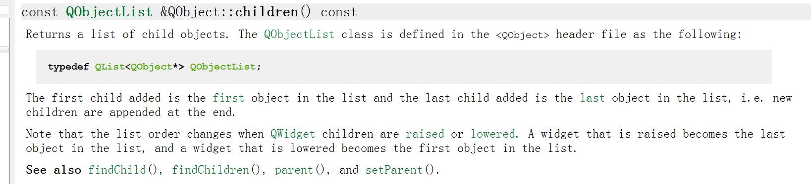
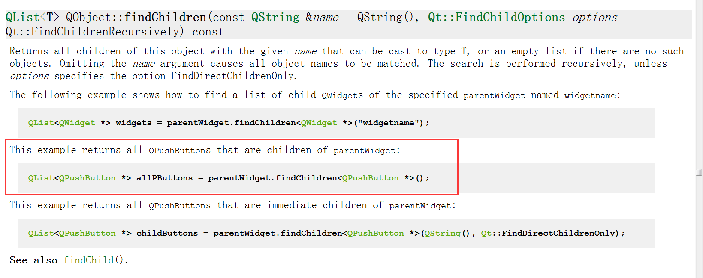
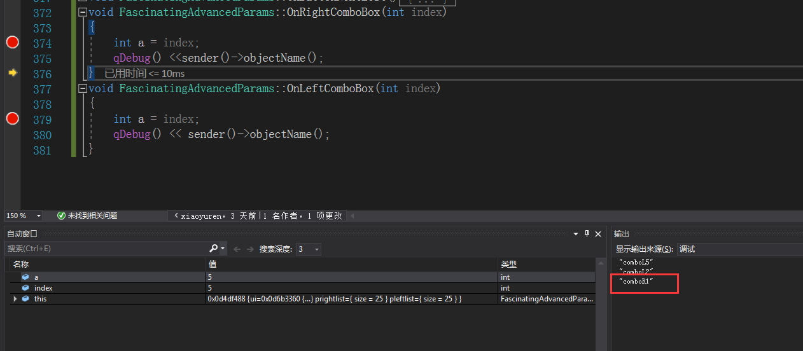

最近一直搞不明白怎么遍历指定类型所有的对象，去请教TM大佬，也请教过狗哥，都给了我很大的启发，发现之前我写的代码很low，现在决定高大上一会。在详细读了QObject的接口，终于找到了我所需的接口。
<!-- more -->
## 获取所有对象const QObjectList &QObject::children() const
&emsp;&emsp;接口源文档说明：


## 利用QObject::findChildren返回指定类类型的接口对象
&emsp;&emsp;接口原文档说明：


利用红框中的 QList<QPushButton *> allPButtons = parentWidget.findChildren<QPushButton *>();可以返回指定类类型的所有children。

## Code
```cpp
//获取当前类的所有QComBox对象
//代理
	QStyledItemDelegate *delegate = new QStyledItemDelegate(this);
	QList<QComboBox *> allComboBox = this->findChildren<QComboBox *>();
	if (allComboBox.size() != 0)
	{
		QString ear;
		QList<QComboBox *>::const_iterator i;
		//遍历容器
		for (i = allComboBox.constBegin(); i != allComboBox.constEnd(); i++)
		{
			qDebug() << (*i)->objectName();
			//获取动态属性ear的值
			ear = (*i)->property("ear").toString();
  			//根据属性值进行归类，或者信号与槽连接
			if (ear == "right")
			{
				QObject::connect((*i), SIGNAL(activated(int)), this, SLOT(OnRightComboBox(int)));
			}
			else if (ear == "left")
			{
				QObject::connect((*i), SIGNAL(activated(int)), this, SLOT(OnLeftComboBox(int)));
			}
			(*i)->setItemDelegate(delegate);
		}
	}
	allComboBox.clear();

```

## 实际测试效果


可以看到信号与槽顺利绑定，根据sender()->objectName()可以知道是谁发送了信号。
