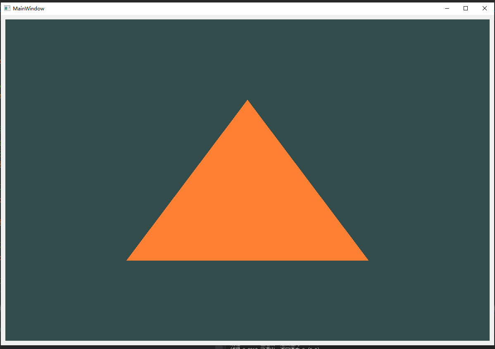

利用Qt实现opengl绘制第一个三角形。<!-- more -->
## 三角形效果图


## triangle.h文件
```cpp
#ifndef TRIANGLE_H
#define TRIANGLE_H

#include <QOpenGLWidget>
#include <QOpenGLFunctions_3_3_Core>

class QOpenGLShaderProgram;
class TriangleWidget : public QOpenGLWidget, protected QOpenGLFunctions_3_3_Core
{
public:
	explicit TriangleWidget(QWidget *parent = 0);
	~TriangleWidget();
protected:
	virtual void initializeGL();
	virtual void resizeGL(int width, int height);
	virtual void paintGL();
private:
	//着色器程序
	QOpenGLShaderProgram *program;
	//GLuint对象指针
	GLuint *pVAO;
	GLuint *pVBO;
};
#endif //TRIANGLE_H
```
## triangle.cpp文件
```cpp
#include "triangle.h"
#include <QOpenGLShaderProgram>
#include <QDebug>

TriangleWidget::TriangleWidget(QWidget *parent):QOpenGLWidget(parent),
	program(new QOpenGLShaderProgram),
	pVAO(new GLuint[2]{}),
	pVBO(new GLuint[2]{})
{
	//设置OpenGL的版本信息  
	QSurfaceFormat format;
	format.setRenderableType(QSurfaceFormat::OpenGL);
	format.setProfile(QSurfaceFormat::CoreProfile);
	//指定opengl版本为3.3
	format.setVersion(3, 3);
	setFormat(format);
}

TriangleWidget::~TriangleWidget() 
{
	//删除所有之前添加到program的着色器
	program->removeAllShaders();
	if (program)
	{
		delete program;
		program = nullptr;
	}
	if (pVAO)
	{
		delete[] pVAO;
		pVAO = nullptr;
	}
	if (pVBO)
	{
		delete[] pVBO;
		pVBO = nullptr;
	}
}

void TriangleWidget::initializeGL() 
{
	//初始化OpenGL函数,这个函数不能少，不然会导致软件崩溃
	initializeOpenGLFunctions();
	//设置全局变量  
	glClearColor(0.2f, 0.3f, 0.3f, 1.0f);
	//这里不指定父类，我们自己来管理这个类
	//program = new QOpenGLShaderProgram;
	//将文件内容编译为指定类型的着色器，并将其添加到着色器程序program
	if (!program->addShaderFromSourceFile(QOpenGLShader::Vertex, "Resources/shader/triangle.vert"))
	{
		//如果执行不成功，打印错误信息
		qDebug() << "compile error" << program->log();
	}
	if (!program->addShaderFromSourceFile(QOpenGLShader::Fragment, "Resources/shader/triangle.frag"))
	{
		//如果执行不成功，打印错误信息
		qDebug() << "compile error" << program->log();
	}
	//将顶点着色器跟片元着色器链接起来
	if (!program->link())
	{
		//如果连接不成功，打印错误信息
		qDebug() << "link error" << program->log();
	}

	//设置三角形的三个顶点数据
	GLfloat vertices[] = 
	{
	-0.5f, -0.5f, 0.0f,
	 0.5f, -0.5f, 0.0f,
	 0.0f,  0.5f, 0.0f
	};

	/*
	函数原型 void glGenBuffers(GLsizei n,GLuint * buffers);
	返回n个缓冲区对象名到数组buffers中
	*/
	glGenBuffers(1, pVBO);
	//创建一个VAO
	glGenVertexArrays(1, pVAO);

	//pVAO[0]是glGenVertexArrays返回的顶点数组对象的名称
	glBindVertexArray(pVAO[0]);
	//绑定数据
	glBindBuffer(GL_ARRAY_BUFFER, pVBO[0]);
	//拷贝数据到缓冲区
	glBufferData(GL_ARRAY_BUFFER, sizeof(vertices), vertices, GL_STATIC_DRAW);
	glVertexAttribPointer(0, 3, GL_FLOAT, GL_FALSE, 3 * sizeof(GLfloat), (void *)0);
	glEnableVertexAttribArray(0);

	glBindBuffer(GL_ARRAY_BUFFER, 0);
	glBindVertexArray(0);//结束记录状态信息 
}

void TriangleWidget::resizeGL(int width, int height) 
{
	glViewport(0, 0, width, height);
}

void TriangleWidget::paintGL() 
{
	glClearColor(0.2f, 0.3f, 0.3f, 1.0f);
	glClear(GL_COLOR_BUFFER_BIT);
	if (!program->bind())
	{
		qDebug() << "bind error" << program->log();
	}
	glBindVertexArray(pVAO[0]);
	glDrawArrays(GL_TRIANGLES, 0, 3);
	program->release();
	update();
}
```
## 顶点着色器文件
&emsp;&emsp;在项目路径opengl/Resources/shader/triangle.vert创建顶点着色器文件
向该文件写入以下内容
```
#version 330 core

layout (location = 0) in vec3 position;

void main()
{
    gl_Position = vec4(position.x, position.y, position.z, 1.0);
}
```

## 编译着色器文件 (triangle.frag)
&emsp;&emsp;在项目路径opengl/Resources/shader/triangle.frag创建编译着色器文件
向该文件写入以下内容
```
#version 330 core

out vec4 color;

void main()
{
    color = vec4(1.0f, 0.5f, 0.2f, 1.0f);
}
```

## 接口函数说明
&emsp;&emsp;在这里主要对opengl的函数作用说明，Qt的封装类我现在还没完全弄明白暂时先放一放...待以后补充。
官方接口说明：[**https://www.khronos.org/registry/OpenGL-Refpages/gl4/**](https://www.khronos.org/registry/OpenGL-Refpages/gl4/)

## void glGenBuffers(GLsizei n, GLuint *buffers);
```
Parameters
n
Specifies the number of buffer object names to be generated.

buffers
Specifies an array in which the generated buffer object names are stored.

Description
glGenBuffers returns n buffer object names in buffers. There is no guarantee that the names form a contiguous set of integers; however, it is guaranteed that none of the returned names was in use immediately before the call to glGenBuffers.

Buffer object names returned by a call to glGenBuffers are not returned by subsequent calls, unless they are first deleted with glDeleteBuffers.

No buffer objects are associated with the returned buffer object names until they are first bound by calling glBindBuffer.

Errors
GL_INVALID_VALUE is generated if n is negative.

```

## void glGenVertexArrays(GLsizei n, GLuint *arrays);
```
Parameters
n
Specifies the number of vertex array object names to generate.

arrays
Specifies an array in which the generated vertex array object names are stored.

Description
glGenVertexArrays returns n vertex array object names in arrays. There is no guarantee that the names form a contiguous set of integers; however, it is guaranteed that none of the returned names was in use immediately before the call to glGenVertexArrays.

Vertex array object names returned by a call to glGenVertexArrays are not returned by subsequent calls, unless they are first deleted with glDeleteVertexArrays.

The names returned in arrays are marked as used, for the purposes of glGenVertexArrays only, but they acquire state and type only when they are first bound.

Errors
GL_INVALID_VALUE is generated if n is negative.
```
## void glBufferData(GLenum target, GLsizeiptr size, const GLvoid *data, GLenum usage);
 &emsp;&emsp;以及 void glNamedBufferData(GLuint buffer, GLsizeiptr size, const void *data, GLenum usage);
``` 
Parameters
target
Specifies the target to which the buffer object is bound for glBufferData, which must be one of the buffer binding targets in the following table:
```
|Buffer Binding Target|	Purpose|
| ----------------------| ------------------------|
|GL_ARRAY_BUFFER	|Vertex attributes|
|GL_ATOMIC_COUNTER_BUFFER	|Atomic counter storage|
|GL_COPY_READ_BUFFER	|Buffer copy source|
|GL_COPY_WRITE_BUFFER	|Buffer copy destination|
|GL_DISPATCH_INDIRECT_BUFFER	|Indirect compute dispatch commands|
|GL_DRAW_INDIRECT_BUFFER	|Indirect command arguments|
|GL_ELEMENT_ARRAY_BUFFER	|Vertex array indices|
|GL_PIXEL_PACK_BUFFER	|Pixel read target|
|GL_PIXEL_UNPACK_BUFFER	|Texture data source|
|GL_QUERY_BUFFER	|Query result buffer|
|GL_SHADER_STORAGE_BUFFER	|Read-write storage for shaders|
|GL_TEXTURE_BUFFER	|Texture data buffer|
|GL_TRANSFORM_FEEDBACK_BUFFER	|Transform feedback buffer|
|GL_UNIFORM_BUFFER	|Uniform block storage|
```
buffer
Specifies the name of the buffer object for glNamedBufferData function.

size
Specifies the size in bytes of the buffer object's new data store.

data
Specifies a pointer to data that will be copied into the data store for initialization, or NULL if no data is to be copied.

usage
Specifies the expected usage pattern of the data store. The symbolic constant must be GL_STREAM_DRAW, GL_STREAM_READ, GL_STREAM_COPY, GL_STATIC_DRAW, GL_STATIC_READ, GL_STATIC_COPY, GL_DYNAMIC_DRAW, GL_DYNAMIC_READ, or GL_DYNAMIC_COPY.
```