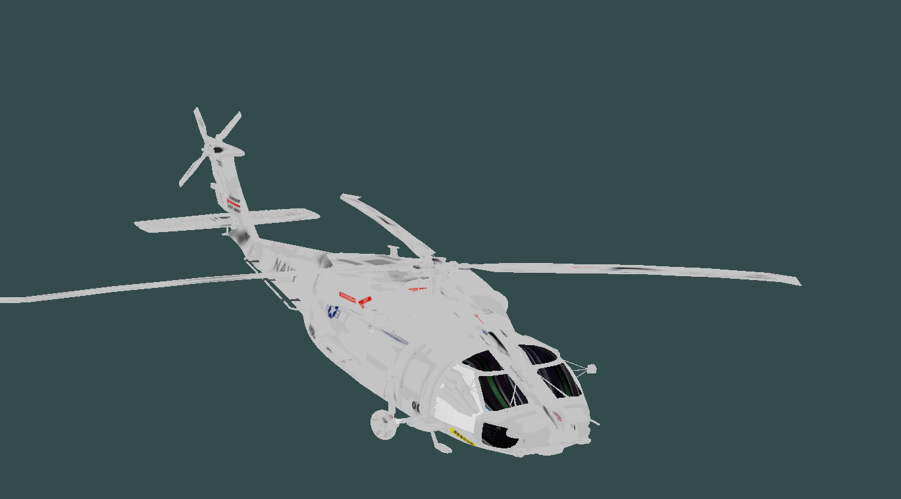

能成功导入模型，在这里要感谢坑神、心魔及Icy等等大佬的帮助。作为一个人要去勇敢的尝试自己未知的领域，不要守着自己的一亩三分地，那样只会永远止步不前。失败了不可怕，要有勇气去面对挫折。<!-- more -->
## 效果图
&emsp;&emsp;如果效果图没有出来，请刷新试试


## 参考网站
&emsp;&emsp;参考learnopengl的模型加载章节：[**https://learnopengl.com/Model-Loading/Assimp**](https://learnopengl.com/Model-Loading/Assimp)
assimp库怎么导入项目就不赘述，作为一个程序员导入库到项目属于基本操作。
assimp库的官方网站：[**http://assimp.sourceforge.net/lib_html/index.html**](http://assimp.sourceforge.net/lib_html/index.html)
该库支持的3D模型文件：
```
Collada ( *.dae;*.xml )
Blender ( *.blend ) 3
Biovision BVH ( *.bvh ) 
3D Studio Max 3DS ( *.3ds ) 
3D Studio Max ASE ( *.ase ) 
Wavefront Object ( *.obj ) 
Stanford Polygon Library ( *.ply ) 
AutoCAD DXF ( *.dxf ) 
IFC-STEP, Industry Foundation Classes ( *.ifc )
Neutral File Format ( *.nff ) 
Sense8 WorldToolkit ( *.nff ) 
Valve Model ( *.smd,*.vta ) 3 
Quake I ( *.mdl ) 
Quake II ( *.md2 ) 
Quake III ( *.md3 ) 
Quake 3 BSP ( *.pk3 ) 1 
RtCW ( *.mdc )
Doom 3 ( *.md5mesh;*.md5anim;*.md5camera ) 
DirectX X ( *.x ). 
Quick3D ( *.q3o;q3s ). 
Raw Triangles ( .raw ). 
AC3D ( *.ac ). 
Stereolithography ( *.stl ). 
Autodesk DXF ( *.dxf ). 
Irrlicht Mesh ( *.irrmesh;*.xml ). 
Irrlicht Scene ( *.irr;*.xml ). 
Object File Format ( *.off ). 
Terragen Terrain ( *.ter ) 
3D GameStudio Model ( *.mdl ) 
3D GameStudio Terrain ( *.hmp )
Ogre (*.mesh.xml, *.skeleton.xml, *.material)3 
Milkshape 3D ( *.ms3d )
LightWave Model ( *.lwo )
LightWave Scene ( *.lws )
Modo Model ( *.lxo )
CharacterStudio Motion ( *.csm )
Stanford Ply ( *.ply )
TrueSpace ( *.cob, *.scn )2
XGL ( *.xgl, *.zgl )
```
不是这些格式的文件解析不了。楼主亲测了一些格式的文件确实解析不了。
## vertex.h
```cpp
#ifndef VERTEX_H
#define VERTEX_H

#include <QVector3D>
#include <QVector2D>

//顶点类
struct Vertex
{
	QVector3D Position; //位置
	QVector3D Normal;   //法向量
	QVector2D TexCoords;//纹理坐标
	//QVector3D Tangent;  //u向量
	//QVector3D Bitangent;//v向量
};
#endif // !VERTEX_H
```
## texture.h
```cpp
#ifndef TEXTURE_H
#define TEXTURE_H

#include <QString>
#include <QOpenGLTexture>
#include <QSharedPointer>

//纹理
struct Texture
{
	QString type;
	QString filename;
	QSharedPointer<QOpenGLTexture> texture;
};

#endif // !TEXTURE_H
```
## mesh.h
```cpp
#ifndef MESH_H
#define MESH_H
#include "vertex.h"
#include "texture.h"

#include <vector>
#include <string>

#include "qopenglfunctions_3_3_core.h"
class QOpenGLShaderProgram;

class Mesh : protected QOpenGLFunctions_3_3_Core
{
public:
	Mesh() = default;
	~Mesh();
	//构造
	Mesh(const std::vector<Vertex> &vertices, const std::vector<GLuint> &indices,
		const std::vector<Texture> &textures);
	//画网格模型
	void draw(QOpenGLShaderProgram *program);
	//顶点
	std::vector<Vertex> vertices;
	//索引
	std::vector<GLuint> indices;
	//纹理
	std::vector<Texture> textures;
	//是否进行过setupMesh初始化操作
	bool isinitialized;
	GLuint VAO;
	GLuint VBO;
	GLuint EBO;
private:
	// 初始化所有缓冲区对象/数组
	void setupMesh(QOpenGLShaderProgram *program);
};

#endif // !MESH_H
```
## mesh.cpp
```cpp
#include "mesh.h"
#include <QString>
#include <QOpenGLShaderProgram>
Mesh::Mesh(const std::vector<Vertex> &vertice, const std::vector<GLuint> &indice,
	const std::vector<Texture> &texture):
	vertices(vertice),
	indices(indice),
	textures(texture),
	isinitialized(false)
{
	//初始化OpenGL函数  
	initializeOpenGLFunctions();
}
Mesh::~Mesh()
{
	glDeleteBuffers(1, &VAO);
	glDeleteBuffers(1, &VBO);
	glDeleteBuffers(1, &EBO);
}
void Mesh::setupMesh(QOpenGLShaderProgram *program)
{
	// 创建缓冲区/数组
	glGenVertexArrays(1, &VAO);
	glGenBuffers(1, &VBO);
	glGenBuffers(1, &EBO);

	glBindVertexArray(VAO);
	//将数据加载到顶点缓冲区中
	glBindBuffer(GL_ARRAY_BUFFER, VBO);
	// 关于结构的一个好处是它们的内存布局对于它的所有项都是顺序的。
	// 结果是我们可以简单地将指针传递给结构，并且它完美地转换为glm :: vec3 / 2数组，该数组再次转换为3/2浮点数，转换为字节数组。
	glBufferData(GL_ARRAY_BUFFER, vertices.size() * sizeof(Vertex), vertices.data()/*&vertices[0]*/, GL_STATIC_DRAW);
	glBindBuffer(GL_ELEMENT_ARRAY_BUFFER, EBO);
	glBufferData(GL_ELEMENT_ARRAY_BUFFER, indices.size() * sizeof(unsigned int), indices.data()/*&indices[0]*/, GL_STATIC_DRAW);
	// 设置顶点属性指针
	// 顶点位置
	glEnableVertexAttribArray(0);
	glVertexAttribPointer(0, 3, GL_FLOAT, GL_FALSE, sizeof(Vertex), (void *)0);
	// 顶点法线
	glEnableVertexAttribArray(1);
	glVertexAttribPointer(1, 3, GL_FLOAT, GL_FALSE, sizeof(Vertex), (void *)offsetof(Vertex, Normal));
	// 顶点纹理坐标
	glEnableVertexAttribArray(2);
	glVertexAttribPointer(2, 2, GL_FLOAT, GL_FALSE, sizeof(Vertex), (void *)offsetof(Vertex, TexCoords));
	// u向量
	//glEnableVertexAttribArray(3);
	//glVertexAttribPointer(3, 3, GL_FLOAT, GL_FALSE, sizeof(Vertex), (void *)offsetof(Vertex, Tangent));
	// v向量
	//glEnableVertexAttribArray(4);
	//glVertexAttribPointer(4, 3, GL_FLOAT, GL_FALSE, sizeof(Vertex), (void *)offsetof(Vertex, Bitangent));
	glBindVertexArray(0);
}
void Mesh::draw(QOpenGLShaderProgram *program)
{

	if (!isinitialized)
	{
		setupMesh(program);
		//setupMesh进行了初始化，状态置为true
		isinitialized = true;
	}
	
	// bind appropriate textures
	unsigned int diffuseNr = 1;
	unsigned int specularNr = 1;
	unsigned int normalNr = 1;
	unsigned int heightNr = 1;
	for (unsigned int i = 0; i < textures.size(); i++)
	{
		
		// retrieve texture number (the N in diffuse_textureN)
		QString number;
		QString type = textures[i].type;
		if (type == "texture_diffuse")
			number = QString::number(diffuseNr++);
		else if (type == "texture_specular")
			number = QString::number(specularNr++); // transfer unsigned int to stream
		else if (type == "texture_normal")
			number = QString::number(normalNr++);   // transfer unsigned int to stream
		else if (type == "texture_height")
			number = QString::number(heightNr++);   // transfer unsigned int to stream
		qDebug() << QString(type + number).toLocal8Bit().constData();
		program->setUniformValue(QString(type + number).toLocal8Bit().constData(), i);
		textures[i].texture->bind(static_cast<unsigned int>(i));
	}

	// draw mesh
	glBindVertexArray(VAO);
	glDrawElements(GL_TRIANGLES, indices.size(), GL_UNSIGNED_INT, 0);
	glBindVertexArray(0);
}
```
## model.h
```cpp
#ifndef MODEL_H
#define MODEL_H
#include "mesh.h"
#include <QString>
#include <vector>
#include <assimp/Importer.hpp>
#include <assimp/scene.h>
#include <assimp/postprocess.h>

struct aiMesh;
struct aiScene;
class QString;
class QOpenGLTexture;
class Model
{
public:
	Model() = default;
	explicit Model(const QString& path);
	~Model();
	//加载模型
	bool loadModel(const QString &path);
	

	void processNode(aiNode *node, const aiScene *scene);
	Mesh *processMesh(aiMesh *mesh, const aiScene *scene);

	/////////////////////////////////////
	bool initFromScene(const aiScene *pscene, const QString &path);
	Mesh *initMesh(const aiScene *pscene, const aiMesh *pmesh);
	/////////////////////////////////////


	//QSharedPointer<QOpenGLTexture> textureFile();
	std::vector<Texture> loadMaterialTextures(aiMaterial *material, aiTextureType type, const QString &typeName);
	
	void draw(QOpenGLShaderProgram *program);
	//目录
	QString directory;
	std::vector<Mesh *> meshes;
	std::vector<Texture> textures_loaded;
};
#endif // !MODEL_H

```
## model.cpp
```cpp
#include "model.h"
#include <string>
#include <QImage>
#include <QDebug>
#include <QSharedPointer>
#include <QOpenGLTexture>
static QSharedPointer<QOpenGLTexture> textureFromFile(const QString &path, const QString &directory)
{
	QString fileName = directory + '/' + path;

	QImage image(fileName);
	QSharedPointer<QOpenGLTexture> texture(new QOpenGLTexture(image));

	texture->setWrapMode(QOpenGLTexture::DirectionS, QOpenGLTexture::Repeat);
	texture->setWrapMode(QOpenGLTexture::DirectionT, QOpenGLTexture::Repeat);
	texture->setMinificationFilter(QOpenGLTexture::LinearMipMapLinear);
	texture->setMagnificationFilter(QOpenGLTexture::Linear);
	return texture;
}
Model::Model(const QString &path)
{
	//Clear();
	if (!loadModel(path))
	{
		qDebug() << "Model init failed!";
	}
}
Model::~Model()
{
	for (unsigned int i = 0; i < meshes.size(); i++)
	{
		delete meshes[i];
	}
	meshes.clear();
}
bool Model::loadModel(const QString &path)
{
	if (path.isEmpty())
	{
		return false;
	}
	// 通过ASSIMP读文件
	Assimp::Importer importer;
	const aiScene *pscene = importer.ReadFile(path.toLocal8Bit().constData(), aiProcess_Triangulate | aiProcess_FlipUVs);
	// 检查错误
	if (!pscene || pscene->mFlags & AI_SCENE_FLAGS_INCOMPLETE || !pscene->mRootNode) // 如果不是0
	{
		qDebug() << "error::ASSIMP:: " << importer.GetErrorString() << endl;
		return false;
	}
	//返回路径字符串最后一次出现'/'的最左边的字符串，也就是文件的目录。
	directory = path.left(path.lastIndexOf('/'));
	bool ret(false);
	if (pscene)
	{
        //如果采用前两行代码，遍历所有的网格
		//如果采用现在没注释的代码，表示通过父类遍历子类。具有父子关系
		//int a = pscene->mRootNode->mNumChildren;
		//ret = initFromScene(pscene, path);
		processNode(pscene->mRootNode, pscene);
	}
	return ret;
}

void Model::processNode(aiNode *node, const aiScene *scene)
{
	for (unsigned int i = 0; i < node->mNumMeshes; ++i) {
		aiMesh *mesh = scene->mMeshes[node->mMeshes[i]];
		meshes.push_back(processMesh(mesh, scene));
	}
	for (unsigned int i = 0; i < node->mNumChildren; ++i)
		processNode(node->mChildren[i], scene);
}
Mesh* Model::processMesh(aiMesh *pmesh, const aiScene *pscene)
{
	std::vector<Vertex> vertices;
	std::vector<GLuint> indices;
	std::vector<Texture> textures;
	//打印网格的顶点数值
	qDebug() << "Vertices = " << pmesh->mNumVertices;
	//是否存在顶点数据
	if (pmesh->HasPositions())
	{
		for (unsigned int i = 0; i < pmesh->mNumVertices; i++)
		{
			Vertex vertex;
			QVector3D vector;
			//位置
			vector.setX(pmesh->mVertices[i].x);
			vector.setY(pmesh->mVertices[i].y);
			vector.setZ(pmesh->mVertices[i].z);
			vertex.Position = vector;
			//法线是否存在？
			if (pmesh->HasNormals())
			{
				vector.setX(pmesh->mNormals[i].x);
				vector.setY(pmesh->mNormals[i].y);
				vector.setZ(pmesh->mNormals[i].z);
				vertex.Normal = vector;
			}

			//// 纹理坐标是否存在
			//if (pmesh->HasTextureCoords(i))
			//{

			//}
			// 顶点最多可包含8个不同的纹理坐标。我们只关心第一个纹理坐标
			if (pmesh->mTextureCoords[0])
			{
				QVector2D vec;
				vec.setX(pmesh->mTextureCoords[0][i].x);
				vec.setY(pmesh->mTextureCoords[0][i].y);
				vertex.TexCoords = vec;
			}
			else
				vertex.TexCoords = QVector2D(0.0f, 0.0f);

			////UV向量是否存在？
			//if (pmesh->HasTangentsAndBitangents())
			//{
			//	// u向量
			//	vector.setX(mesh->mTangents[i].x);
			//	vector.setY(mesh->mTangents[i].y);
			//	vector.setZ(mesh->mTangents[i].z);
			//	vertex.Tangent = vector;
			//	// v向量
			//	vector.setX(mesh->mBitangents[i].x);
			//	vector.setY(mesh->mBitangents[i].y);
			//	vector.setZ(mesh->mBitangents[i].z);
			//}
			vertices.push_back(vertex);
		}
	}
	//现在遍历每个网格面（一个面是一个三角形的网格）并检索相应的顶点索引。
	for (unsigned int i = 0; i < pmesh->mNumFaces; i++)
	{
		aiFace face = pmesh->mFaces[i];
		// 检索面的所有索引并将它们存储在索引向量中
		for (unsigned int j = 0; j < face.mNumIndices; j++)
			indices.push_back(face.mIndices[j]);
	}

	//场景中包含材质？
	if (pscene->HasMaterials())
	{
		aiMaterial *material = pscene->mMaterials[pmesh->mMaterialIndex];
		// 1. diffuse maps
		std::vector<Texture> diffuseMaps = loadMaterialTextures(material, aiTextureType_DIFFUSE, "texture_diffuse");
		textures.insert(textures.end(), diffuseMaps.begin(), diffuseMaps.end());
		// 2. specular maps
		std::vector<Texture> specularMaps = loadMaterialTextures(material, aiTextureType_SPECULAR, "texture_specular");
		textures.insert(textures.end(), specularMaps.begin(), specularMaps.end());
		// 3. normal maps
		std::vector<Texture> normalMaps = loadMaterialTextures(material, aiTextureType_HEIGHT, "texture_normal");
		textures.insert(textures.end(), normalMaps.begin(), normalMaps.end());
		// 4. height maps
		std::vector<Texture> heightMaps = loadMaterialTextures(material, aiTextureType_AMBIENT, "texture_height");
		textures.insert(textures.end(), heightMaps.begin(), heightMaps.end());
	}
	return new Mesh(vertices, indices, textures);
}
bool Model::initFromScene(const aiScene *pscene, const QString &filename)
{
	bool ret(true);
	//场景中包含动画？
	if (pscene->HasAnimations())
	{
		for (unsigned int i = 0; i < pscene->mNumAnimations; i++)
		{
			const aiAnimation *panimation = pscene->mAnimations[i];
		}
	}
	//场景中包含相机？
	if (pscene->HasCameras())
	{
		//int a = 10;
	}
	//场景中包含光照？
	if (pscene->HasLights())
	{
		//int a = 10;
	}
	
	//场景中包含网格？
	if (pscene->HasMeshes())
	{
		for (unsigned int i = 0; i < pscene->mNumMeshes; i++)
		{
			const aiMesh *pmesh = pscene->mMeshes[i];
			Mesh *me = initMesh(pscene, pmesh);
			meshes.push_back(me);
		}
	}
	//场景中包含纹理？
	if (pscene->HasTextures())
	{
		int a = 10;
	}

	return ret;
}
void Model::draw(QOpenGLShaderProgram *program)
{
	for (unsigned int i = 0; i < meshes.size(); i++)
		meshes[i]->draw(program);
}
Mesh *Model::initMesh(const aiScene *pscene, const aiMesh *pmesh)
{
	std::vector<Vertex> vertices;
	std::vector<GLuint> indices;
	std::vector<Texture> textures;
	//打印网格的顶点数值
	qDebug() << "Vertices = " << pmesh->mNumVertices;
	//是否存在顶点数据
	if (pmesh->HasPositions())
	{
		for (unsigned int i = 0; i < pmesh->mNumVertices; i++)
		{
			Vertex vertex;
			QVector3D vector;
			//位置
			vector.setX(pmesh->mVertices[i].x);
			vector.setY(pmesh->mVertices[i].y);
			vector.setZ(pmesh->mVertices[i].z);
			vertex.Position = vector;
			//法线是否存在？
			if (pmesh->HasNormals())
			{
				vector.setX(pmesh->mNormals[i].x);
				vector.setY(pmesh->mNormals[i].y);
				vector.setZ(pmesh->mNormals[i].z);
				vertex.Normal = vector;
			}

			//// 纹理坐标是否存在
			//if (pmesh->HasTextureCoords(i))
			//{

			//}
			// 顶点最多可包含8个不同的纹理坐标。我们只关心第一个纹理坐标
			if (pmesh->mTextureCoords[0]) 
			{
				QVector2D vec;
				vec.setX(pmesh->mTextureCoords[0][i].x);
				vec.setY(pmesh->mTextureCoords[0][i].y);
				vertex.TexCoords = vec;
			}
			else
				vertex.TexCoords = QVector2D(0.0f, 0.0f);

			////UV向量是否存在？
			//if (pmesh->HasTangentsAndBitangents())
			//{
			//	// u向量
			//	vector.setX(mesh->mTangents[i].x);
			//	vector.setY(mesh->mTangents[i].y);
			//	vector.setZ(mesh->mTangents[i].z);
			//	vertex.Tangent = vector;
			//	// v向量
			//	vector.setX(mesh->mBitangents[i].x);
			//	vector.setY(mesh->mBitangents[i].y);
			//	vector.setZ(mesh->mBitangents[i].z);
			//}
			vertices.push_back(vertex);
		}
	}
	//现在遍历每个网格面（一个面是一个三角形的网格）并检索相应的顶点索引。
	for (unsigned int i = 0; i < pmesh->mNumFaces; i++)
	{
		aiFace face = pmesh->mFaces[i];
		// 检索面的所有索引并将它们存储在索引向量中
		for (unsigned int j = 0; j < face.mNumIndices; j++)
			indices.push_back(face.mIndices[j]);
	}

	//场景中包含材质？
	if (pscene->HasMaterials())
	{
		aiMaterial *material = pscene->mMaterials[pmesh->mMaterialIndex];
		// 1. diffuse maps
		std::vector<Texture> diffuseMaps = loadMaterialTextures(material, aiTextureType_DIFFUSE, "texture_diffuse");
		textures.insert(textures.end(), diffuseMaps.begin(), diffuseMaps.end());
		// 2. specular maps
		std::vector<Texture> specularMaps = loadMaterialTextures(material, aiTextureType_SPECULAR, "texture_specular");
		textures.insert(textures.end(), specularMaps.begin(), specularMaps.end());
		// 3. normal maps
		std::vector<Texture> normalMaps = loadMaterialTextures(material, aiTextureType_HEIGHT, "texture_normal");
		textures.insert(textures.end(), normalMaps.begin(), normalMaps.end());
		// 4. height maps
		std::vector<Texture> heightMaps = loadMaterialTextures(material, aiTextureType_AMBIENT, "texture_height");
		textures.insert(textures.end(), heightMaps.begin(), heightMaps.end());
	}
	return new Mesh(vertices, indices, textures);
}

std::vector<Texture> Model::loadMaterialTextures(aiMaterial *material, aiTextureType type, const QString &typeName)
{
	std::vector<Texture> textures;
	for (unsigned int i = 0; i < material->GetTextureCount(type); i++) 
	{
		aiString str;
		material->GetTexture(type, i, &str);
		bool skip(false);
		QString path(str.C_Str());
		path = path.right(path.length() - path.lastIndexOf('\\') - 1);
		for (unsigned int j = 0; j < textures_loaded.size(); j++)
		{
			//路径相等打破这个循环
			if (textures_loaded[j].filename == path)
			{
				textures.push_back(textures_loaded[j]);
				skip = true;
				break;
			}
		}
		if (!skip)
		{
			Texture texture;
			texture.filename = path;
			texture.type = typeName;
			texture.texture = textureFromFile(path, directory);
			textures.push_back(texture);
			textures_loaded.push_back(texture);
		}
		
	}
	return textures;
}
```
## loadengine.h
```cpp
#ifndef LOADENGINE_H
#define LOADENGINE_H


#include <QOpenGLTexture>
#include <QSharedPointer>
#include <QOpenGLWidget>  
#include <QString>
#include <QOpenGLFunctions_3_3_Core> 
#include <QTime>
class Model;
class QOpenGLTexture;
class QOpenGLShaderProgram;

class LoadEngineWidget : public QOpenGLWidget, protected QOpenGLFunctions_3_3_Core
{
	Q_OBJECT
public:
	explicit LoadEngineWidget(QWidget *parent = 0);
	~LoadEngineWidget();
protected:
	virtual void initializeGL() override;
	virtual void paintGL() override;
	virtual void resizeGL(int width, int height) override;
private:
	//着色器程序
	QOpenGLShaderProgram *program;
	Model *pmodel;
	//时间
	QTime time;

};

#endif // !LOADMODEL_H


```

## loadengine.cpp
```cpp
#include "loadengine.h"
#include "model.h"
#include <QOPenglTexture>
#include <QVector3D>
#include <QOpenGLShaderProgram>
#include <QDebug>


LoadEngineWidget::LoadEngineWidget(QWidget *parent) : QOpenGLWidget(parent),
	program(new QOpenGLShaderProgram),
	pmodel(nullptr)
{
	//设置OpenGL的版本信息  
	QSurfaceFormat format;
	format.setRenderableType(QSurfaceFormat::OpenGL);
	format.setProfile(QSurfaceFormat::CoreProfile);
	//指定opengl版本为3.3
	format.setVersion(3, 3);
	setFormat(format);
	setCursor(Qt::ArrowCursor);
}
LoadEngineWidget::~LoadEngineWidget()
{
	//删除所有之前添加到program的着色器
	program->removeAllShaders();
	if (program)
	{
		delete program;
		program = nullptr;
	}
	if (pmodel)
	{
		delete pmodel;
		pmodel = nullptr;
	}
}
void LoadEngineWidget::initializeGL()
{

	//初始化OpenGL函数  
	initializeOpenGLFunctions();

	glEnable(GL_CULL_FACE);
	//设置全局变量  
	glClearColor(0.2f, 0.3f, 0.3f, 1.0f);
	//这里不指定父类，我们自己来管理这个类
	//program = new QOpenGLShaderProgram;
	//将文件内容编译为指定类型的着色器，并将其添加到着色器程序program
	if (!program->addShaderFromSourceFile(QOpenGLShader::Vertex, "Resources/shader/loadengine.vert"))
	{
		//如果执行不成功，打印错误信息
		qDebug() << "compile error" << program->log();
	}
	if (!program->addShaderFromSourceFile(QOpenGLShader::Fragment, "Resources/shader/loadengine.frag"))
	{
		//如果执行不成功，打印错误信息
		qDebug() << "compile error" << program->log();
	}
	//将顶点着色器跟片元着色器链接起来
	if (!program->link())
	{
		//如果连接不成功，打印错误信息
		qDebug() << "link error" << program->log();
	}
	//模型网上自己找个，注意格式要符合assimp库支持的。
	//pmodel = new Model("D:/opengl/opengl/opengl/Resources/ironman/Seahawk.obj");
	//pmodel = new Model("D:/opengl/opengl/opengl/Resources/ironman/UH60/uh60.obj");
	pmodel = new Model("D:/opengl/opengl/opengl/Resources/ironman/earth.obj");
	
	
	glBindBuffer(GL_ARRAY_BUFFER, 0);
	glBindVertexArray(0);//结束记录状态信息 

	if (!program->bind())
	{
		qDebug() << "bind error" << program->log();
	}
	//开启定时器
	time.start();

	//给着色器变量赋值,projextion,view默认构造是生成单位矩阵
	QMatrix4x4 projection, view, model;
	view.translate(QVector3D(-0.5f, 0.0f, -5.0f));
	projection.perspective(30.0f, (GLfloat)width() / (GLfloat)height(), 0.1f, 100.0f);
	/*
	将此程序绑定到active的OPenGLContext，并使其成为当前着色器程序
	先前绑定的着色器程序将被释放，等价于调用glUseProgram(GLuint id)
	id为着色器程序调用programId()接口返回的GLuint类型的值
	*/
	if (!program->bind())
	{
		qDebug() << "bind error" << program->log();
	}
	program->setUniformValue("view", view);
	program->setUniformValue("model", model);
	program->setUniformValue("projection", projection);

	/* 固定属性区域 */
	glEnable(GL_DEPTH_TEST);  //开启深度测试 
}
void LoadEngineWidget::paintGL()
{
	//清理屏幕  
	glClear(GL_COLOR_BUFFER_BIT | GL_DEPTH_BUFFER_BIT); // also clear the depth buffer now!
	QMatrix4x4 model;
	//model.scale(0.005f, 0.005f, 0.005f);
	//model.scale(0.010f, 0.010f, 0.010f);
	model.scale(0.15f, 0.15f, 0.15f);
	//model.rotate((float)time.elapsed() / 10, QVector3D(0.5f, 1.0f, 0.0f));
	model.rotate((float)time.elapsed() / 20, QVector3D(0.0f, 0.5f, 1.0f));
	if (!program->bind())
	{
		qDebug() << "bind error" << program->log();
	}
	program->setUniformValue("model", model);
	pmodel->draw(program);
	program->release();
	update();
}
void LoadEngineWidget::resizeGL(int width, int height)
{
	glViewport(0, 0, width, height);
	update();
}

```
## 总结
&emsp;&emsp;加载模型，主要是通过assimp自己的场景中先解析成它自己的数据结构，然后我们再将这些数据取出来。比如说最基础的网格数据，材质啊，材质包含了环境光、漫反射、镜面反色，还有法线之类的。还有一些其它的数据，可以查阅assimp官网查看接口的用法。opengl的世界很广，有趣的很！最近时间有限，不能再投入时间到opengl上面去了，做到加载模型这一步基本满足我项目的需求了。要忙着赶项目，另外还有更重要的事情去做，要开始研究算法了。等基础算法会了，我再回从新开始研究opengl。