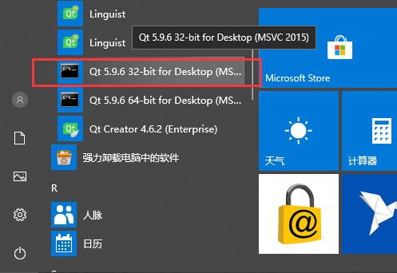
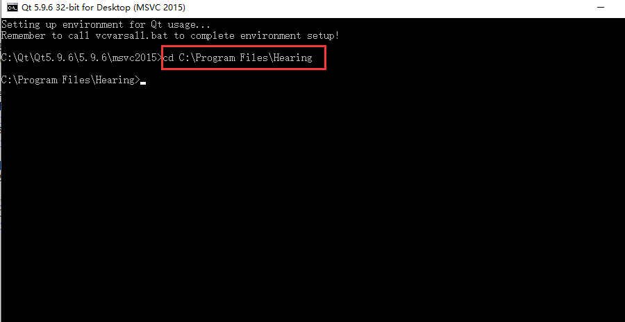
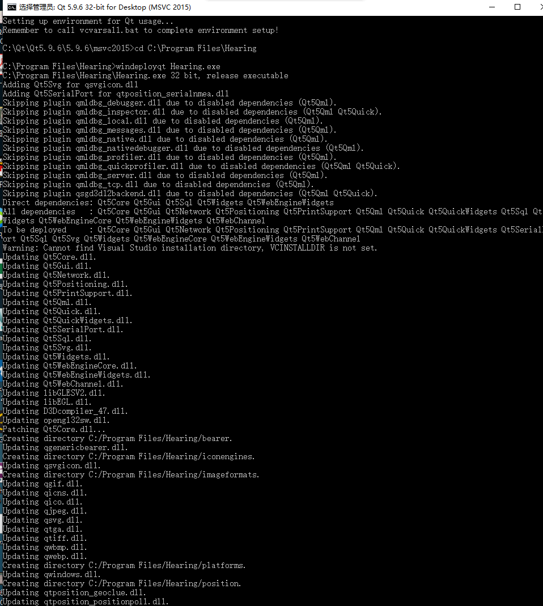

好久没有写博客了，最近在忙其它的事情。唉，人老了，记忆力真是衰的不行，之前常用的Qt打包在没隔一个月的时间下竟然忘记了怎么用，真是汗颜，干脆就写下来以便后面查询。这里只介绍在windows系统下的windeployqt打包工具，废话不多说，直接进入主题。
<!-- more -->
## 准备要打包的可执行文件
&emsp;&emsp;一般这个时候是要发布的软件，自然是在Release版本下的可执行程序，Qt下的可执行程序你点它是跑不起来的，不然就没有我要说的打包的事情了。在项目路路径下的Win32里的Release在这里我的可执行程序如下：

将这个可执行程序拷贝到一个干净的文件夹下，注意路径不要包含中文，貌似Qt很不喜欢中文路径。

## 选择Qt开发者命令行
然后“开始”菜单栏里面找到Qt开发者工具，我这里是选中32位的（注意要是管理员权限运行），因为我要打包的是32位程序，一 一对应是没有错的。今天下午我打包出来的程序一直有问题，回到家我才想明白是咋回事，原来我当时也不知道脑子发热还是啥的，话说今天也确实高能，头脑有点热。用了cmd的黑窗口，结果当然很惨，肯定行不通，会报`oxc0000007b`这样的错误。正确的做法，用Qt开发者命令行工具，吃Qt的饭当然要用Qt的工具了。

接下来就要进入刚刚创建的新的存放Hearing.exe可执行文件的文件夹。在黑窗口输入刚刚的路径**`cd C:\Program Files\Hearing`**

## windeployqt工具
利用windeployqt工具补齐Hearing.exe依赖的相关文件，具体操作是在命令行下输入**`windeploy xxx.exe`**,按下enter键。会自动补齐相关的依赖文件，在这里如下图所示：

进入Hearing文件夹下查看，生成了所有相关的文件。

运行Hearing.exe，可以看到软件跑起来了

最后就可以用inno setup打包工具将软件做成一个exe发布了。

