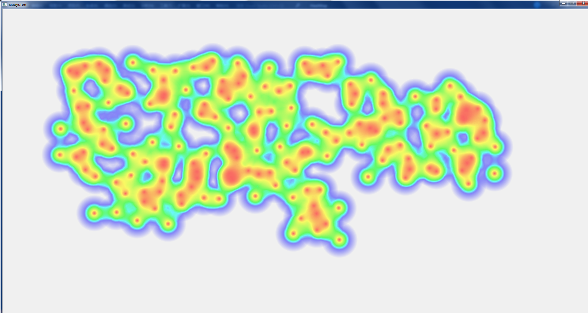
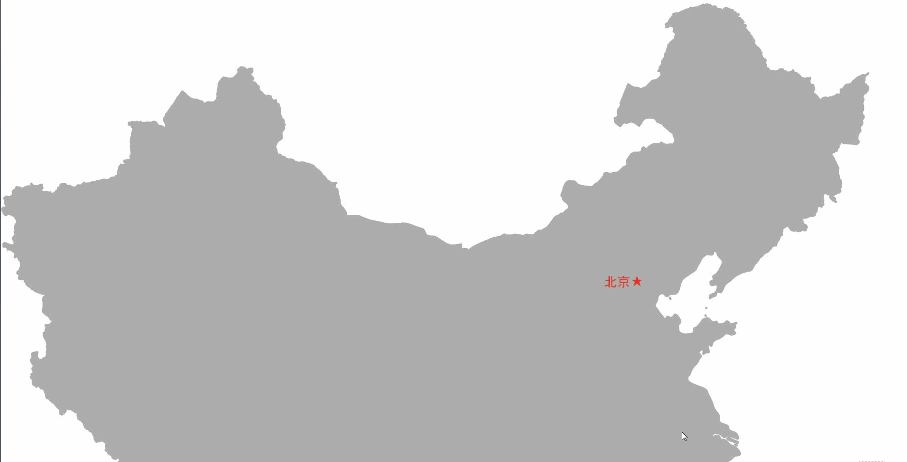
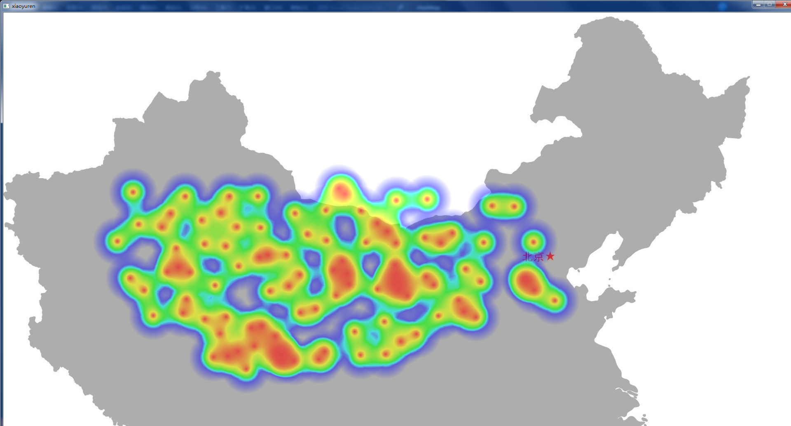

好几次机缘巧合看到热力图，感觉很酷，最近忙完手头工作，费了好几天才把这个原理搞懂，感觉自己智商欠费，好在终于弄清楚了。
<!-- more -->
## 效果展示
&emsp;&emsp;静态图：

Gif图效果：

## 原理
* 利用Qt绘制QImage来实现的
* 准备一张颜色映射表，QLinearGradient线性渐变的画布，在这里是取值0—255像素，中间可以渐变你需要的颜色。
* 准备一张QImage图用来作为显示绘制用的，那么这张图的每个像素点的颜色就要根据另外一张QImage（用来映射的QImage）对应像素点的透明度（alpha值0-255）来进行从上面制作好的颜色板中的取出RGB颜色值。
* 假设一张图片的像素大小为1920*1080，那么在这里就可以创建一个同等大小的数组，用来记录鼠标被点击的次数，初始为零，每次点击了就记录下来，如果在同一位置点击了，那点击次数依次递增。被点击的坐标点次数除以最大点击次数来达到图像分层的效果。
* 不用点击数据，而用输入一组数据，也是一个道理，如果正真理解了绘制原理你就会明白我说的这句话。
## 源码
## mainwindow.h
```cpp
#ifndef MAINWINDOW_H
#define MAINWINDOW_H

#include <QtWidgets/QWidget>
#include "ui_MainWindow.h"

class QImage;
class HeatMapper;
class ImagePalette;

class MainWindow : public QWidget
{
	Q_OBJECT

public:
	MainWindow(QWidget *parent = Q_NULLPTR);
	~MainWindow();

protected:
	void paintEvent       (QPaintEvent *event) override;
	void mouseReleaseEvent(QMouseEvent *event) override;

private:
	Ui::MainWindowClass *ui;
	HeatMapper   *pmapper;    //绘图对象指针
	QImage       *pcanvas;    //用于显示输出的图像
	ImagePalette *palette;    //调色板
};

#endif // !MAINWINDOW_H

```
## mainwindow.cpp
```cpp
#include "mainwindow.h"
#include "heatmapper.h"
#include "imagepalette.h"
#include <QPainter>
#include <QRadialGradient>
#include <QImage>
#include <QPoint>
#include <QBrush>
#include <QMouseEvent>

MainWindow::MainWindow(QWidget *parent)
	: QWidget(parent),
	ui     (new Ui::MainWindowClass),
	palette(new ImagePalette(255)),
	//pcanvas(new QImage(1000, 618, QImage::Format_ARGB32))
	pcanvas(new QImage(1920, 1080, QImage::Format_ARGB32))
{
	ui->setupUi(this);
	setMouseTracking(true);
	setWindowTitle("xiaoyuren");
	palette->SetColorAt(0.45, Qt::blue);
	palette->SetColorAt(0.55, Qt::cyan);
	palette->SetColorAt(0.65, Qt::green);
	palette->SetColorAt(0.85, Qt::yellow);
	palette->SetColorAt(1.0,  Qt::red);

	pcanvas->fill(QColor(0, 0, 0, 0));
	pmapper = new HeatMapper(pcanvas, palette, 60, 150);
	setFixedSize(pcanvas->width(), pcanvas->height()); //界面大小设置跟图片一样大小
}

MainWindow::~MainWindow()
{
	if (ui)
	{
		delete ui;
		ui = nullptr;
	}
	if (palette)
	{
		delete palette;
		palette = nullptr;
	}
	if (pcanvas)
	{
		delete pcanvas;
		pcanvas = nullptr;
	}
	if (pmapper)
	{
		delete pmapper;
		pmapper = nullptr;
	}
}

void MainWindow::paintEvent(QPaintEvent *event)
{
	QPainter painter(this);
	//painter.drawImage(QPoint(0, 0), QImage(":/MainWindow/Resources/timg.jpg"));
	painter.drawImage(QPoint(0, -100), QImage(":/MainWindow/Resources/map.jpg"));
	painter.drawImage(QPoint(0, 0), *pcanvas);
}

void MainWindow::mouseReleaseEvent(QMouseEvent *event)
{
	if (pmapper == nullptr)
		return;
	pmapper->AddPoint(event->x(), event->y());
	update();
}
```

## imagepalette.h
颜色取色板，对应透明度0-255
```cpp
#ifndef IMAGEPALETTE_H
#define IMAGEPALETTE_H
#include <QLinearGradient>

class QImage;

class ImagePalette
{

public:
	ImagePalette(int width);
	~ImagePalette();
	void SetColorAt(qreal index, const QColor &color);
	QColor GetColorAt(qreal index);

private:
	//线性渐变
	QLinearGradient gradient;
	//调色板的画布
	QImage *pcanvas;
	//宽度
	int width;

};


#endif // !IMAGEPALETTE_H

```


## imagepalette.cpp
```cpp
#include "imagepalette.h"
#include <QImage>
#include <QPainter>
ImagePalette::ImagePalette(int width) :
	pcanvas(new QImage(width, 1, QImage::Format_ARGB32)),
	gradient(0, 0, width, 1),
	width(width)
{

}

ImagePalette::~ImagePalette()
{
	if (pcanvas)
	{
		delete pcanvas;
		pcanvas = nullptr;
	}
}

/*
 * 用指定颜色在指定位置创建一个停止点
 * @param index 指定位置，对应位置为 (0, index)
 * @param color 颜色
 */
void ImagePalette::SetColorAt(qreal index, const QColor &color)
{
	gradient.setColorAt(index, color);
	QPainter painter(pcanvas);
	painter.setBrush(gradient);
	painter.setPen(Qt::NoPen);
	painter.fillRect(pcanvas->rect(), gradient);

}


/*
 * 获得指定点颜色值
 * @param index 取值位置
 * @return 返回指定索引处的颜色值
 */
QColor ImagePalette::GetColorAt(qreal index)
{
	index -= 1;
	if (index > this->width)
		return Qt::color0;
	return pcanvas->pixel(index, 0);
}
```

## heatmapper.h
图片像素映射处理
```cpp
#ifndef HEATMAPPER_H
#define HEATMAPPER_H
#include <QVector>

class QImage;
class ImagePalette;

class HeatMapper
{
public:
	HeatMapper(QImage *image, ImagePalette *palette, int radius, int opacity);
	~HeatMapper();

	void AddPoint(int x, int y);                     
	//void SetPalette(ImagePalette *palette);     //设置调色板
	int Increase(int x, int y, int delta = 1);//更新点击坐标的点击次数，并返坐标被点击的次数，
	int GetCount(int x, int y);               //返回坐标被点击的次数
	void ColorInit(int x, int y);
	void DrawAlpha(int x, int y, int count, bool state = true);
protected:
	void ColorInit(int left, int top, int right, int bottom);
	void Redraw();
private:
	QVector<int> data;    //存储点 频率的数组，大小和图像像素大小一样
	QImage *palphaCanvas; //用于存储渐变透明数据的图像副本
	QImage *pshowCanvas;  //用于显示输出的图像
	ImagePalette *palette;  //调色板
	int radius;           //半径
	int opacity;          //不透明度
	int width;            //图像宽度
	int height;           //图像高度
	qreal max;            //最大点击数
};

#endif  //HEATMAPPER_H

```

## heatmapper.cpp
```cpp
#include "heatmapper.h"
#include "imagepalette.h"
#include <QImage>
#include <QColor>
#include <QPainter>
#include <QRadialGradient>
#include <QDebug>


int num = 0;
HeatMapper::HeatMapper(QImage *image, ImagePalette *palette, int radius, int opacity) :
	pshowCanvas(image),
	palphaCanvas(new QImage(image->size(), QImage::Format_ARGB32)),
	palette(palette),
	radius(radius),
	opacity(opacity),
	width(image->width()),
	height(image->height()),
	max(1)
{
	palphaCanvas->fill(QColor(0, 0, 0, 0));
	data.resize(width * height);   //数组大小为图像像素大小
	data.fill(0);                  //初始填充点击次数为零，即为未点击过
}
HeatMapper::~HeatMapper()
{
	if (palphaCanvas)
	{
		delete palphaCanvas;
		palphaCanvas = nullptr;
	}
	pshowCanvas = nullptr;
	palette = nullptr;
	data.clear();
}


//记录点击处的坐标，并返回指定坐标点的点击次数
int HeatMapper::Increase(int x, int y, int delta)
{
	int index = (y - 1) * width + (x - 1);
	data[index] += delta;
	return data[index];
}


//增加或者更新一个数据点，同时进行绘制
void HeatMapper::AddPoint(int x, int y)
{
	if (x < 0 || y < 0 || x > width || y > height)
		return;
	int count = Increase(x, y, 1);
	if (max < count)
	{
		max = count;
		Redraw();
		return;
	}
	DrawAlpha(x, y, count);

}


//根据最大命中次数重绘整个图像，此方法产生余晖效果
void HeatMapper::Redraw()
{
	QColor color(0, 0, 0, 0);
	palphaCanvas->fill(color);
	pshowCanvas->fill(color);

	int size = data.size();
	for (int i = 0; i < size; i++)
	{
		if (0 == data[i])
			continue;
		DrawAlpha(i % width + 1, i / width + 1, data[i], false);
	}
	ColorInit(0, 0, width, height);
}

//void HeatMapper::SetPalette(ImagePalette *palette)
//{
//	if (palette != nullptr)
//		this->palette = palette;
//}

int HeatMapper::GetCount(int x, int y)
{
	if (x < 0 || y < 0)
		return 0;
	return data[(y - 1) * width + (x - 1)];
}

void HeatMapper::DrawAlpha(int x, int y, int count, bool state)
{
	int alpha = int(qreal(count * 1.0 / max) * 255);
	QRadialGradient radialgradient(x, y, radius);
	radialgradient.setColorAt(0, QColor(0, 0, 0, alpha));
	radialgradient.setColorAt(1, QColor(0, 0, 0, 0));

	QPainter painter(palphaCanvas);
	painter.setPen(Qt::NoPen);
	painter.setBrush(radialgradient);
	painter.drawEllipse(QPoint(x, y), radius, radius);
	if (state)
		ColorInit(x, y);
}

//着色
void HeatMapper::ColorInit(int x, int y)
{
	int left = x - radius;
	int top = y - radius;
	int right = x + radius;
	int bottom = y + radius;

	//越界处理
	if (left < 0)
		left = 0;
	if (top < 0)
		top = 0;
	if (right > width)
		right = width;
	if (bottom > height)
		bottom = height;

	ColorInit(left, top, right, bottom);
}

//实际着色 left top right bottom 矩形坐标
void HeatMapper::ColorInit(int left, int top, int right, int bottom)
{
	int alpha(0);
	int finalAlpha(0);
	QColor color;
	for (int i = left; i < right; i++)
	{
		for (int j = top; j < bottom; j++)
		{
			alpha = qAlpha(palphaCanvas->pixel(i, j));
			if (!alpha)
				continue;
			finalAlpha = (alpha < opacity ? alpha : opacity);
			color = palette->GetColorAt(alpha);
			pshowCanvas->setPixel(i, j, qRgba(color.red(), color.green(), color.blue(), finalAlpha));
		}
	}
}

```
