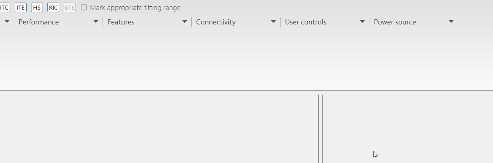

说起来很惭愧，玩了几年的Qt，竟然不会耍popup界面，竟然还停留在QMenu这种界面。直到此刻，才发现自己真的很菜，还有很多Qt技能都玩不起来。
在TM大佬的教授下，终于知道怎么搞出这个界面，感谢TM大佬！
<!-- more -->
## 效果图


## 代码很简单，主要是通过设置Window Flags来实现
```
Qt::WindowFlags flags = Qt::Popup;
ui->widget->setWindowFlags(flags);
```
## 坐标系迁移
&emsp;&emsp;当时半天弹不正确的位置，最后TM大佬直接把他的代码给我。才让问题顺利解决，不然一天都搞不出来我感觉。
popup界面坐标系是全局的，需要迁移坐标系，这个坐标系我也是半桶水，后面会再去看下文档补起来。
```
ui->widget->move(mapToGlobal(QPoint(0, 0)).x(), mapToGlobal(QPoint(0, 0)).y() + 27);
```

## selectionwidget.h
```cpp
#ifndef SELECTIONWIDGET
#define SEKECTIONWIDGET
#include <QWidget>
namespace Ui
{
	class SelectionWidget2;
}
class SeriesItem;
class QFocusEvent;
//Performance
class SelectionWidget2 : public QWidget
{
	Q_OBJECT
public:
	explicit SelectionWidget2(QWidget* parent = Q_NULLPTR, bool isCN = true);
	~SelectionWidget2();

	void Init(); //初始化
	void CreateConnect();
public slots:
	void OnButtonClicked();
protected:
	virtual void focusOutEvent(QFocusEvent* event) override;
private:
	Ui::SelectionWidget2* ui;
	bool isCN;
};

#endif // !SELECTIONWIDGET
```
## selectionwidget.cpp
```cpp
#include "selectionwidget.h"
#include "ui_SelectionWidget2.h"

SelectionWidget2::SelectionWidget2(QWidget* parent, bool isCN) :
	QWidget(parent),
	ui(new Ui::SelectionWidget2),
	isCN(isCN)
{
	ui->setupUi(this);
	Init();
	CreateConnect();
}
SelectionWidget2::~SelectionWidget2()
{
	if (ui)
	{
		delete ui;
		ui = nullptr;
	}
}
void SelectionWidget2::focusOutEvent(QFocusEvent* event)
{
	ui->toolButton->update();
}
void SelectionWidget2::Init()
{
	Qt::WindowFlags flags = Qt::Popup;
	ui->widget->setWindowFlags(flags);
	ui->widget->hide();
	if (isCN)
	{
		const int MORE = 22;
		if (ui->button1->isChecked())
			ui->button1->setMinimumWidth(34 + MORE);
		else
			ui->button1->setMinimumWidth(34);
		if (ui->button2->isChecked())
			ui->button2->setMinimumWidth(34 + MORE);
		else
			ui->button2->setMinimumWidth(34);
		if (ui->button3->isChecked())
			ui->button3->setMinimumWidth(34 + MORE);
		else
			ui->button3->setMinimumWidth(34);
		if (ui->button4->isChecked())
			ui->button4->setMinimumWidth(44 + MORE);
		else
			ui->button4->setMinimumWidth(44);
	}
	setAttribute(Qt::WA_StyledBackground);

}
void SelectionWidget2::CreateConnect()
{
	QObject::connect(ui->toolButton, &QToolButton::clicked, [=]() {
		ui->widget->move(mapToGlobal(QPoint(0, 0)).x(), mapToGlobal(QPoint(0, 0)).y() + 27);
		ui->widget->show();
		ui->toolButton->update();
		});
	QObject::connect(ui->widget, &EmitHideWidget::Hide, [=]() {
		ui->toolButton->update();
		});
	QObject::connect(ui->button1, SIGNAL(clicked()), this, SLOT(OnButtonClicked()));//High
	QObject::connect(ui->button2, SIGNAL(clicked()), this, SLOT(OnButtonClicked()));//Mid
	QObject::connect(ui->button3, SIGNAL(clicked()), this, SLOT(OnButtonClicked()));//Value
	QObject::connect(ui->button4, SIGNAL(clicked()), this, SLOT(OnButtonClicked()));//Basic
}
void SelectionWidget2::OnButtonClicked()
{
	QString objectName = sender()->objectName();
	const int MORE = 22;
	if ("button1" == objectName)//High
	{
		if (isCN)
		{
			if (ui->button1->isChecked())
				ui->button1->setMinimumWidth(34 + MORE);
			else
				ui->button1->setMinimumWidth(34);
		}
		else
		{
			if (ui->button1->isChecked())
				ui->button1->setMinimumWidth(50 + MORE);
			else
				ui->button1->setMinimumWidth(50);
		}
	}
	else if ("button2" == objectName)//Mid
	{
		if (isCN)
		{
			if (ui->button2->isChecked())
				ui->button2->setMinimumWidth(34 + MORE);
			else
				ui->button2->setMinimumWidth(34);
		}
		else
		{
			if (ui->button2->isChecked())
				ui->button2->setMinimumWidth(44 + MORE);
			else
				ui->button2->setMinimumWidth(44);
		}
	}
	else if ("button3" == objectName)//Value
	{
		if (isCN)
		{
			if (ui->button3->isChecked())
				ui->button3->setMinimumWidth(34 + MORE);
			else
				ui->button3->setMinimumWidth(34);
		}
		else
		{
			if (ui->button3->isChecked())
				ui->button3->setMinimumWidth(53 + MORE);
			else
				ui->button3->setMinimumWidth(53);
		}
	}
	else if ("button4" == objectName)//Basic
	{
		if (isCN)
		{
			if (ui->button4->isChecked())
				ui->button4->setMinimumWidth(44 + MORE);
			else
				ui->button4->setMinimumWidth(44);
		}
		else
		{
			if (ui->button4->isChecked())
				ui->button4->setMinimumWidth(49 + MORE);
			else
				ui->button4->setMinimumWidth(49);
		}
	}
}
```

