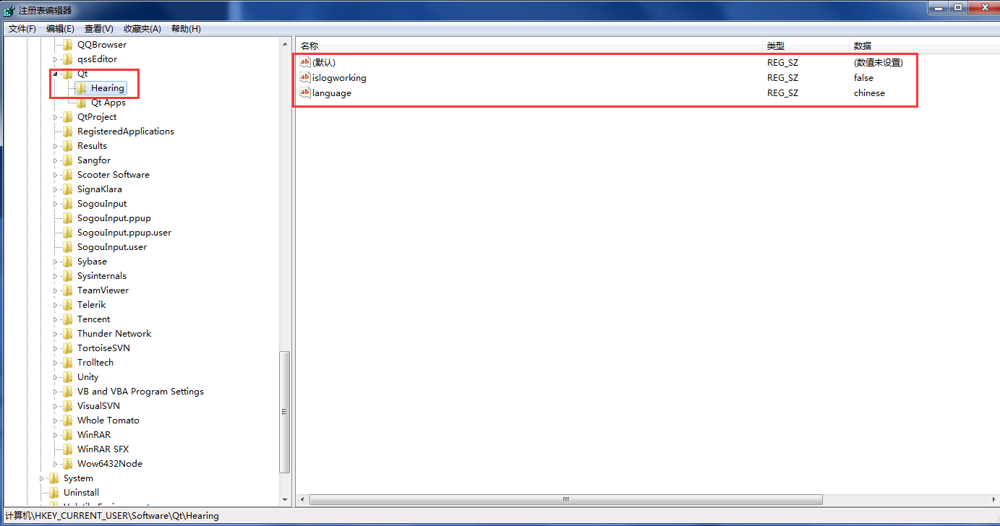

第一次接触到这个类还是以前狗哥给我的给软件注册验证的源码里看到，QSettings不仅可以操作注册表，还可以操作配置文件，感觉功能很强大。
这里主要介绍我在Win7下用到的操作注册表的使用，Win10安全更高了，感觉在Win10下操作注册表我估计肯定会有权限的问题。
<!-- more -->
## 效果展示

## 代码
```cpp
	//操作注册表
	QSettings settings(QSettings::NativeFormat, QSettings::UserScope, "Qt", "Hearing");
	//如果注册表里没有这个目录跟键值，那就创建
	if (settings.value("language", "").toString().isEmpty())
	{
		settings.setValue("language", "chinese");
	}
	else
	{
		//读取到语言设置为中文
		if ("chinese" == settings.value("language", "").toString())
		{
			//将国际化设置为中文
			//...
		}
		//读取到语言设置为英文
		else if ("english" == settings.value("language", "").toString())
		{
			//默认语言
		}
	}
	if (settings.value("islogworking", "").toString().isEmpty())
	{
		//创建并设置键值，数据类型为bool型
		settings.setValue("islogworking", false);
	}
	else
	{
		if (settings.value("islogworking", "").toBool())
		{
			// 安装日志处理工具
			//...
		}
	}
```

## QSettings上述用到的构造函数说明
```
QSettings::QSettings(Format format, Scope scope, const QString &organization, const QString &application = QString(), QObject *parent = Q_NULLPTR)
Constructs a QSettings object for accessing settings of the application called application from the organization called organization, and with parent parent.
If scope is QSettings::UserScope, the QSettings object searches user-specific settings first, before it searches system-wide settings as a fallback. If scope is QSettings::SystemScope, the QSettings object ignores user-specific settings and provides access to system-wide settings.
If format is QSettings::NativeFormat, the native API is used for storing settings. If format is QSettings::IniFormat, the INI format is used.
If no application name is given, the QSettings object will only access the organization-wide locations.
```
* Format format
这里主要介绍QSettings::NativeFormat跟QSettings::IniFormat；
QSettings::NativeFormat说明：
Store the settings using the most appropriate storage format for the platform. On Windows, this means the system registry; on macOS and iOS, this means the CFPreferences API; on Unix, this means textual configuration files in INI format意思就是windows系统下为注册表，IOS跟MacOS系统为...，uinx系统下为ini文件。

QSettings::IniFormat说明：
Store the settings in INI files.意思就是ini格式的配置文件

* Scope scope参数
这个enum可选参数QSettings::UserScope，QSettings::SystemScope；我的理解就相当于是不同的注册表路径。
QSettings的注册表路径是：计算机\HEKY_CURRENT_USER\Software剩下的子目录就是后面的第三个参数指定的名称。
虽然我没有测试QSettings::SystemScope，我推测它应该是指定注册表系统目录的路径。

* const QString &organization
这个参数就是组织名，获取一般在main()函数里面设置的名字，你也可设置这个QString为任意的字符，如"CompanyName"
QCoreApplication::setOrganizationName("MySoft");
QCoreApplication::setOrganizationDomain("mysoft.com");
QCoreApplication::setApplicationName("Star Runner");

* const QString &application参数
QCoreApplication::setApplicationName("Star Runner");
这个就是个app的名字，你同样也可以设置成任意。

## 补充
```cpp
	//操作注册表
	QSettings settings(QSettings::NativeFormat, QSettings::UserScope, "Qt", "Hearing");
	//副本操作注册表，此时不会再创建了，因为前面已经创建好了，但是可以同样操作注册表的键值。
	QSettings copysettings(QSettings::NativeFormat, QSettings::UserScope, "Qt", "Hearing");
```
请参考官方文档学习QSettings
