圆角问题我一直在留意，网上也没有很好的解答，以前做的圆角总是不太理想，只能用固定界面大小做圆角界面。如果界面大小改变了呢，然后吃相就很难看了。最近时机成熟，重新捣鼓这个问题，终于把这个挤压了一年多的问题给解决了。可以做到界面大小改变，还是完美的圆角界面。现在真的是perfect圆角界面了！
<!-- more -->

## 第一种 利用绘制的方法制作圆角
需要包含
```CPP
	//#include<QBitmap>  需要包含这两个头文件
	//#include<QPainter>
	QBitmap bmp(this->size());
	bmp.fill();
	QPainter painter(&bmp);
	painter.setRenderHint(QPainter::Antialiasing, true);  //设置反锯齿渲染
	painter.setPen(Qt::NoPen);
	painter.setBrush(Qt::black);
	painter.drawRoundedRect(bmp.rect(), 8, 8);             //8 8表示圆角的x radius跟 y radius
	painter.setRenderHint(QPainter::Antialiasing, false);  //设置反锯齿渲染
	setMask(bmp);
```
这种操作是可以制作圆角界面，但是当界面大小改变，不是初始构造的时候，麻烦来了，就会出现以下情况。
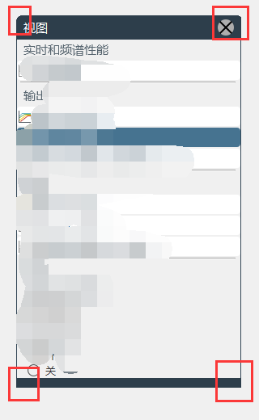
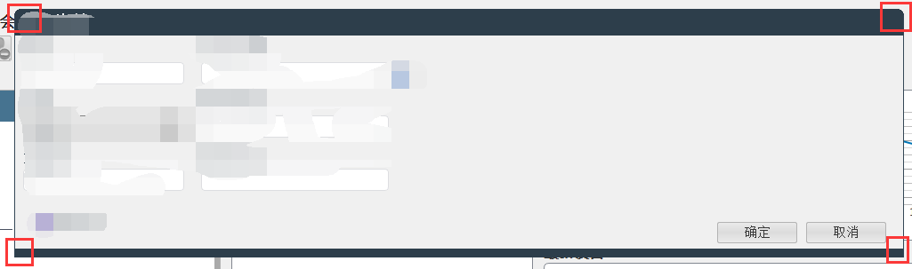
是不是很讨厌，边角要不还是矩形，要不就是画了一部分。

## 第二种 利用qss的方法实现圆角
先来看官方文档怎么说，这里给出了支持border-radius支持的圆角，widget小部件。
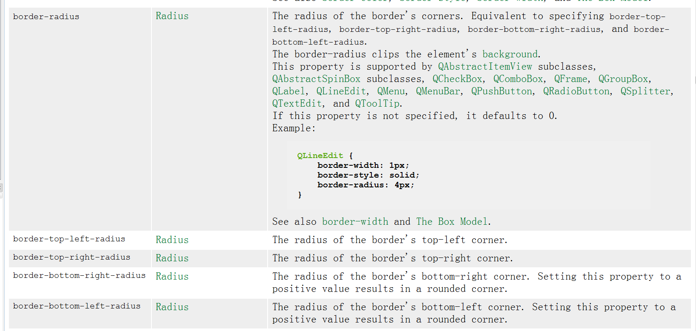
看到没QWidget不支持，所以你创建了一个QWidget的ui，里面不要再包含QWidget的容器了，可以用QFrame或者QGroupBox作为容器，这样就可以作为圆角了。

首先QWidget儿子放一个QGroupBox或者QFrame我这里放的是QGroupBox，设置border圆角如下图所示：
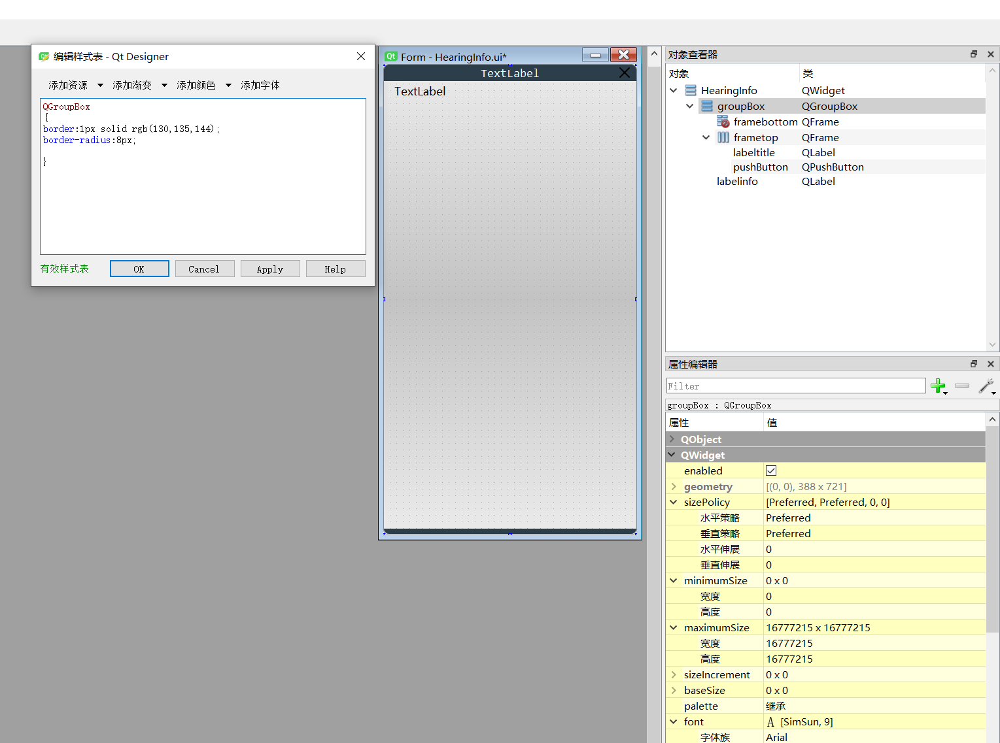

上下两个QFrame界面也要保证跟QGroupBox同样的border-radius像素，这样就可以一样大小，如下图所示：
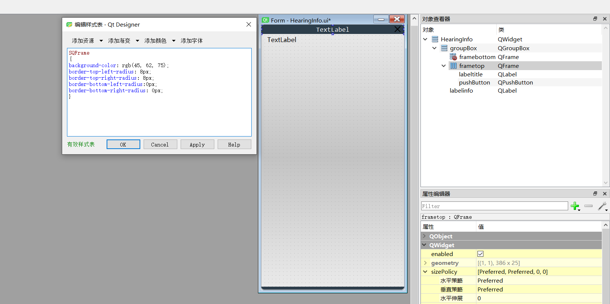

最后看下圆角的效果图
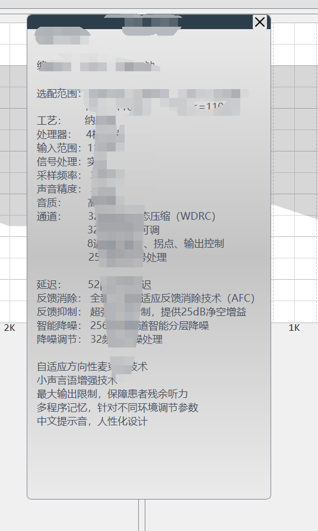
改变界面的大小，还是保证了圆角的效果
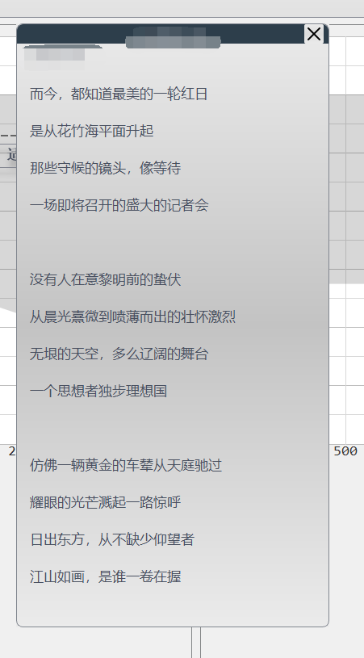
现在终于是一个完美的圆角了！

## 事实上我高兴的太早了，很快就被打脸了。
易友大佬看了我的博客，很快就发现了BUG！
之所以前面看起来很圆滑，其实是背景跟ui的界面颜色是一样的，忽略了多出的那点背景色。仔细看，还是能发现一些端倪，没错就是仔细看，问题是我就是没看见...
把圆角背景放置到黑色的背景下，就能看的比较明显，如下图所示
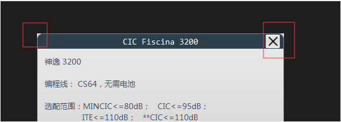
边角还是尖锐的直角，难道就无药可救了吗，来自大佬的做法是：
* 将Ui的最外围容器背景色设置为透明，即设置界面的属性`setAttribute(Qt::WA_TranslucentBackground);`
同时配合使用Qt的无边框窗口flag `Qt::FramelessWindowHint`，就是要无边框的窗口。
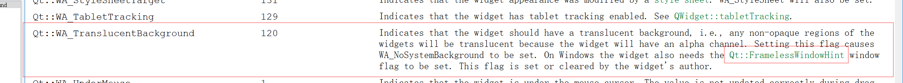
* 另外Ui的最外围容器QWidget的QSS设置 `border:none;`
至此圆角界面真的很圆了。

## 顽固的QWebEngineView
碰到这家伙，我尝试用QSS border属性去修饰它，发现根本不起效果。最后去看了下它的父辈，原来继承自QWidget，真是有其父必有其子，总算明白为什么这家伙这么顽固了。
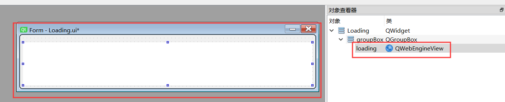
可以看到ui设计里面它还是直的，最后我曲线救国，在外面套个QGroupBox，让QGroupBox进行圆滑处理，另外QWwebEngineView加载执行后，背景色变成了最黑的那种，就是
rgb(0,0,0)，那我也把QGroupBox做成最黑。最后得到这样的效果，最后也得到了圆角效果，我称它为伪圆角界面。看看最后的效果吧：
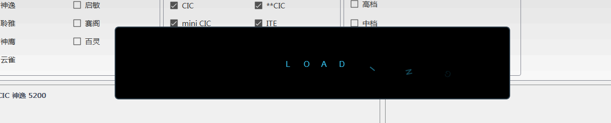


