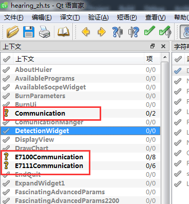
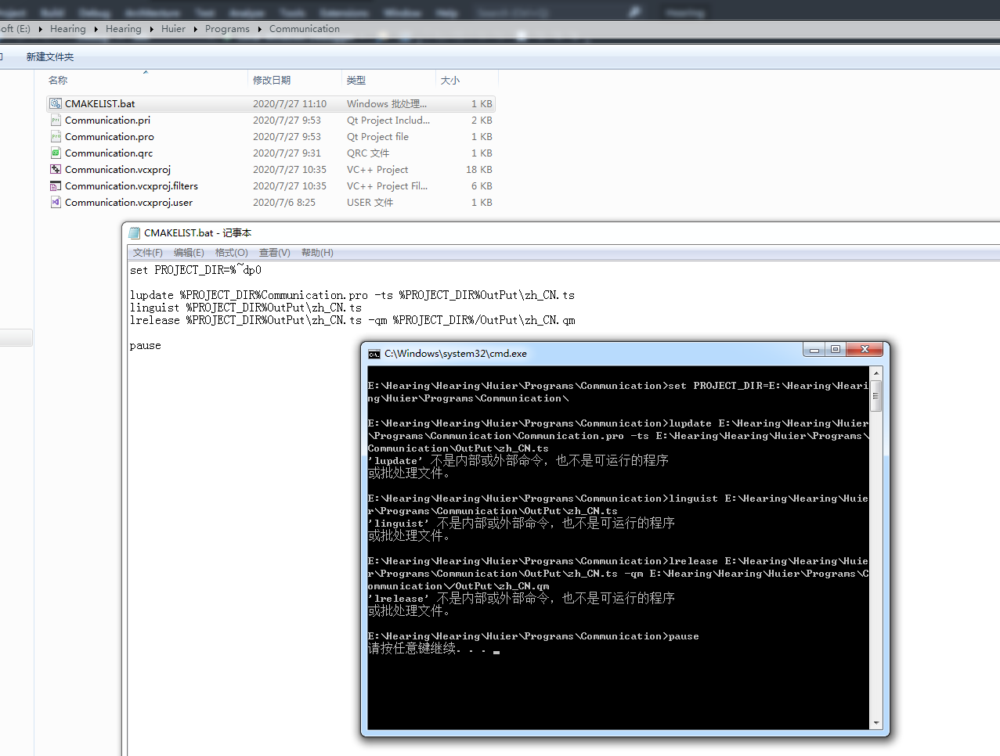
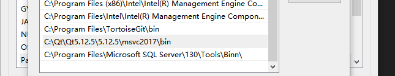
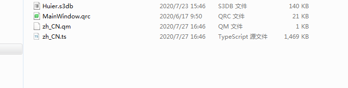

最近项目拓展了，增加了一个项目作为Qt类库，里面也有需要国际化的操作。如果按照惯例做法，那就会重新创建一个翻译文件，这样操作起来很多弊端，
比如说我每创建一个项目，就要创建一个.ts文件，这个不是麻烦，更麻烦的是我要怎么整合到我的软件里面用起来，我想不出有什么好办法，应该挺麻烦。
好在我得到了小怪兽大佬和时光少年_依旧蓝大佬的帮助，得到了一个比较完美的解决方案，但还是留有一点遗憾。
<!-- more -->

## 思路
       根据我理解看到的资料，应该有两种办法：
* 利用CMake来弄，具体怎么搞得我也不知道。等我学会了CMake，我会去尝试的。
* 利用bat文件来重定向需要翻译的文件。
我就是利用的后者bat文件来操作，bat文件其实又可以分为两种，一中是用pro里面管理好的源代码来直接进行翻译文件查询，另外一中稍微更费时间一点，
利用递归遍历所有的可翻译文件（这是我自己定义的术语，因为很多格式的文件，用lupdate去检测它只会检测限定的格式），这个就是我此次主要采用的方法。

## 失败案例
bat文件里面内容
```
set PROJECT_DIR=%~dp0

lupdate %PROJECT_DIR%Communication.pro -ts %PROJECT_DIR%..\..\Build\OutPut\zh_CN.ts
linguist %PROJECT_DIR%..\..\Build\OutPut\zh_CN.ts
lrelease %PROJECT_DIR%..\..\Build\OutPut\zh_CN.ts -qm %PROJECT_DIR%..\..\Build\OutPut

pause
```
也不能完全说失败，这个就是利用.bat文件基于pro管理的文件来进行翻译确认的。最后定向到`%PROJECT_DIR%..\..\Build\OutPut\zh_CN.ts`这个文件进行重写，
其实跟我们在vs+qt项目里面点 `Qt->lupdate All .ts Files in Project`效果是一样的。只不过这里我们可以重定向路径跟文件。这里说明下`PROJECT_DIR`定义
的这个东西就是当前目录的意思，`..\..\`上二级目录。
这里为什么说失败呢，因为这个只是单个项目的需要翻译的文件定向，如果A运行了这个bat，在去b项目运行类似的bat，那就会相互覆盖，产生如下这样的问题：




被覆盖的文件无效了。

运行A项目下的.bat会重写.ts的目标文件，运行B项目下的.bat也会重写.ts的目标文件，因为各自目录的.pro都不含对方需要翻译的文件，所以就会有你没我有我没你的
情况，当然如果.pro文件是顶级的pro文件涵盖了所有的需要翻译的文件，那这样写就没有毛病，是完全可以的。

可能会遇到的问题


这是由于缺少了系统环境变量 `C:\Qt\Qt5.12.6\5.12.6\msvc2017\bin`


## 成功案例
.bat文件里面内容
```
set PROJECT_DIR=%~dp0

lupdate  -recursive %PROJECT_DIR% -ts %PROJECT_DIR%Hearing\zh_CN.ts
linguist %PROJECT_DIR%Hearing\zh_CN.ts

pause
```
想看lupdate的用法，可以在cmd里面执行lupdate -help的用法，我会把它附录到最后面。可以看到`-recursive`参数代表递归目录，你只要递归包含所有需要翻译的顶级目录，
那就会把所有的需要翻译的文件一口气找出来
```
 -recursive
           Recursively scan directories (default).
```
最悲催的问题来了，我以前翻译好的文件需要重新翻译过了，这个就是我之前说的遗憾地方，我不得不花几天时间重新国际化一遍，苦逼啊。上面这个递归目录那它是不是要遍历
所有的文件吗，别担心聪明的Qt已经帮你想到了这些情况，这东西自带只查找哪些文件，默认查找如下这些格式的可翻译文件，当然你还可以自己限定只查找哪些后缀的文件。我
这里没有试验过这个参数，我按默认来，几秒钟就搞定了，很快。
```
 -extensions <ext>[,<ext>]...
           Process files with the given extensions only.
           The extension list must be separated with commas, not with whitespace.
           Default: 'java,jui,ui,c,c++,cc,cpp,cxx,ch,h,h++,hh,hpp,hxx,js,qs,qml,qrc'.
```

附录我最后生成的.ts跟.qm文件



## lupdate -help
```
Usage:
    lupdate [options] [project-file]...
    lupdate [options] [source-file|path|@lst-file]... -ts ts-files|@lst-file

lupdate is part of Qt's Linguist tool chain. It extracts translatable
messages from Qt UI files, C++, Java and JavaScript/QtScript source code.
Extracted messages are stored in textual translation source files (typically
Qt TS XML). New and modified messages can be merged into existing TS files.

Options:
    -help  Display this information and exit.
    -no-obsolete
           Drop all obsolete and vanished strings.
    -extensions <ext>[,<ext>]...
           Process files with the given extensions only.
           The extension list must be separated with commas, not with whitespace.
           Default: 'java,jui,ui,c,c++,cc,cpp,cxx,ch,h,h++,hh,hpp,hxx,js,qs,qml,qrc'.
    -pluralonly
           Only include plural form messages.
    -silent
           Do not explain what is being done.
    -no-sort
           Do not sort contexts in TS files.
    -no-recursive
           Do not recursively scan directories.
    -recursive
           Recursively scan directories (default).
    -I <includepath> or -I<includepath>
           Additional location to look for include files.
           May be specified multiple times.
    -locations {absolute|relative|none}
           Specify/override how source code references are saved in TS files.
           Guessed from existing TS files if not specified.
           Default is absolute for new files.
    -no-ui-lines
           Do not record line numbers in references to UI files.
    -disable-heuristic {sametext|similartext|number}
           Disable the named merge heuristic. Can be specified multiple times.
    -pro <filename>
           Name of a .pro file. Useful for files with .pro file syntax but
           different file suffix. Projects are recursed into and merged.
    -pro-out <directory>
           Virtual output directory for processing subsequent .pro files.
    -pro-debug
           Trace processing .pro files. Specify twice for more verbosity.
    -source-language <language>[_<region>]
           Specify the language of the source strings for new files.
           Defaults to POSIX if not specified.
    -target-language <language>[_<region>]
           Specify the language of the translations for new files.
           Guessed from the file name if not specified.
    -tr-function-alias <function>{+=,=}<alias>[,<function>{+=,=}<alias>]...
           With +=, recognize <alias> as an alternative spelling of <function>.
           With  =, recognize <alias> as the only spelling of <function>.
           Available <function>s (with their currently defined aliases) are:
             Q_DECLARE_TR_FUNCTIONS (=Q_DECLARE_TR_FUNCTIONS)
             QT_TR_N_NOOP (=QT_TR_N_NOOP)
             QT_TRID_N_NOOP (=QT_TRID_N_NOOP)
             QT_TRANSLATE_N_NOOP (=QT_TRANSLATE_N_NOOP)
             QT_TRANSLATE_N_NOOP3 (=QT_TRANSLATE_N_NOOP3)
             QT_TR_NOOP (=QT_TR_NOOP)
             QT_TRID_NOOP (=QT_TRID_NOOP)
             QT_TRANSLATE_NOOP (=QT_TRANSLATE_NOOP)
             QT_TRANSLATE_NOOP3 (=QT_TRANSLATE_NOOP3)
             QT_TR_NOOP_UTF8 (=QT_TR_NOOP_UTF8)
             QT_TRANSLATE_NOOP_UTF8 (=QT_TRANSLATE_NOOP_UTF8)
             QT_TRANSLATE_NOOP3_UTF8 (=QT_TRANSLATE_NOOP3_UTF8)
             findMessage (=findMessage)
             qtTrId (=qtTrId)
             tr (=tr)
             trUtf8 (=trUtf8)
             translate (=translate)
             qsTr (=qsTr)
             qsTrId (=qsTrId)
             qsTranslate (=qsTranslate)
    -ts <ts-file>...
           Specify the output file(s). This will override the TRANSLATIONS.
    -version
           Display the version of lupdate and exit.
    @lst-file
           Read additional file names (one per line) or includepaths (one per
           line, and prefixed with -I) from lst-file.

```


