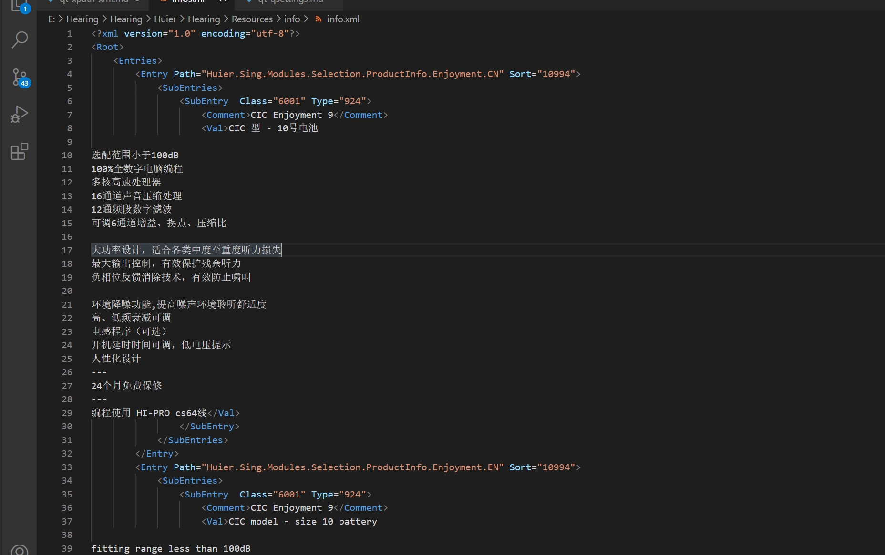
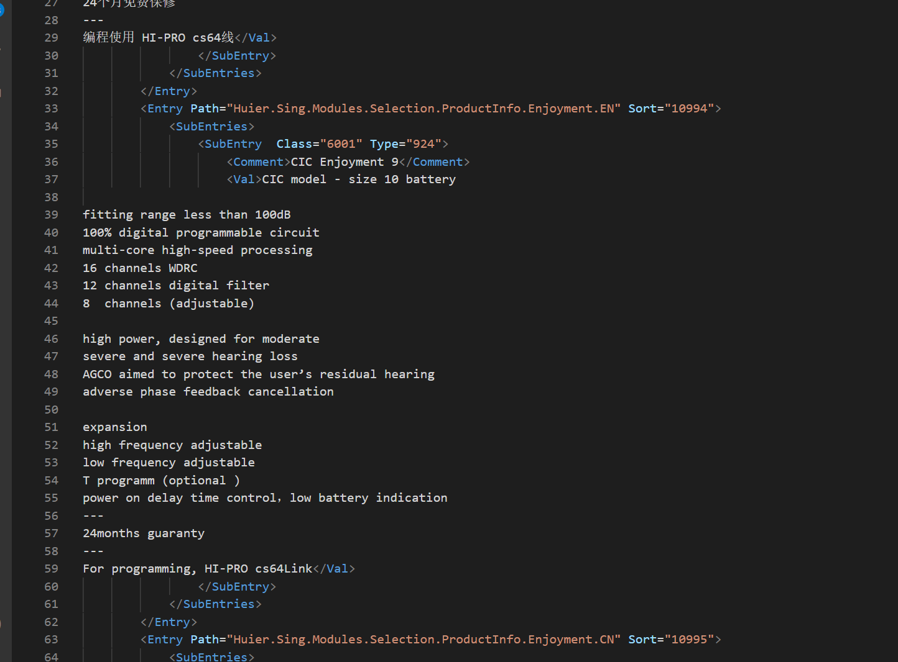
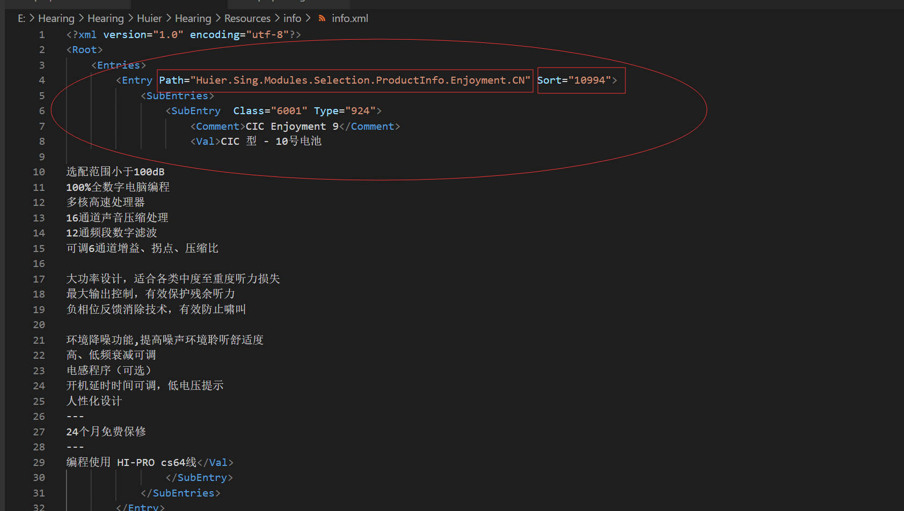
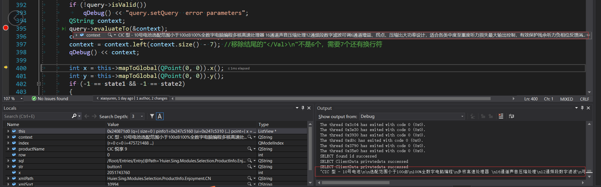
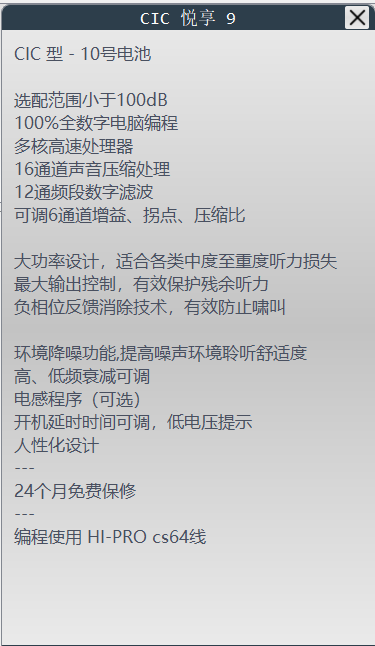

有一个需求需要展示产品信息，我不想把大量的资源藏到数据库，按道理藏到数据库没毛病，但是不利于维护，因为我这个信息需要经常修改，最好给第三方人员来弄，藏数据库不是个好办法，自己也想不出来，张开嘴就是问，第一次听狗的建议xpath，当时没搞成，最近要拿起做这东西，又问了一遍，又得到狗哥的推荐xPath，还帮我解决了多个属性查询的问题，无敌的狗哥！真的很喜欢这个功能，超级好用！xml我尝试用3M的xml资源查询，也是非常快的。
<!-- more -->
## 主要利用xPath的查询功能
这个我自己半桶水，看看菜鸟网站初步的使用应该是没有问题的，如果要深入的研究，建议去W3C的官方网站看看。里面好像都是英文。看过一点，内容太多了···
XPath菜鸟学习网站：[**https://www.runoob.com/xpath/xpath-tutorial.html**](https://www.runoob.com/xpath/xpath-tutorial.html)
W3C网站(官方网站)：[**https://www.w3.org/**](https://www.w3.org/)
## QXmlQuery
Qt文档上面的描述，这个类似QSqlQuery封装了XPath相关的接口。
```
The QXmlQuery class performs XQueries on XML data, or on non-XML data modeled to look like XML.
The QXmlQuery class compiles and executes queries written in the XQuery language. QXmlQuery is typically used to query XML data, but it can also query non-XML data that has been modeled to look like XML.
Using QXmlQuery to query XML data, as in the snippet below, is simple because it can use the built-in XML data model as its delegate to the underlying query engine for traversing the data. The built-in data model is specified in XQuery 1.0 and XPath 2.0 Data Model.
```
## 我的使用过程
我主要利用了内存换速度的思想，先将xml加载绑定QXmlQuery，这样后续查询非常快，不需要加载绑定的时间，不太会影响界面的交互速度，我感觉很快。

 首先定义一个类成员对象
 `QXmlQuery* query;//xml资源查询`

 其次将xml资源绑定到query
``` cpp
void ListView::InitXmlQuerry()
{
	QString path = "/Resources/info/info.xml";
	QString pathDir = QDir::currentPath();
	path = pathDir + path;
	QDir dir;
	//没有这个目录就先创建这个目录
	if (!dir.exists(pathDir + "/Resources/info"))
		dir.mkpath(pathDir + "/Resources/info");

	//QXmlQuery query;
	QFile db(path);
	if (!db.exists())
	{
		qDebug() << "Resources/info/info.xml file not exists.";
		return;
	}
	if (!db.open(QIODevice::ReadOnly | QIODevice::Text))
	{
		qDebug() << "Open Resources/info/info.xml file failed.";
		return;
	}
	query->setFocus(&db);
	db.close();
}
```
这个info.xml就是我要查询的xml资源





使用时候，直接查看使用部分
```cpp
        QModelIndex index = this->selectionModel()->currentIndex();
		int row = index.row();
		QString productName;
		if (isCN)
			productName = pmodel->index(row, 3).data().toString();
		else
			productName = pmodel->index(row, 2).data().toString();
		productName = productName.replace(QChar('\n'), QChar(' '), Qt::CaseInsensitive);//用空格替换掉换行符

		QString xmlPath = pmodel->index(row, 18).data().toString() + QString(isCN ? ".CN" : ".EN");
		QString xmlSort = pmodel->index(row, 6).data().toString();


        /****************************使用部分*******************************/
		QString sql = QString("/Root/Entries/Entry[@Path='%1' and @Sort='%2']/SubEntries/SubEntry/Val").arg(xmlPath).arg(xmlSort);
		query->setQuery(sql);
		if (!query->isValid())
			qDebug() << "query.setQuery  error parameters";
		QString context;
		query->evaluateTo(&context);
        /****************************使用部分*******************************/

		context = context.right(context.size() - 5);//移除开头的"<Val>"
		context = context.left(context.size() - 7); //移除结尾的"</Val>\n"不是6个，需要7个还有个Str结束标志符
		qDebug() << context;
```
可以看到我xml元素的结构`/Root/Entries/Entry[@Path='%1' and @Sort='%2']/SubEntries/SubEntry/Val`
Entry元素有两个属性，我这里查询了所有的元素



最后我把查询到符合条件的内容保存到了context里面，查询出来的内容形式是`</Val>···</Val>`所以我最后还要把这个剔除。
打个断点可以查看我查询的内容


