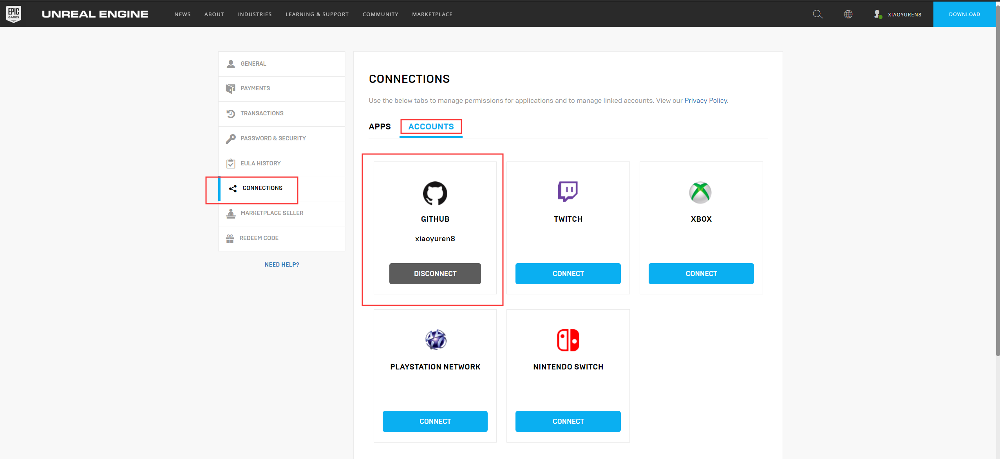
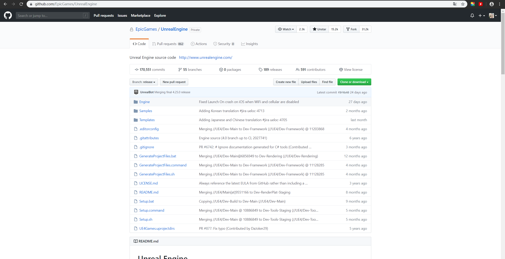
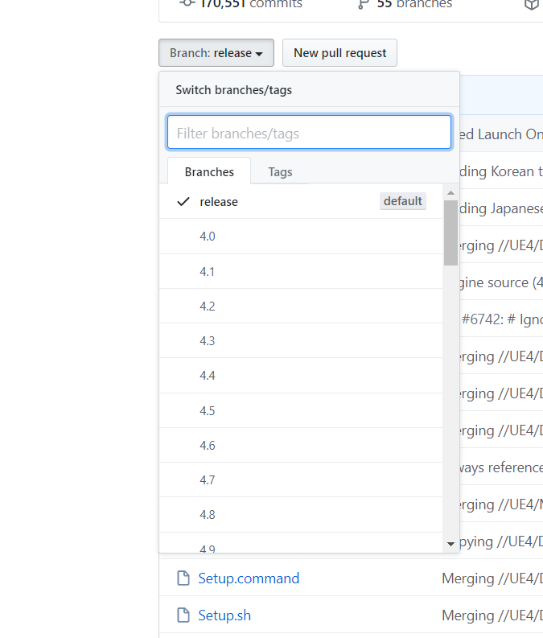

大名鼎鼎的虚幻引擎，也是从Icy大佬那里听说来的，没错Unity3D游戏大佬Icy，向大佬低头。说是开源，可是我Github上检索来检索去，愣是没找到。我还以为他们又不开源了。
后来在Icy大佬的帮助下，终于访问到了Github上面的EpicGames/UnrealEngine开源项目。
<!-- more -->
## 注册账号
中文网站：[**https://www.unrealengine.com/zh-CN/?sessionInvalidated=true**](https://www.unrealengine.com/zh-CN/?sessionInvalidated=true)
英文网站：[**https://www.unrealengine.com/en-US/?sessionInvalidated=true**](https://www.unrealengine.com/en-US/?sessionInvalidated=true)

## 与Github建立链接
直接在Github是访问不到项目的，需要先注册好虚幻账号后，在个人设置里面`Connect->Accounts`Connect Github。

## 完成
最后可以在Github上面访问到EpicGames/UnrealEngine项目

可以看到很多分支版本，目前最新的是4.25版本。

接下来就是一顿疯狂fork、star了，很是激动开心。这对我一个没见过大世面的人来说，算得上是一个庞大的项目。

