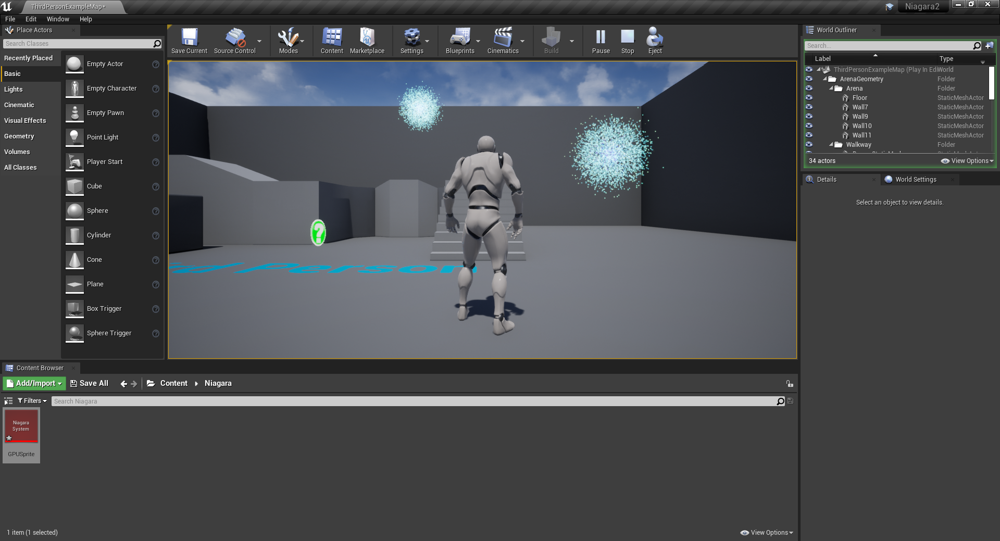
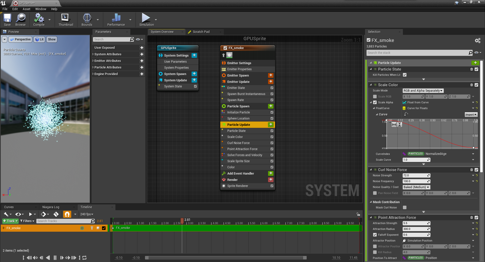

在GPU上跑粒子效果
<!-- more -->
## 效果图


    <iframe src="https://www.bilibili.com/video/BV1m5411u7Xe?share_source=copy_web" scrolling="no" border="0" frameborder="no" framespacing="0" allowfullscreen="true" style="position:absolute; height: 100%; width: 100%;"></iframe>



## 截图

## 官方文档
**传送门:**[**https://docs.unrealengine.com/zh-CN/RenderingAndGraphics/Niagara/HowTo/GPUParticles/index.html**](https://docs.unrealengine.com/zh-CN/RenderingAndGraphics/Niagara/HowTo/GPUParticles/index.html);