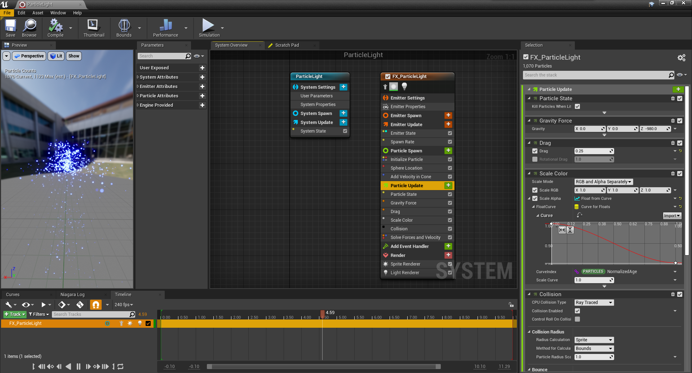
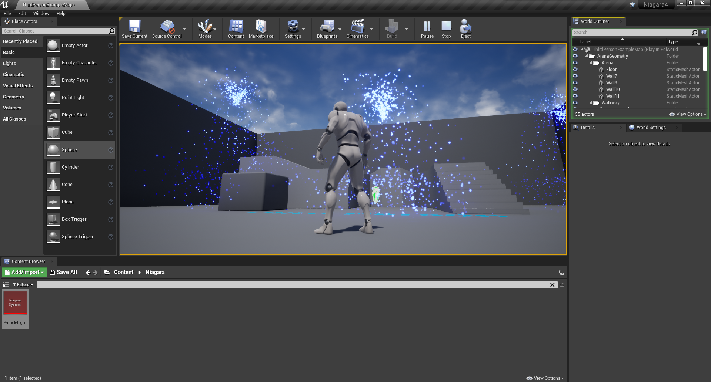

Niagara创建的粒子光源效果，很酷！
<!-- more -->
## 效果图

## 效果动图


    <iframe src="https://www.bilibili.com/video/BV1hh411Y7WX?share_source=copy_web" scrolling="no" border="0" frameborder="no" framespacing="0" allowfullscreen="true" style="position:absolute; height: 100%; width: 100%;"></iframe>



## 官方文档
**传送门:**[**https://docs.unrealengine.com/zh-CN/RenderingAndGraphics/Niagara/HowTo/ParticleLights/index.html**](https://docs.unrealengine.com/zh-CN/RenderingAndGraphics/Niagara/HowTo/ParticleLights/index.html);