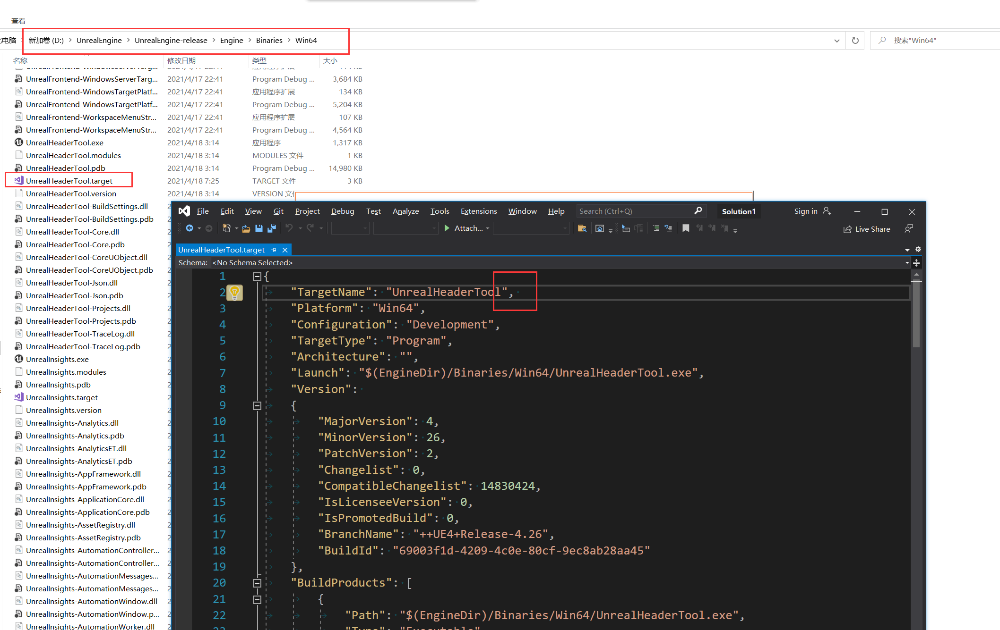

UE编译完成要好几个小时，编译好后打开项目再运行，又触发了重新编译，真是吐血的感觉。网上查了下，一个空格就能解决得问题。虽然不知道空格为啥有这么大的力量，还是先记录下来。
<!-- more -->
## 首先等待项目完成编译
编译好后，不要去做其它事，首先就去改这个配置，这个配置文件初次需要编译好才会出现，所以等全部编译好后就先去改这配置文件。
## 进入指定文件路径修改
找到制定目录下得得文件 D:\UnrealEngine\UnrealEngine-release\Engine\Binaries\Win64\UnrealHeaderTool.target
在``` "TargetName": "UnrealHeaderTool", ```后面增加一个空格```' '```



竟然有这种骚操作...