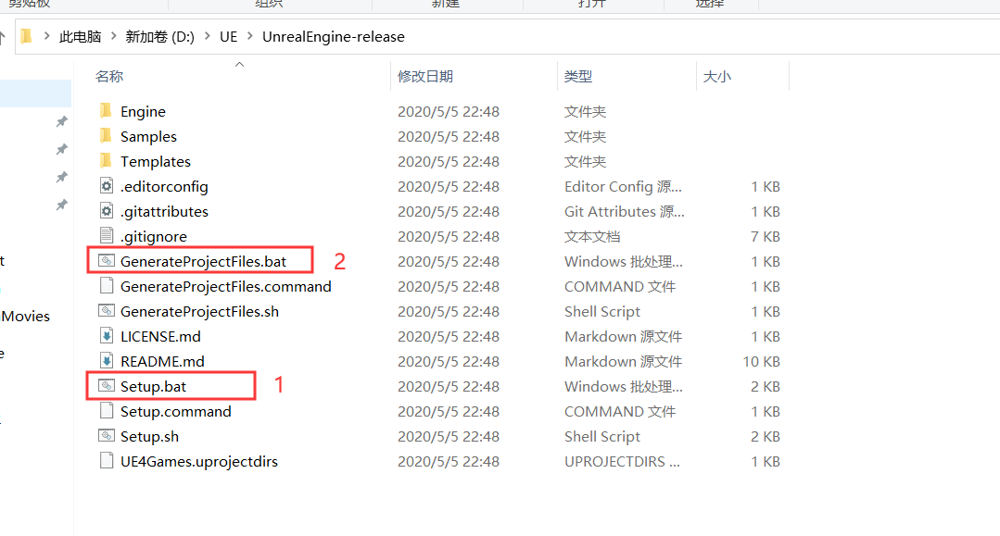
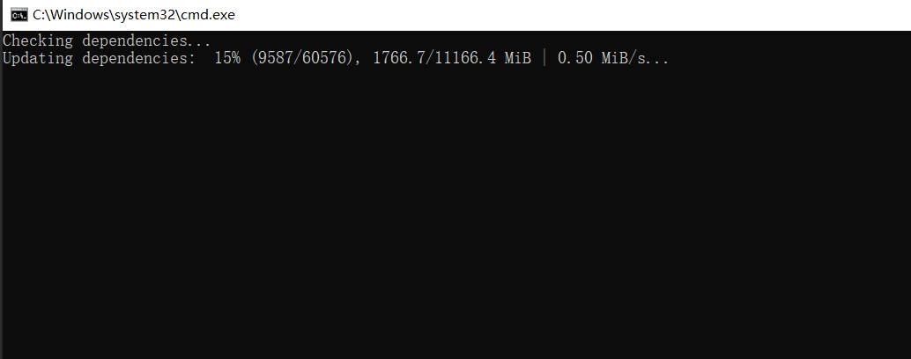
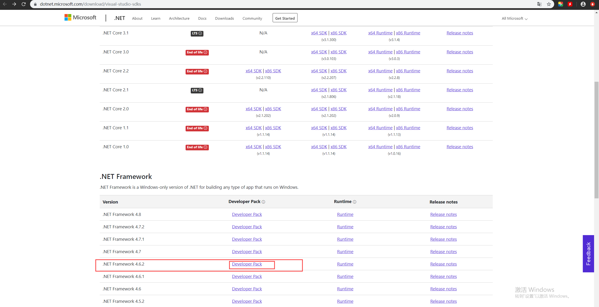
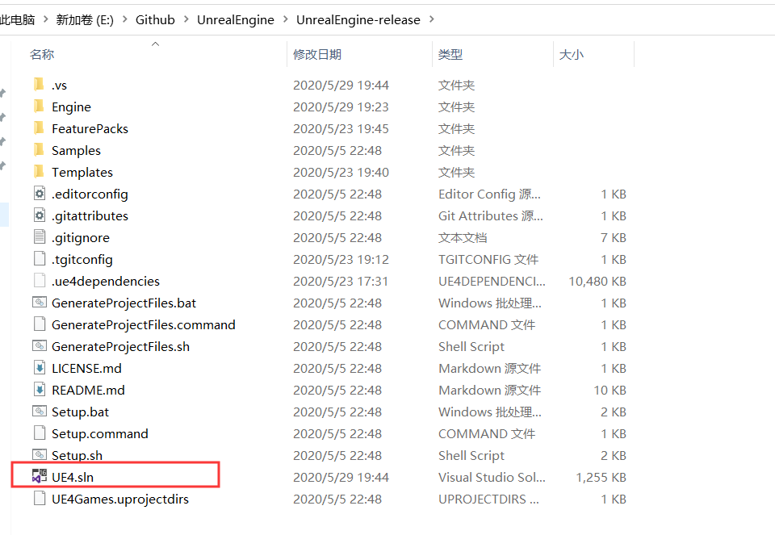
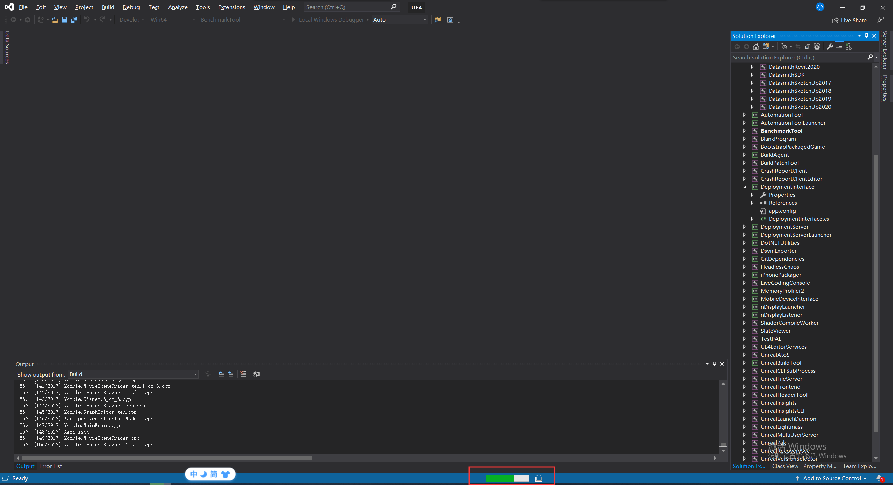

下载项目下来后，最重要的是跑起来，不然我觉得用处就大打折扣了。跑起来后能调试那就很完美了。
<!-- more -->
## 官方参考文档
[**https://docs.unrealengine.com/zh-CN/Programming/Development/BuildingUnrealEngine/index.html**](https://docs.unrealengine.com/zh-CN/Programming/Development/BuildingUnrealEngine/index.html);
不过我按照这个文档并没有顺利转换成.sln项目。但是这个文档是很重要的，一定要细看，比如说电脑的软硬件配置，不然别瞎搞。
## 从Github上下载项目
https协议下载：[**https://github.com/EpicGames/UnrealEngine.git**](https://github.com/EpicGames/UnrealEngine.git);
SSH协议下载：[**git@github.com:EpicGames/UnrealEngine.git**](git@github.com:EpicGames/UnrealEngine.git);
从上面下了UnrealEngine-release跟UnrealEngine-4.25两个项目。
下载后解压项目后可以看到目录

## 执行Setup.bat文件
先执行`Setup.bat`，之前尝试先执行`GenerateProjectFiles.bat`但是没有效果，后来乱点。发现要先执行这一步，我估计是下载拉取资源操作。

## 这行GenerateProjectFiles.bat文件
这行这个文件的时候，可能会遇到缺少.Net Framework4.6.2环境，如果缺少这个可以去微软官方`Developer Pack`下载。
[**https://dotnet.microsoft.com/download/visual-studio-sdks**](https://dotnet.microsoft.com/download/visual-studio-sdks)

## 最终得到UE4.sln
过程是还是出了很多曲折，不过终是出来了。可以看到出现了ue4.sln

用VS2019打开，可以看到ue4项目目录。在这里说下我用的是msvc2017C++编译器

编译了快半个小时了还没有编译好，果然要编译30~40分钟，ue不曾欺我。好了就到这里了，项目编译看到了两个错误了。

