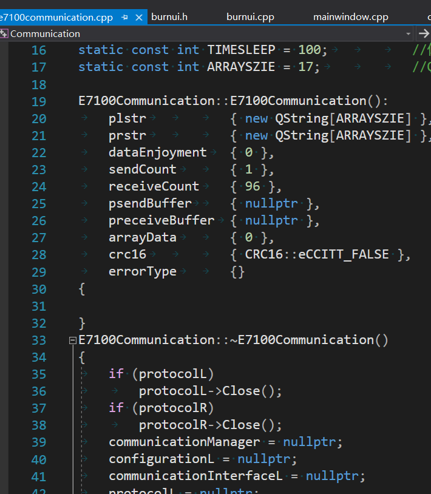
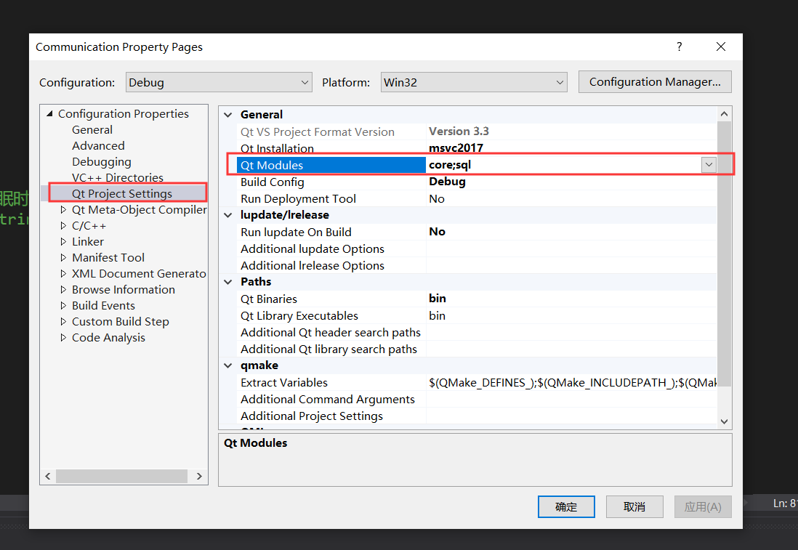
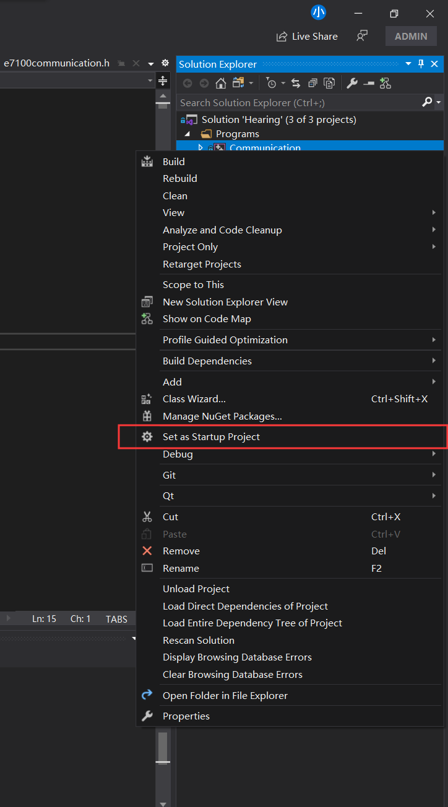

我的是VS2019 + Qt5.12.6环境，VS里面的Qt项目有不高亮情况，其它项目都正常。这个问题一直困扰我，到现在也没有完全解决，只能算临时解决的办法，如果有更好的办法可以告知我。
<!-- more -->
## 问题图

## 临时解决办法1
通过将Qt依赖的Modules里面随便增加一个新的模块，然后点击应用（在Win7下可行，Win10不行，完了以后在把新增的模块去掉就好了）

## 临时解决办法2
将不能高亮的项目设置为启动项目（Win10项目下可行，Win7下没测试过）

后来我在Win7下测试好像不是这么回事，有时候重启编辑器才行，有时重启编辑器也不行。搞不清咋回事。

## 网上找了一种办法（但是没起效果）
