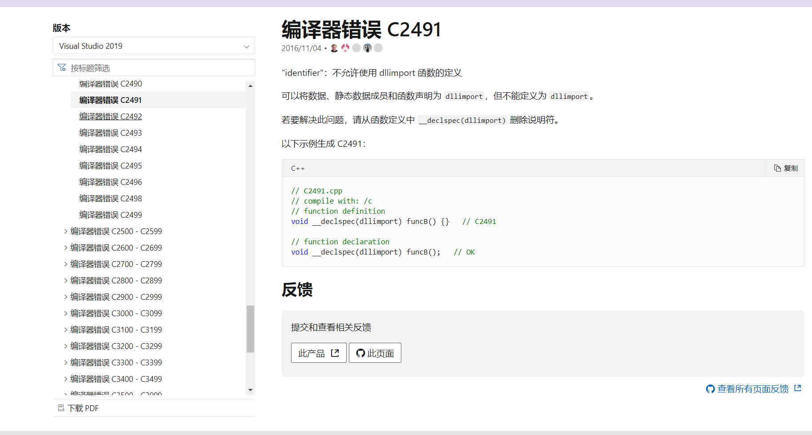

调试Visual studio项目的时候，是不是经常遇到 error Link2019 error c2065...之类的错误，什么原因引起的，百度搜，那群给答案的大佬
又是怎么知道的呢，应该是官方文档来的。好了以后有问题就直接去官网查询。
<!-- more -->
## 微软官方网站
中文站：[**https://docs.microsoft.com/zh-cn/cpp/error-messages/compiler-errors-1/compiler-errors-c2000-c3999?view=vs-2019**](https://docs.microsoft.com/zh-cn/cpp/error-messages/compiler-errors-1/compiler-errors-c2000-c3999?view=vs-2019)
英文站：[**https://docs.microsoft.com/en-US/cpp/error-messages/compiler-errors-1/compiler-errors-c2000-c3999?view=vs-2019**](https://docs.microsoft.com/en-US/cpp/error-messages/compiler-errors-1/compiler-errors-c2000-c3999?view=vs-2019)

## C/C++ 编译器和生成工具错误与警告
可以看到警告与错误分的很详细

