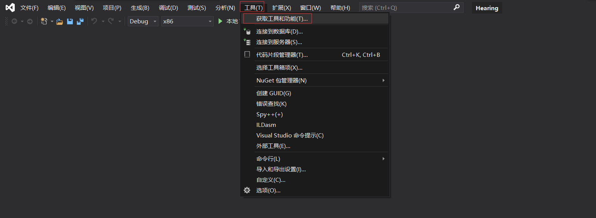
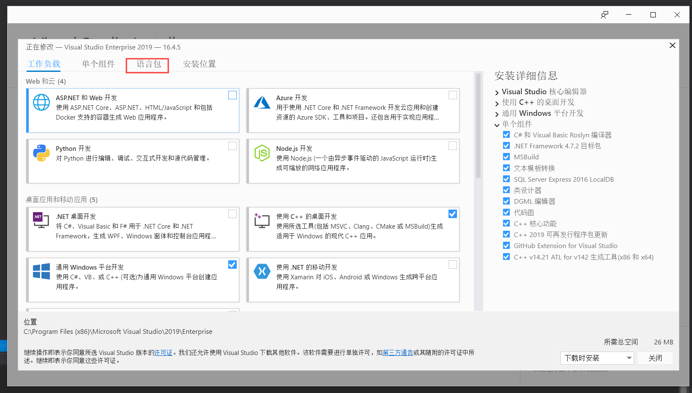
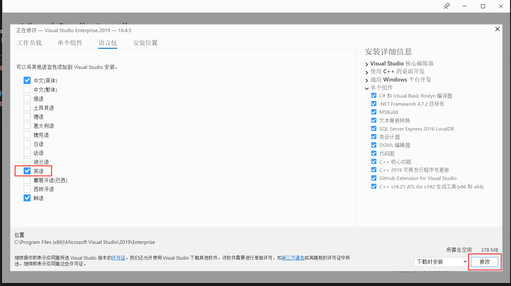
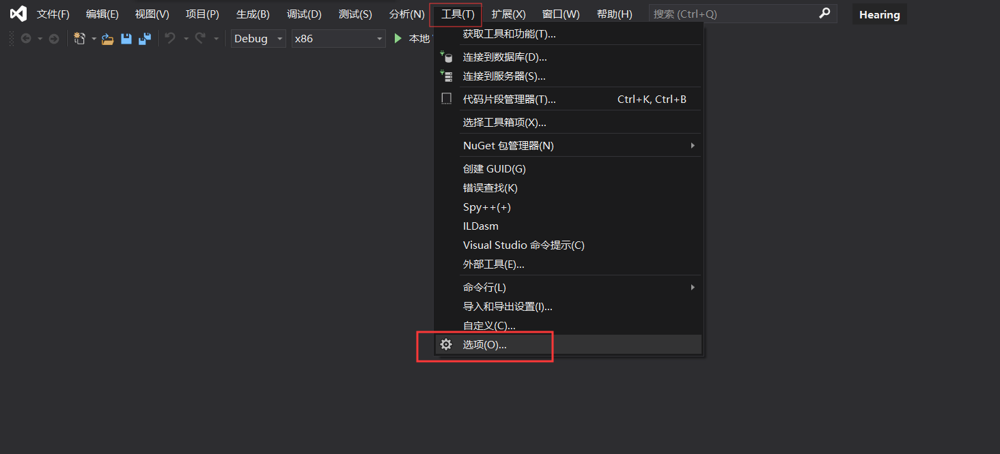
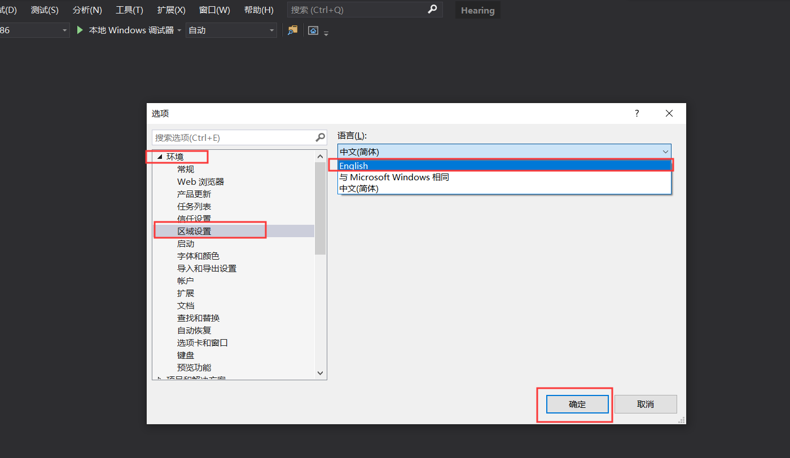
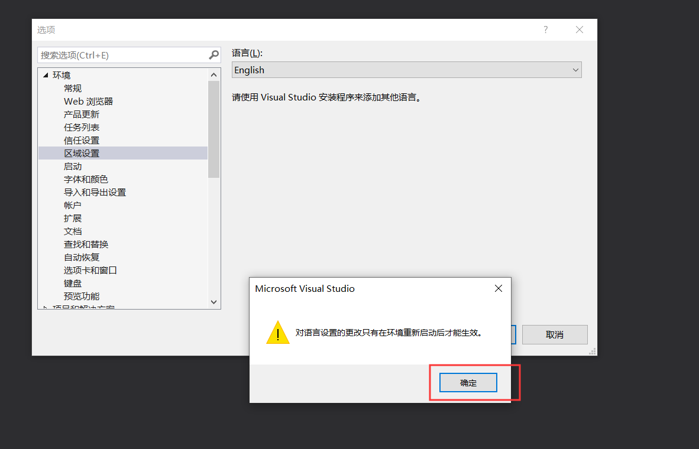
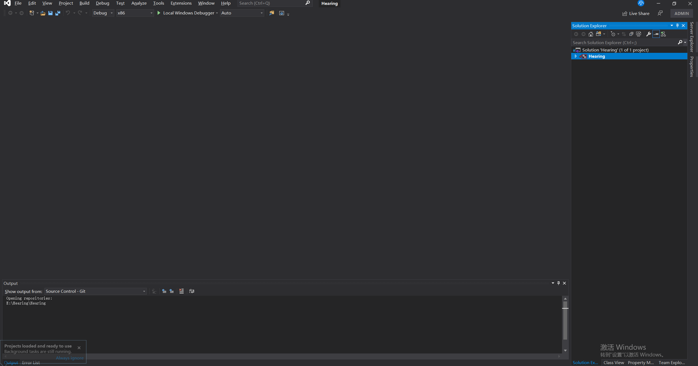

vs2015我用的是英文版，到了vs2019就变成了中文版，也许是开始安装的时候没太注意，就一直沿袭了中文的习惯，为了长远发展，还是决定换回英文版的
语言界面好点。想做就做，然后就百度开始行动。
<!-- more -->
## 选择vs2019 “工具->获取工具和功能”

 

## 进入vs2019的更新界面 选择“语言”

 

把“英语”这一项勾选上，这里是因为我之前已经安装过了，所以我又勾选了一个韩语，这样就会出现最右下角修改。

 
更新下载好后重启vs2019

## 继续回到vs选择 “工具->选项”

 
“环境->区域设置->English”

 
弹出重启生效的提示，点确定

 

## 重启VS2019，这样就进入到了英文开发环境了

 