随着项目内容一天天增加，看着自己代码布局怎么是这样的，看狗哥的项目文件放置的那么整整齐齐，不行啊，去请教Icy大佬也是，他们文件夹都是有明确的分工。不行啊，我这个有很大的问题，以前没有人带，是不知道这玩意还要配置，强迫症的我不能再忍了，于是果断今天抽空，决定把这颗毒瘤拔掉。结果是一天搞不定，花了两天，博客推到了今天来写了。
<!-- more -->

## 最终效果
&emsp;&emsp;当然还可以再简化些，不过达到这样的效果我已经满意了。这个是我项目的目录树图。
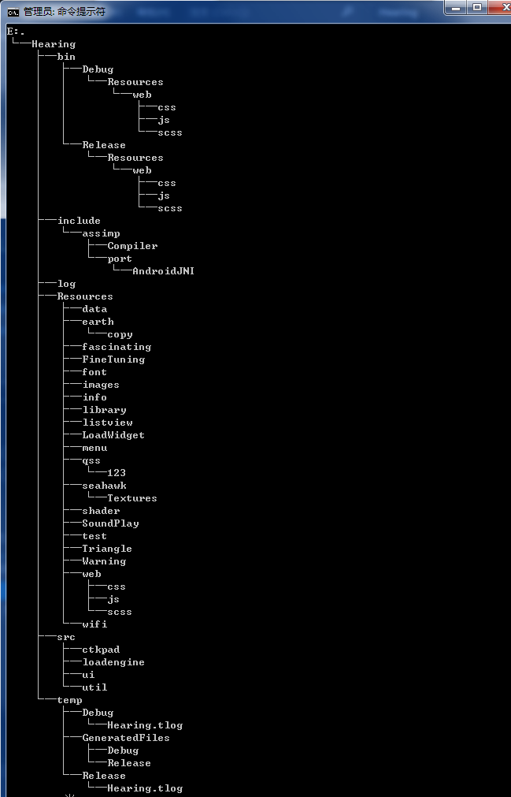
这个是最后的项目文件展示

* bin目录下含有两个文件夹debug跟release。这两个文件夹不仅存放了生成了的exe，我还把lib文件跟dll文件都放在exe的同级目录了。
* include目录用来存放第三方库的头文件/源文件。
* log用来存放打印信息，便于后期软件的维护和定位。
* Resources文件，各种资源存放的目录。有点小遗憾，一开始没有改成小写，现在要改起来代价太大了。改不动了。
* src存放源码的文件夹，里面还有专门的ui文件夹，还有其他功能模块的源码文件夹。
* temp用来存放C/C++编译连接的中间文件，也存放了Qt的ui文件以及moc等等中间文件。

## 最早的目录
&emsp;&emsp;早期项目的路径杂乱无章，源代码放了很多个位置，库跟源码混在了一起，感觉很乱。随着项目的进行，会导致更加的无序，最终我会觉得问题很严重。好在浪子回头，亡羊补牢来得及。没错今天我用千金换了浪子回头，把船开向了正确的航向。
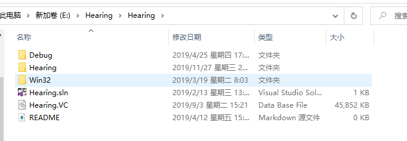
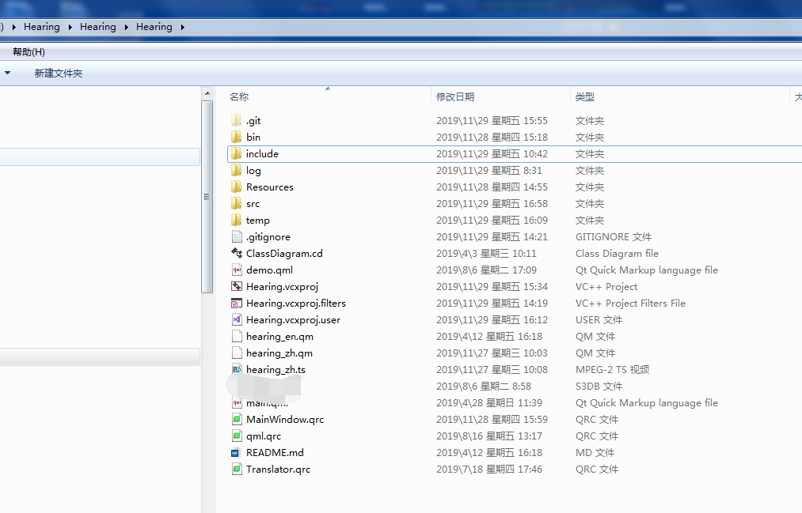

## 项目属性配置
&emsp;&emsp;鼠标移动到项目上右击进入属性配置页。一定要注意，Debug跟Release是需要各自配置的，除非一起选择配置，这种情况下我没有实际使用过。现在我只讲我Debug模式下的配置，Release下同样，因为$(Configuration)Debug模式下表示Debug，Release表示Release。所以他们的配置完全一样。以下的各种路径都可以设置很多个路径，等下你就可以看到多路径的方便。
* 配置属性->General下配置自己的中间目录跟输出目录。输出目录是可执行程序的目录，我设置为bin目录。中间目录我设置为temp目录，用来存放编译链接产生的文件。
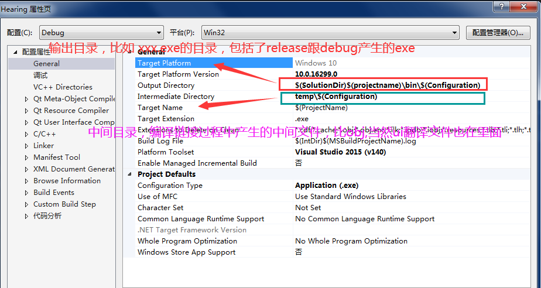
选择输出目录，进入选择编辑
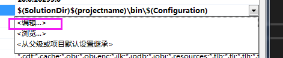
这个是输出目录，我这里项目放在e盘，所以它展示的实际路径。
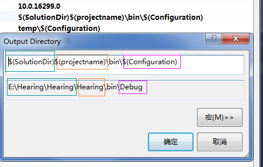
这个是中间目录，这个是它展示的实际路径。
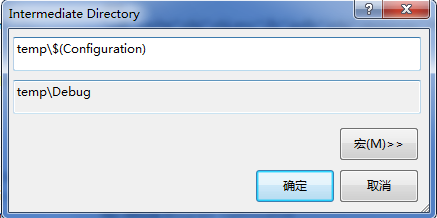

* 配置属性->VC++Directories，这里是第三方库的源文件路径，跟库路径，如下图所示。
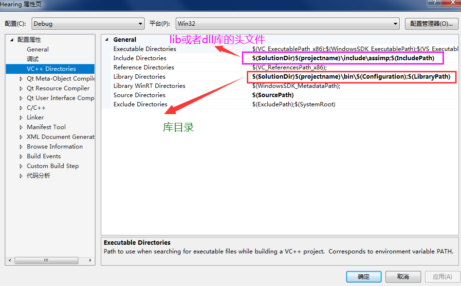
这里只展示下库目录的源文件路径，库路径就不展示了
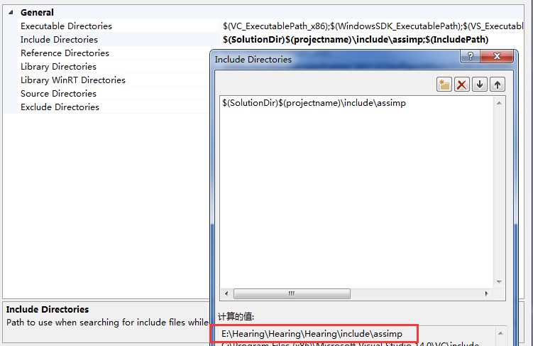

* 配置属性->C/C++ 没错这里就是我们源代码的路径，看到没有这里我设置了很多个路径项目可以直接访问，这样你就可以创建很多个文件夹来管理你的源代码，我觉得很棒。
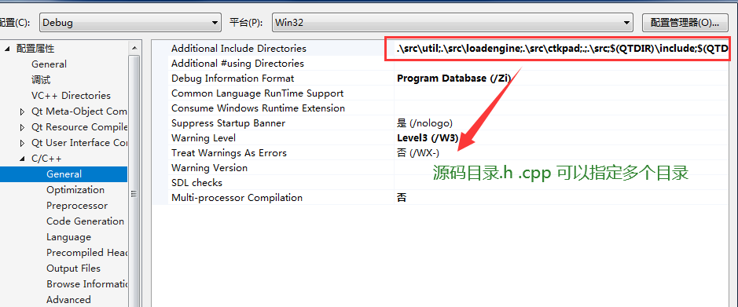

* 配置属性->Linker，这里就是静态链接库。
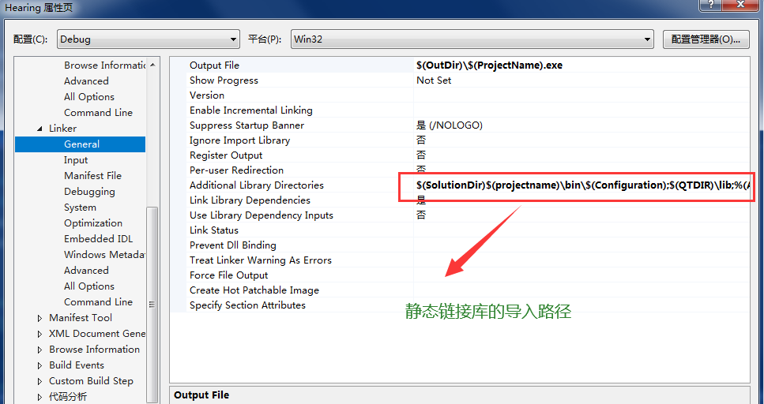

## Qt的配置省略
&emsp;&emsp;跟他们是一个道理，更简单的多。如果不知道`$(Configuration)`、`$(SolutionDir)`等等这种的含义，可以点进去查看他们代表的路径或者名称。一目了然。

