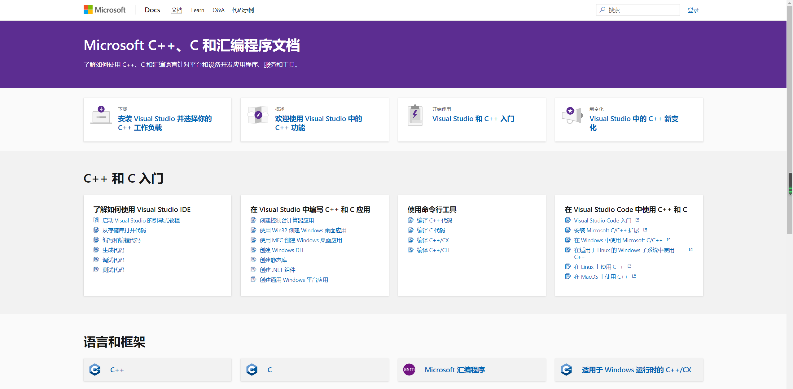
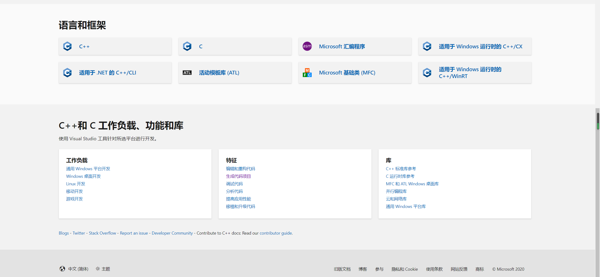
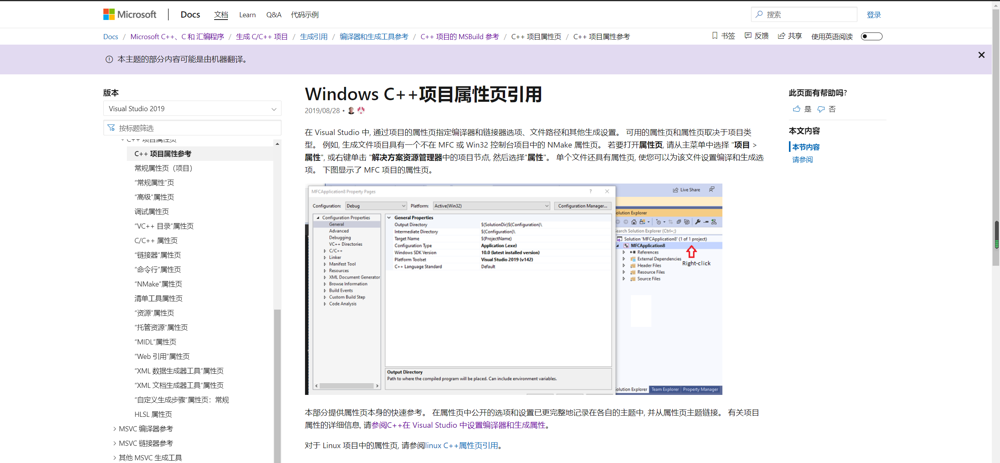
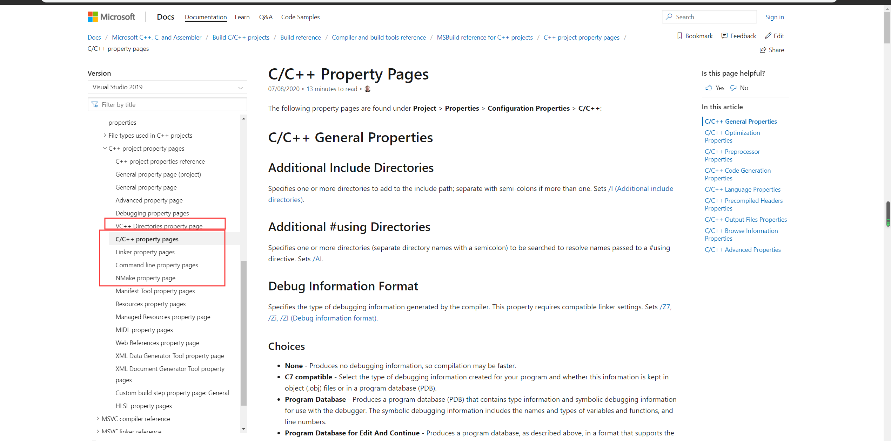
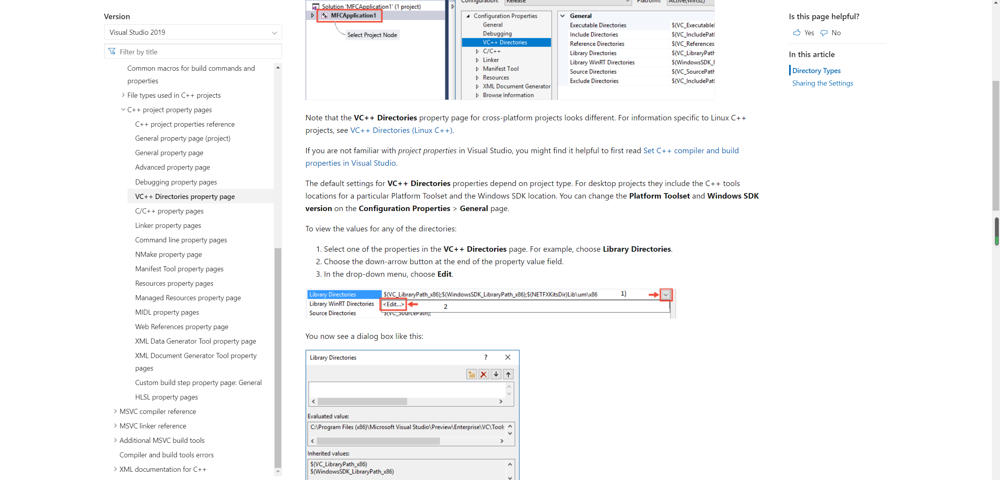

项目属性的配置，自己现在也只能算入门级别，有很多东西看了文档还是不会，还是不误人子弟，感兴趣的自己去官网查看含义。
<!-- more -->

## Microsoft C++、C 和汇编程序文档
中文站：[**https://docs.microsoft.com/zh-cn/cpp/?view=vs-2019**](https://docs.microsoft.com/zh-cn/cpp/?view=vs-2019)
英文站：[**https://docs.microsoft.com/en-us/cpp/?view=vs-2019**](https://docs.microsoft.com/en-us/cpp/?view=vs-2019)
可以看到C++的很多知识，学海无涯，这知识它不进脑子啊。微软还是那个微软。

## C++项目属性页
中文站：[**https://docs.microsoft.com/zh-cn/cpp/build/reference/property-pages-visual-cpp?view=vs-2019**](https://docs.microsoft.com/zh-cn/cpp/build/reference/property-pages-visual-cpp?view=vs-2019)
英文站：[**https://docs.microsoft.com/en-us/cpp/build/reference/property-pages-visual-cpp?view=vs-2019**](https://docs.microsoft.com/en-us/cpp/build/reference/property-pages-visual-cpp?view=vs-2019)

很想好好学下这个，可是看了一遍两遍有些地方还是不懂，没有经过一次两次多次的不断尝试对我来说是学不会的。慢慢来吧。