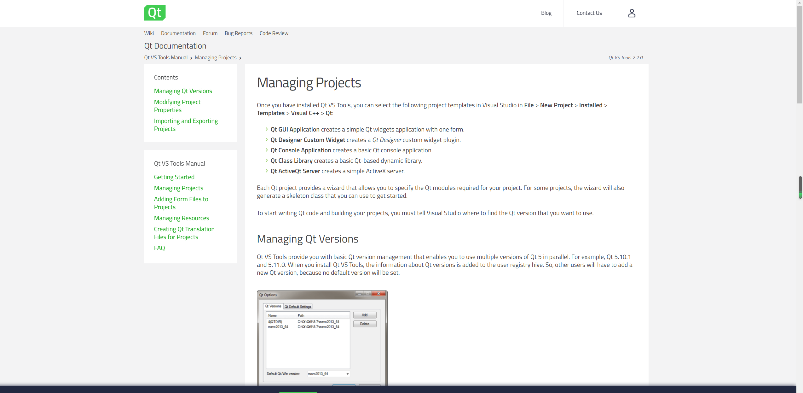

Visual Studio 的Qt扩展工具使用方法，吐槽一下文档写的不够详细，有些模块一笔带过，Qt有时候真是尿性啊。
<!-- more -->
## 文档地址
这个工具还是有它的缺陷，有些中间文件的输出路径配置不了，不知道是不是必须要启用pro或者pri文件来配置呢，不过我没有这样操作过。
Qt官方网站链接：[**https://doc.qt.io/qtvstools/index.html**](https://doc.qt.io/qtvstools/index.html)

