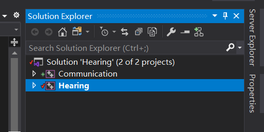
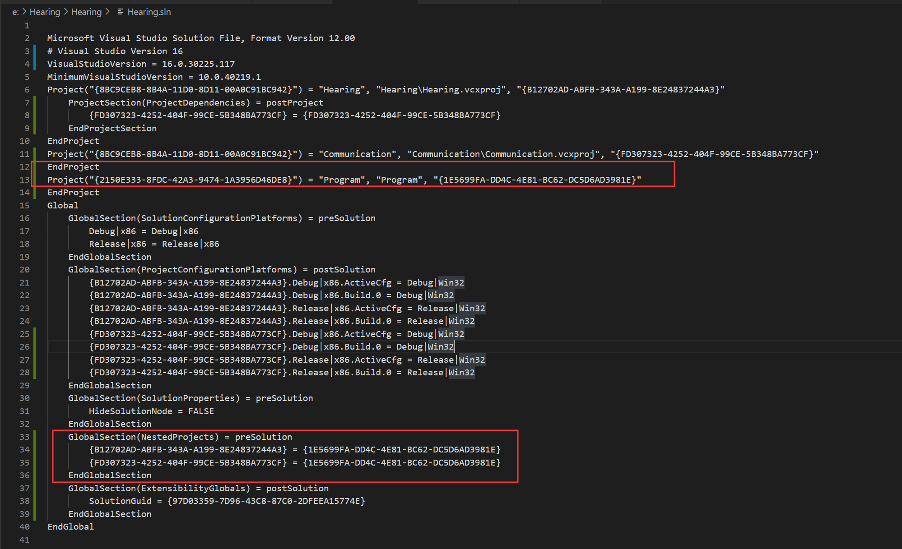
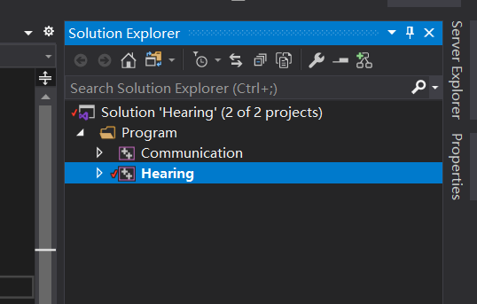

一直不能理解.sln文件里面的含义，让我很困惑，在微软上面翻了很多文档也没翻到，还好CSDN上翻到了别人的博客，一看就是大佬。解开了我的困惑。
<!-- more -->
## 基本概念
* 版本信息
    * Microsoft Visual Studio Solution File, Format Version 12.00
    * \# Visual Studio Version 16
    * VisualStudioVersion = 16.0.30225.117
    * MinimumVisualStudioVersion = 10.0.40219.1
* 项目信息
    * Project
    * EndProject
* 全局信息
    * Global
    * EndGlobal

看起来是三个独立部分，但是实际除了版本信息外，项目信息跟全局信息还是有挺多耦合的部分的。



```
Microsoft Visual Studio Solution File, Format Version 12.00
# Visual Studio Version 16
VisualStudioVersion = 16.0.30225.117
MinimumVisualStudioVersion = 10.0.40219.1
Project("{8BC9CEB8-8B4A-11D0-8D11-00A0C91BC942}") = "Hearing", "Hearing\Hearing.vcxproj", "{B12702AD-ABFB-343A-A199-8E24837244A3}"
	ProjectSection(ProjectDependencies) = postProject
		{FD307323-4252-404F-99CE-5B348BA773CF} = {FD307323-4252-404F-99CE-5B348BA773CF}
	EndProjectSection
EndProject
Project("{8BC9CEB8-8B4A-11D0-8D11-00A0C91BC942}") = "Communication", "Communication\Communication.vcxproj", "{FD307323-4252-404F-99CE-5B348BA773CF}"
EndProject
Global
	GlobalSection(SolutionConfigurationPlatforms) = preSolution
		Debug|x86 = Debug|x86
		Release|x86 = Release|x86
	EndGlobalSection
	GlobalSection(ProjectConfigurationPlatforms) = postSolution
		{B12702AD-ABFB-343A-A199-8E24837244A3}.Debug|x86.ActiveCfg = Debug|Win32
		{B12702AD-ABFB-343A-A199-8E24837244A3}.Debug|x86.Build.0 = Debug|Win32
		{B12702AD-ABFB-343A-A199-8E24837244A3}.Release|x86.ActiveCfg = Release|Win32
		{B12702AD-ABFB-343A-A199-8E24837244A3}.Release|x86.Build.0 = Release|Win32
		{FD307323-4252-404F-99CE-5B348BA773CF}.Debug|x86.ActiveCfg = Debug|Win32
		{FD307323-4252-404F-99CE-5B348BA773CF}.Debug|x86.Build.0 = Debug|Win32
		{FD307323-4252-404F-99CE-5B348BA773CF}.Release|x86.ActiveCfg = Release|Win32
		{FD307323-4252-404F-99CE-5B348BA773CF}.Release|x86.Build.0 = Release|Win32
	EndGlobalSection
	GlobalSection(SolutionProperties) = preSolution
		HideSolutionNode = FALSE
	EndGlobalSection
	GlobalSection(ExtensibilityGlobals) = postSolution
		SolutionGuid = {97D03359-7D96-43C8-87C0-2DFEEA15774E}
	EndGlobalSection
EndGlobal

```
下面我们来一一说明：

## 版本信息
```
Microsoft Visual Studio Solution File, Format Version 12.00
# Visual Studio Version 16
VisualStudioVersion = 16.0.30225.117
MinimumVisualStudioVersion = 10.0.40219.1
```
记录文件的格式版本是12.00， 使用visual studio 2019编辑/创建。
如果 VisualStudioVersion的版本号设置为15.0会使得打开sln文件的时候默认使用visual studio 2017
而设置16.0则会用visual studio 2019。
## 项目信息
```
Project("{8BC9CEB8-8B4A-11D0-8D11-00A0C91BC942}") = "Hearing", "Hearing\Hearing.vcxproj", "{B12702AD-ABFB-343A-A199-8E24837244A3}"
	ProjectSection(ProjectDependencies) = postProject
		{FD307323-4252-404F-99CE-5B348BA773CF} = {FD307323-4252-404F-99CE-5B348BA773CF}
	EndProjectSection
EndProject
Project("{8BC9CEB8-8B4A-11D0-8D11-00A0C91BC942}") = "Communication", "Communication\Communication.vcxproj", "{FD307323-4252-404F-99CE-5B348BA773CF}"
EndProject
```
项目信息至少由两行组成，第一行标记项目信息开始，最后一行表示信息结束，Project跟EndProject是一对，
在这里我有两个项目。
其格式为：
```
Project("{项目类型}") = "项目名称", "项目路径", "{项目ID}"
EndProject
```
项目类型，这个会专门放到下一篇讲。项目ID:在解决方案下每创建一个项目都会生成一个新的ID。
vcproj中可以指定项目依赖项。
### ProjectSection
`Project`和`EndProject`的内部还可以放`ProjectSection`，记录项目依赖关系（非项目之间的真实依赖，而是解决方案级别的编译依赖）：
```
Project("{8BC9CEB8-8B4A-11D0-8D11-00A0C91BC942}") = "Hearing", "Hearing\Hearing.vcxproj", "{B12702AD-ABFB-343A-A199-8E24837244A3}"
	ProjectSection(ProjectDependencies) = postProject
		{FD307323-4252-404F-99CE-5B348BA773CF} = {FD307323-4252-404F-99CE-5B348BA773CF}
	EndProjectSection
EndProject
```
我的项目Hearing依赖另一个项目Communication。依赖是以 `项目ID = 项目ID`的方式写出来的；如果有多个依赖那就写多行。
不用吐槽为什么一样还要写两遍，因为这是一个固定格式，这个配置还可以是两个不一样的，将来学会了再说。
关于设置项目依赖关系的方法，除了手改sln文件外，还可以通过设置项目依赖属性的方式。


还可以包含解决方案文件，例如：
```
Project("{2150E333-8FDC-42A3-9474-1A3956D46DE8}") = "Solution Items", "Solution Items", "{B002382D-4C9E-4F08-85E5-F12E2C061F5A}"
	ProjectSection(SolutionItems) = preProject
		.gitattributes = .gitattributes
		.gitignore = .gitignore
		README.md = README.md
		build\Version.props = build\Version.props
	EndProjectSection
EndProject

```
这个解决方案文件夹中包含了四个文件，其路径分别记录在了`ProjectSection`节点里面。
## 全局信息
```
Global
	GlobalSection(SolutionConfigurationPlatforms) = preSolution
		Debug|x86 = Debug|x86
		Release|x86 = Release|x86
	EndGlobalSection
	GlobalSection(ProjectConfigurationPlatforms) = postSolution
		{B12702AD-ABFB-343A-A199-8E24837244A3}.Debug|x86.ActiveCfg = Debug|Win32
		{B12702AD-ABFB-343A-A199-8E24837244A3}.Debug|x86.Build.0 = Debug|Win32
		{B12702AD-ABFB-343A-A199-8E24837244A3}.Release|x86.ActiveCfg = Release|Win32
		{B12702AD-ABFB-343A-A199-8E24837244A3}.Release|x86.Build.0 = Release|Win32
		{FD307323-4252-404F-99CE-5B348BA773CF}.Debug|x86.ActiveCfg = Debug|Win32
		{FD307323-4252-404F-99CE-5B348BA773CF}.Debug|x86.Build.0 = Debug|Win32
		{FD307323-4252-404F-99CE-5B348BA773CF}.Release|x86.ActiveCfg = Release|Win32
		{FD307323-4252-404F-99CE-5B348BA773CF}.Release|x86.Build.0 = Release|Win32
	EndGlobalSection
	GlobalSection(SolutionProperties) = preSolution
		HideSolutionNode = FALSE
	EndGlobalSection
	GlobalSection(ExtensibilityGlobals) = postSolution
		SolutionGuid = {97D03359-7D96-43C8-87C0-2DFEEA15774E}
	EndGlobalSection
EndGlobal
```
在这个全局信息的例子中，为解决方案指定了两个配置(Configuration)，`Debug`和`Release`，平台是x86根win32。
同时也为每个项目指定了单独的配置种类，可供选择，每一行都是 `项目的配置 = 解决方案的配置` 表示此项目的此种配置
在解决方案的某个全局配置之下。

如果我们将这两个项目放到一个文件夹中，那我们可以在Global和EndGlobal之间看到一个全新的全局配置`NestedProjects`
可以看到sln文件出生成了新的配置信息


```
GlobalSection(NestedProjects) = preSolution
		{B12702AD-ABFB-343A-A199-8E24837244A3} = {1E5699FA-DD4C-4E81-BC62-DC5D6AD3981E}
		{FD307323-4252-404F-99CE-5B348BA773CF} = {1E5699FA-DD4C-4E81-BC62-DC5D6AD3981E}
EndGlobalSection
```
字面意思是项目`{B12702AD-ABFB-343A-A199-8E24837244A3}`和`{FD307323-4252-404F-99CE-5B348BA773CF}`项目嵌套在
项目`{1E5699FA-DD4C-4E81-BC62-DC5D6AD3981E}`中，但实际是`Hearing`项目跟`Communication`两个项目在文件夹`Program`中


## 转自
[https://blog.csdn.net/wpwalter/article/details/101511974](https://blog.csdn.net/wpwalter/article/details/101511974)