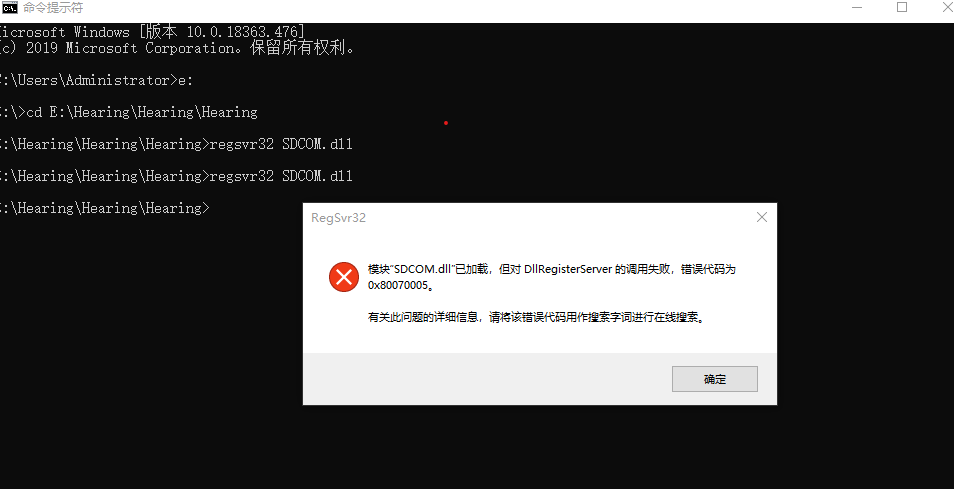
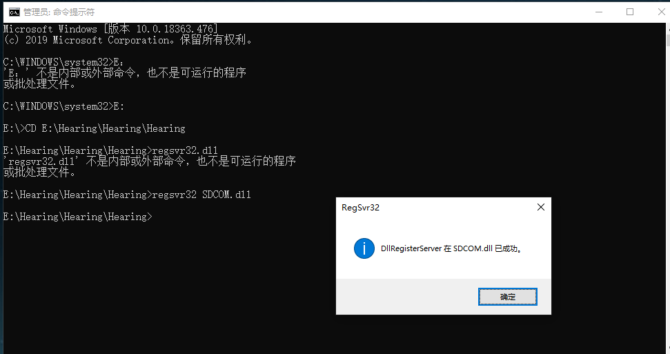

傻傻如我，一直用非管理员权限注册dll，我说怎么老失败，擦！又是管理员权限。
<!-- more -->
## 失败注册

## 成功注册

## 注册步骤
* 以管理权限运行CMD命令窗口
* 进入指定目录 C盘下可以直接 CD: "url（路径）"，例如：`CD: E:\blog\source\image`;要进入D盘可以输入`D:`然后再通过CD进入指定目录
* 到达指定目录后，输入`regsvr32 SDCOM.dll`，然后就注册成功了。
* 当然你还可以一口气到位 `regsvr32 E:\Hearing\Hearing\Hearing\SDCOM.dll`
管理员权限100遍啊100遍！
