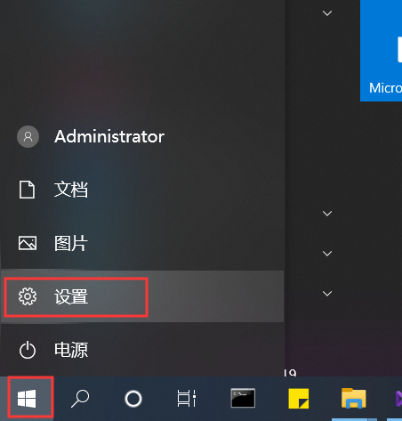
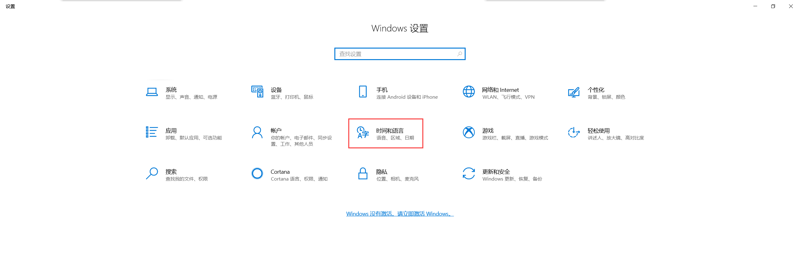
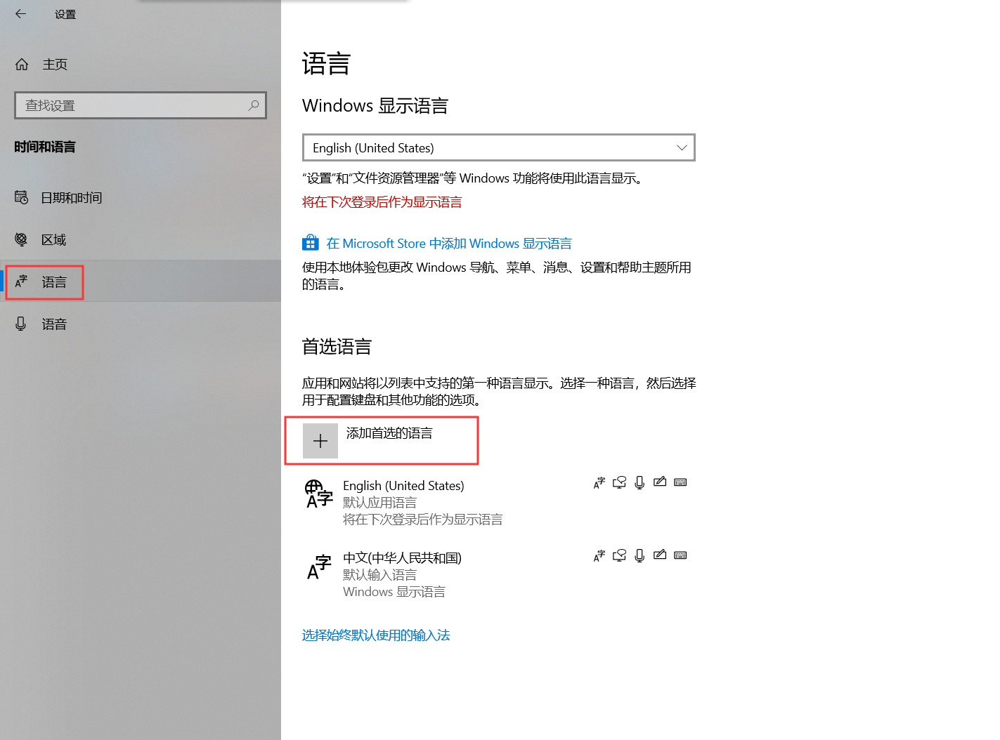
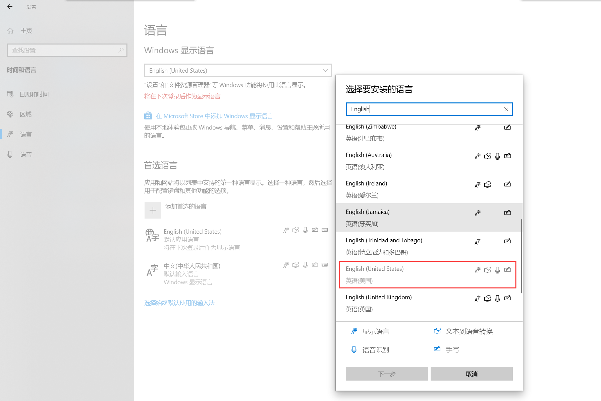

修改windows10操作系统的默认语言，这里由中文修改为英文。
<!-- more -->
## 启动菜单栏选择“windows图标->设置”

 

进入Windows 设置，选择“时间和语言”

 

选择“语言->添加首选的语言”，这里是因为我之前已经设置过了，所以含有英文这项

 

正常是会到这个框里面选择英文，可以在搜索栏里面输入“English”快速检索，可以看到这里出现了很多个英文版的国家。
我们这里当然要选老大US美国了。如果你喜欢英国也可以选它。

 

到了安装语言功能，这里把设置为我的显示语言勾选上，意思就是默认的选项，因为之前已经默认安装了US版的English为
默认语言，这里就切换到UK版的English作为演示。

 
点击“安装”，安装完成后会弹出现在重启还是稍后重启。重启生效，好了语言切换到这里就大功告成了。